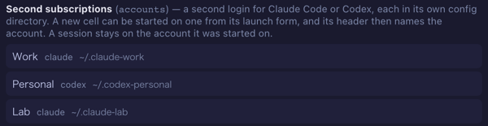
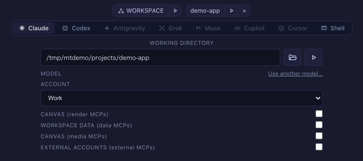
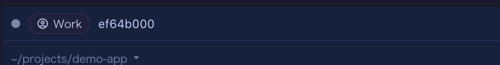

# Several subscriptions side by side (beta)
{: .no_toc }

> **Beta.** This feature has been checked by automated tests and not yet by use across a real
> day of work. It should do nothing at all until you configure an account, but if something
> looks wrong on an account cell, please file it (the `mulmoterminal-bug-report` skill helps).

*For someone with more than one Claude Code or Codex subscription who wants some cells on each —
say six cells, two of them on the work subscription.*

1. TOC
{:toc}

## What you get

- A new cell can be started on a **second login** (an *account*). The cell beside it keeps running
  on your usual login.
- The cell's header names the account it runs on.
- The resume list shows the sessions of every account, each named with its account. A session always
  continues on the account it was started on.
- The toolbar shows each account's **5h / 7d usage** beside your usual login's.

If you configure nothing, none of this appears and nothing changes.

## 1. Add the account to the config

Open `~/.mulmoterminal/config.json` and add an `accounts` list. Each entry names a config directory
of its own. The directory does not have to exist yet.

```json
{
  "accounts": [
    { "id": "work", "label": "Work", "agent": "claude", "home": "~/.claude-work" },
    { "id": "personal", "label": "Personal", "agent": "codex", "home": "~/.codex-personal" }
  ]
}
```

- `id` is how sessions are remembered. Choose it once. To show a different name, change `label`.
- `agent` is `"claude"` or `"codex"`.
- `home` must be absolute or start with `~/`. **Do not use `~/.claude` or `~/.codex` itself.** That
  is your usual login's directory: a cell on such an account simply runs on your usual login, and the
  account gets no gauge of its own.

Every key and limit is in the reference: [Configuration → accounts](config.html#accounts). Or ask
`/mulmoterminal-model` to write the entry for you.

## 2. Restart and reload

The list is read at startup. Restart MulmoTerminal, then reload the browser tab.

**How to tell it worked:** Settings → **Models and backends** lists the account under *Second
subscriptions*.



## 3. Start the first cell and log in

1. In an empty cell, pick the agent (Claude or Codex). An **ACCOUNT** select appears under the model.
   It offers **Default login** followed by your accounts.
2. Pick the account and launch.

   

3. If the directory is new, or has never been logged in, the CLI asks you to log in. For Claude Code, run `/login` and sign in
   with the subscription you want on this account. The login is kept in that directory from now on.

The header of that cell now shows the account's name.



An account on a new directory starts **empty**: your settings, your own MCP servers and the per-project
trust answers belong to your usual login. A directory you already used with `CLAUDE_CONFIG_DIR` or
`CODEX_HOME` keeps whatever it holds, login included. MulmoTerminal's own parts do follow the account: the bundled
`mulmoterminal-*` skills are installed into its directory, and a cell on it gets the same GUI tools as
any other cell in that directory.

## 4. Let the usage check in (Claude accounts)

A Claude account's usage is measured the way your usual login's is: by a short hidden session in the
**workspace** folder, run on that account's login. On a new account, that hidden session stops at
Claude Code's trust prompt for the folder, and nobody can see it. The toolbar then shows
`Work n/a`. Hover over it for the reason.

To clear it once:

1. Start a cell on the account in the **workspace** (the **WORKSPACE** chip in the launch form, with
   the account selected).
2. Accept the trust prompt.

The check retries by itself, less often each time (up to an hour apart). Restarting the server
resets that wait, so the gauge appears sooner.

A Codex account needs none of this. Its usage is read from its own session files after the first
session there.

## What the toolbar shows


| You see | Meaning |
|---|---|
| `Work 5h 12% 7d 40%` | The account's windows, named with its label |
| `Work n/a` | A Claude account that cannot be measured yet. The hover text says why: the trust prompt (step 4), no answer yet (not logged in, or the check is retrying), or API-key billing (no windows) |
| nothing for an account | Not measured yet, or a Codex account with no session yet |

Once any account is on the row, every set of figures carries its tool's mark, so the figures of your
usual login cannot be mistaken for an account's.

## Things that do not work, on purpose

- **Changing a session's account.** A session stays on the account it was started on, whatever the
  select says later. Its transcript lives in that account's directory.
- **Putting `CLAUDE_CONFIG_DIR` or `CODEX_HOME` in a custom agent's `command` or a provider's `env`.**
  MulmoTerminal would look in the usual directory while the session writes elsewhere, and the session
  list, resume, cost and history would come back empty. Use `accounts` instead.
- **Two accounts on one directory.** They are one login, so the toolbar shows it once, under the
  first one's label.

## Removing an account

Delete the entry and restart. A cell that is still open keeps running on that directory, and its
header then shows the account's bare `id`. The account's older sessions are **no longer listed** for
resume, because only the directories of configured accounts are read. To get them back in the list,
add the entry again with the same `id` and `home`. The directory and its login are yours to delete.
