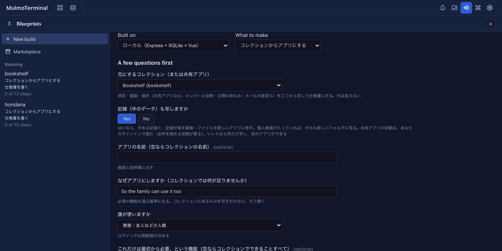
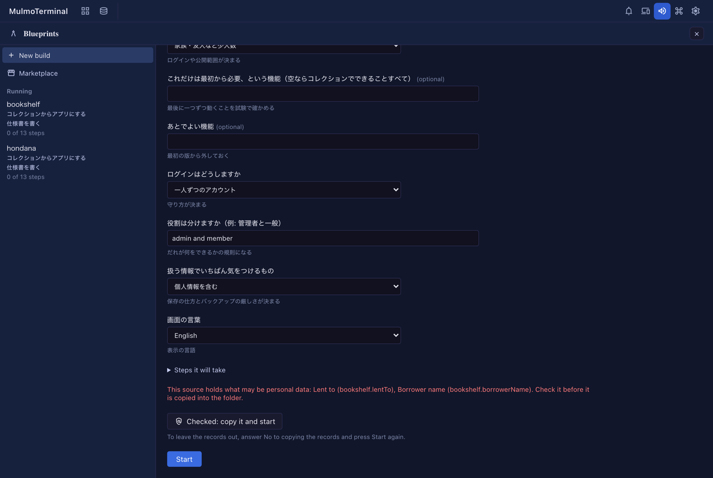
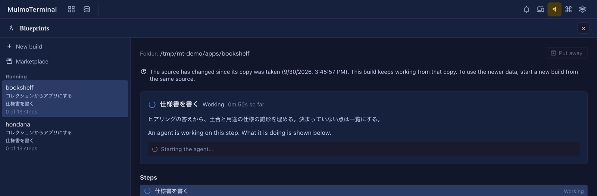

# From a collection to an app
{: .no_toc }

Take what you built as a collection — a bookshelf, an attendance sheet, a sign-up desk — and make it **an app
you own as code**. Its fields, screens and actions are copied into a spec, and its records can move into the new
app too. The collection itself is not touched.

This is one of the "what to make" choices of the experimental [Blueprints](blueprints.html). Do the Blueprints
setup first (Claude Code, a trusted work folder): see [the Blueprints guide](blueprints.html#trust).

1. TOC
{:toc}

## When to use it

A collection's strength is that you can reshape it by talking to an agent. An app is easier when:

- other people should use it through fixed screens (family, a team, the public);
- sign-in and roles (admins and members, say) should decide who can do what;
- it should run on your own server or cloud (Firebase, Cloudflare, Supabase) and live in your hands as code.

The collection keeps working after you make the app. The two are not kept in sync (see
[when the source changes after the copy](#source-changed)).

## Choosing a base

The base is where the app runs. Start with **local**: it stays on your computer, costs nothing and needs no cloud
setup.

| Base | The app | Records | Images and files | What you need (besides what everyone needs) |
|---|---|---|---|---|
| Local | Express + SQLite + Vue, on your computer | SQLite | `data/files/` | nothing |
| Firebase | A Firebase web app, with a development and a production project | Firestore | Cloud Storage | a Google account, a billing account, the `firebase` CLI, `gcloud`, JDK 21 or later |
| Cloudflare | A Cloudflare Workers app | D1 | R2 | a Cloudflare account (free is fine); `wrangler` comes with the project |
| Supabase | A Vue app served by Cloudflare that talks to Supabase directly | Postgres | Supabase Storage | Docker Desktop (running), Supabase and Cloudflare accounts; the CLIs come with the project |

Everyone needs Node.js 22.13 or later, `yarn`, a signed-in Claude Code and git
([Blueprints guide](blueprints.html)). On Firebase, `firebase` and `gcloud` must be signed in with **the same
Google account**.

## Starting

1. Open **Blueprints** from the "More features" menu in the top bar (the `widgets` icon), and press **New build**.
2. Pick the base under **Built on**, and under **What to make** pick **Turn a collection into an app** (**コレクションからアプリにする** on a Japanese screen).
3. For the **Project folder**, give a folder inside a trusted parent (a name that does not exist yet is fine).
4. Answer the questions and press **Start**.

### What the questions are for

The questions follow MulmoTerminal's display language: English on every language but Japanese, where the pack's own Japanese shows. The Japanese wording is given in each row for matching.

| Question | What it decides |
|---|---|
| 元にするコレクション（または共有アプリ） — the source | What to copy. Collections of the workspace and the saved folders are listed, and shared apps (folders with an `app.json`) |
| 記録（中のデータ）も写しますか — copy the records too? | **Yes**: the records and the images and files they point at move into the app. **No**: only the shape, giving an empty app. There is no default; you choose each time |
| アプリの名前 — the app's name | Shown on screen and in the README. Empty means the collection's name |
| なぜアプリにしますか — why an app? | The yardstick for the must-haves. "Just copy it" is a fine answer |
| 誰が使いますか — who uses it? | Decides sign-in and how public it is |
| これだけは最初から必要、という機能 — must-haves | Each is proven by a test at the end. Empty means everything the collection does |
| あとでよい機能 — later | Left out of the first version |
| ログインはどうしますか — sign-in | none / one shared password / an account per person |
| 役割は分けますか — roles | Admins and members, say. Asked only with an account per person |
| 扱う情報でいちばん気をつけるもの — the most sensitive data | Decides storage and how strict backups are |
| 画面の言葉 — the app's language | Japanese, English, or both |
| 見た目 — the look | The same as MulmoTerminal (the default), or a template: soft, crisp, calm. See [The look](#design) |

## What is copied

When you press Start, the copy is taken once, into the new folder's `.blueprint/source/`:

- the shape of the chosen collection and of every collection it links to through `ref`, embeds, backlinks and
  rollups (`schema.json`, `SKILL.md`, the declared views and action templates). A linked collection that cannot
  be found is listed under the spec's open questions;
- with the records: each collection's records (`records.jsonl`) and the files their image and file fields point at;
- for a shared app: its declaration (`app.json`) and the shape of every collection;
- what was copied and when (`source.json`).

The copy may weigh **200 MB** in all. Past that the start is refused before anything is written; start without
the records (the shape alone almost always fits).

### The check before personal data is copied {#personal-data}

When the copy would carry what may be personal data, pressing Start **stops once** and lists what would be copied:

- with the records: every email field, and fields whose key or label names a person's name, mail, phone, address,
  birth date or postal code (columns inside a table field included);
- for a shared app: the members' email addresses. These travel with `app.json`, so the check appears even without
  the records.

Check the list and press **Checked: copy it and start**. To leave the records out, answer **No** to copying the
records and press Start again. Changing an answer takes the offer back, so you confirm what you actually send.

The detection leans wide: a field that is not personal may be listed, which costs one confirmation.

### Starting from a shared app

- With the records, they are read from Firestore with **your own sign-in**. Connect to [shared apps](shared-apps.html)
  first.
- Your role must read every record (owner, editor or viewer). A role that reads only part of them would give a
  short copy, so the start is refused with the reason.
- The app's declaration — members and roles, public submissions, who sees what, mail, aggregates — is carried into
  the spec's who-can-do-what, every part of it, and enforced by the base: the server's rules on local and
  Cloudflare, security rules on Firebase, row level security on Supabase.

## What the spec settles

The first step, 仕様書を書く (write the spec), drafts the spec from the copy and waits for your approval. You can
change it by talking to it before you approve.

- Every field, view, action and ingest of the source is listed under a name that says which collection it came from
  (`books.title`, `books.views.board`, `books.actions.tidy`). If one is missing, the step does not pass.
- Each action (something an agent was asked to do) and ingest gets a proposed treatment:
  - **Make it a feature**: built into the app. An action that only changes values (`mutate`) always is.
  - **A person does it by hand**: the README gets the procedure.
  - **Drop it**: the spec says why.
- The table and column names the spec settles are what the record move is checked against.

### How field types come out

| Collection type | Local and Cloudflare (SQLite / D1) | Firebase (Firestore) | Supabase (Postgres) |
|---|---|---|---|
| string / text / email / markdown | TEXT | string | text |
| number | REAL (INTEGER if whole numbers) | number | numeric (integer if whole numbers) |
| boolean | 0 / 1 | boolean | boolean |
| date / datetime | ISO 8601 TEXT | ISO 8601 string | date / timestamptz |
| enum | TEXT with a value constraint | string | text |
| ref | a foreign key | the referenced document's ID | a foreign key |
| image / file | a path in `data/files/` (R2 on Cloudflare) | a path in Cloud Storage | a path in Storage |
| table | a child table | an array in the document | a child table |
| derived / rollup / backlinks / embed / toggle / flag | not stored; computed for display | same | same |

## The steps

Each base runs these steps in order. A step marked (approve) waits for you to approve it on screen. On a Japanese
screen the step titles are in Japanese, as the packs write them; every other language shows the English titles used here.

| | Local | Firebase | Cloudflare | Supabase |
|---|---|---|---|---|
| 1 | Write the spec | Write the spec | Write the spec | Write the spec |
| 2 | Check the tools (approve) | Tools and sign-in (approve) | Check the tools (approve) | Check the tools (approve) |
| 3 | App skeleton | Development and production projects (approve) | App skeleton | App skeleton |
| 4 | Data shape | App skeleton | Data shape | Data and permissions |
| 5 | **Move the records** | Sign-in | **Move the records** | **Move the records** |
| 6 | API | Data shape and security rules | API | Screens |
| 7 | Screens | **Move the records (emulators)** | Screens | Sign-in |
| 8 | Sign-in | Features and screens | Sign-in | **Match the look** |
| 9 | **Match the look** | **Match the look** | **Match the look** | Start it and check |
| 10 | Start it and check | Prove the must-haves by tests | Start it and check | Prove the must-haves by tests |
| 11 | Prove the must-haves by tests | Make the actions features | Prove the must-haves by tests | Make the actions features |
| 12 | Make the actions features | Publish for development | Make the actions features | Security check |
| 13 | Security check | App Check and a budget alert (approve) | Security check | Publish to Supabase and Cloudflare (approve) |
| 14 | How to use it, and backups | Security check | Publish to Cloudflare (approve) | **Move the records to production** (approve) |
| 15 |  | Publish to production (approve) | **Move the records to production** (approve) | How to use it, and handover |
| 16 |  | **Move the records to production** (approve) | How to use it, and handover |  |

In each step an agent works, then a machine check runs (tests, a build, reading the data back). If it fails, the
agent fixes it and the check runs again.

## The look {#design}

The question 見た目 (the look) chooses how the app looks.

- **The same as MulmoTerminal** (the default): the app looks as the collection does when you open it in MulmoTerminal — the same header, toolbar, table, kanban, calendar and record panel, in the same colours, with the collection's icon in the header.
- **Soft**, **crisp** or **calm**: templates that keep those shapes and change only the colours and how round the corners are. Soft is warm paper with round corners, crisp is white and near-black with small corners, calm is deep green on soft grey.

The step 見た目を合わせる (match the look) restyles the screens the earlier steps built. The choice is written to `DESIGN.md` in the app's folder, and the screens later steps add follow it.

## How the records move

With records copied, the 記録を移す (move the records) step builds the import (`yarn import-source`). A build that
copied the shape only does nothing there.

- **The result is checked against the source by machine.** Every record and every stored field has to be in the
  agreed table with its original value, and every image and file in place with the same bytes.
- **Running it again gives the same result** (rows are overwritten by primary key, never duplicated). The check
  runs it twice to make sure.
- By base:
  - **Local**: into SQLite and `data/files/`.
  - **Firebase**: first into the emulators. Production comes after 本番に公開 (publish to production), with one more
    approval. It writes with your Google account (`gcloud auth application-default login`) and reads production
    back to compare.
  - **Cloudflare**: first into `wrangler`'s local state, so the app `yarn start` opens has the records too.
    Production comes after publishing to Cloudflare, with one more approval, through
    `yarn import-source --remote`, with the account you signed in with `yarn wrangler login`.
  - **Supabase**: first into the local Supabase stack (in Docker). Production comes after publishing, with one
    more approval, through `yarn import-source --linked --owner <email>`, naming the address you registered in the
    published app. Imported records belong to your own account by default. It writes with the account you used for
    `yarn supabase login` and `link`; no secret key is used.

## Actions and ingests

What the spec made a feature is built in the アクションを機能にする (make the actions features) step, each with a test.

- A step that needs AI (summarising, classifying, drafting) becomes a feature that calls the Claude API **from the
  server**, never from the browser. Where the key goes depends on the base:

  | Base | Local | Production |
  |---|---|---|
  | Local | `.env` | — |
  | Firebase | a secret (`firebase functions:secrets:set`) | same |
  | Cloudflare | `.dev.vars` | `wrangler secret put` |
  | Supabase | `supabase/functions/.env` | `supabase secrets set` |

  The agent never writes the key's value; the README says where you put yours. The check fails if the key file is
  not in `.gitignore`.
- An ingest (RSS, Atom, JSON) becomes a job that runs on its schedule.
- When a must-have needs an action, the must-haves step builds it first, and the actions step does not build it
  twice.

## When the source changes after the copy {#source-changed}

The copy is taken once, at the start, and the build keeps working from it. If the collection or shared app changes
afterwards, opening the build says so in one line.

- It is checked once each time you open the build, not continuously (a shared app's records are read from Firestore
  again).
- To use the newer data, **start a new build** from the same source. The copy of a running build is never replaced,
  because its spec was written from it.
- When the source cannot be read again (it is gone, or you signed out of the shared apps), nothing is shown.

## What you end up with

- An ordinary project in the folder (`package.json`, sources, tests); `yarn start` runs it.
- `README.md`: how to use it, the steps for actions a person does by hand, where the keys go.
- The last step writes how to use it and how to back it up (local), or how to hand it over (cloud).
- `.blueprint/` keeps the spec, the copy, and the record of the steps.

If you want git, run `git init` after the build: making the folder a repository midway drops its trust and stops
the steps.

## Troubleshooting

| Symptom | Cause and fix |
|---|---|
| Refused as not trusted | Claude Code does not trust the folder. Press "Open Claude Code here" under the message and answer, then Start again ([Blueprints guide](blueprints.html#trust)) |
| Refused with the copy's size and the 200 MB limit | Too many records and images. Start without the records (the shape only) |
| A shared app refused for want of a sign-in | Copying records needs your sign-in. Connect to [shared apps](shared-apps.html) first |
| A shared app refused because your role reads only part of the records | Ask an owner for owner, editor or viewer, or start without the records |
| Firebase stops at tools and sign-in | `firebase` and `gcloud` are signed in with different accounts, or JDK 21 is missing. Fix it with the command shown, then Try again |
| Supabase says Docker is not running | Start Docker Desktop, then Try again |
| Supabase's local stack does not start | Another project's local Supabase stack on the same ports is named in the message. Stop it with `yarn supabase stop --project-id <name>`, then Try again |
| The record move's check fails | The check's output says which field of which record differs, and the agent fixes it. If it keeps failing, please [report it](blueprints.html) |

## See also

- [Blueprints (experimental) — a guide for testers](blueprints.html)
- [Shared apps](shared-apps.html)
- [The 7.3.0 setup guide](v7.3.0.html)
