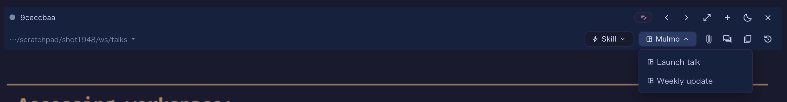

# 4.15.0 — Show a deck from your repository

**A snapshot as of 4.15.0 (released 2026-09-03).** It will go stale as the app moves on — that is
expected, and the living reference is the guide each section links to.

```bash
npx mulmoterminal@latest
```

**One thing here needs configuring** — a deck kept inside a repository has to be named before the
header menu will list it. Everything else works as soon as you upgrade.

## Open a deck without asking the agent

A mulmoScript deck used to be something you asked the agent to open, one turn at a time. There are
now two ways to open one yourself, and both edit the file in your repository rather than a copy.

### From the file tree — nothing to configure

Open the **Files** pane beside a cell, **right-click** a row, and choose **Open in the Canvas**.

The entry appears only for files something can actually render, so a `.txt` shows nothing and a
deck shows the entry. This works in any cell that has a Canvas beside it, a plain shell cell
included.

If the server cannot open it — the file was deleted between the menu opening and your click, or the
workspace moved since the app started — the pane now **says why** instead of doing nothing.

### From the header — `⊞ Mulmo ▾`

Beside **Run** and **Skill** there is a new dropdown listing this project's decks. Picking one shows
it in the Canvas beside the cell, enlarging the cell first if it was tiled.



It is a **viewer**: nothing is typed into the session and the agent is not asked, so it costs no
tokens and works while the agent is busy.

## Naming a deck you keep in a repository

The menu has two sources and **never searches your disk**:

1. **`artifacts/stories/` under the workspace** — where the plugin puts the decks an agent makes.
   Always offered, nothing to configure.
2. **Decks you name yourself** — for one kept inside a repository:

```json
{
  "decks": ["decks/launch.json", "docs/talks/retro.json"]
}
```

Put that in `<your-project>/.mulmoterminal.json` and **reload the browser tab**. The `⊞ Mulmo`
button appearing, with those decks in it, is how you tell the config took.

- Paths are **relative to that file**, and must stay inside its directory. `../elsewhere.json` and
  absolute paths are dropped — a config file travels with a clone, so a declaration names a deck in
  *this* repository.
- A path that is not a mulmoScript, or is not there, is dropped silently.
- Each deck is named by its own `title`, falling back to the file name.
- At most 50 entries.

{: .warning }
> **The menu shows on agent cells only** — beside Run and Skill. A launcher chip (a plain shell)
> has none of those three. The file tree's **Open in the Canvas** works there instead.

### Why you name them rather than the menu finding them

Because a search finds what is on disk, and on disk there is mostly other people's data. Measured on
a real workspace, searching for anything that parses as a deck found **250 files: 33 were the user's
own decks and 217 were a checked-out repository's test fixtures and samples**. The menu would have
been a wall of another project's test data.

### Where decks have to live

Under the workspace MulmoTerminal was started in — that is the directory it serves decks from. A
cell opened outside it shows no button, because nothing it could list could be opened.

If your repositories live somewhere else, start the app from a directory above them, or open the
deck through the file tree instead. Making an arbitrary repository work is
[issue #1951](https://github.com/receptron/mulmoterminal/issues/1951).

The reference is [the `decks` key](config.html#decks).

## Collections: which agent a chat starts is now visible

For anyone starting a chat from a **collection**. The agent it launches is a global, persistent
setting, and it used to be visible in exactly one dropdown — so setting it once to something other
than Claude quietly applied to every chat started from anywhere else. That produced a real "why is
Meta Muse starting?" report, which was configuration rather than a bug.

The picker now appears in the in-cell Collections pane header, in Settings' skill-launch dialog, and
in the chat modal itself. It stays out of the way while the value is `claude`, so nothing changes
for you unless you changed it.

**How to tell you have it:** open a collection, start a chat, and look at the modal's footer — the
agent it will start is named there, and changeable.

## Fixes worth knowing you have

### A custom theme no longer leaves the terminal on the old background

Reloading a tab while a custom colour scheme was selected left the header and panels in your
colours while the **terminal's own background stayed Midnight's dark blue**. The palette is now
repainted when the config arrives, instead of being decided at mount from a theme list that has not
loaded yet.

**How to tell you have the fix:** select a custom theme, reload the tab, and look at the terminal
background rather than the chrome around it.

### Smaller ones

- `@mulmoclaude/mulmoscript-plugin` 4.5.1 — a spurious warning on startup is gone.
- The guide's header page is split into an introduction and a reference, with `when` and the
  substitution variables corrected against what the code actually does.

## Where the reference lives

This page is a snapshot; the guide is the part that stays current.
[The `decks` key](config.html#decks) ·
[Every key in the config file](config.html#all-keys) ·
[Header buttons](header.html) ·
[What MulmoTerminal does](features.html)
