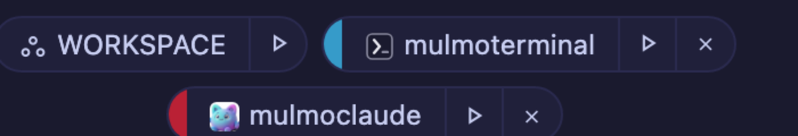

# Give a repository its own icon and colour

**A snapshot written on 2026-08-05, for MulmoTerminal 4.5.0.** Behaviour described here is what
shipped that day; the living reference is [Configuration](config.html), which is kept current.

Nine cells of the same dark grey, and the only way to tell them apart is to read the path. 4.5.0
gives a repository a way to say what it is — a name, a mark, a colour — in a file any tool can read.


*The mark on the left of each header comes from the repository itself. Neither cell was configured
in MulmoTerminal.*

## The short version

Put a `repo.json` at the root of your repository:

```json
{
  "name": "diffusion-lab",
  "description": "Training and evaluation for latent diffusion models",
  "icon": "docs/logo.png",
  "color": "#7c3aed"
}
```

Save it. **The cells recolour immediately** — no restart, no page reload, as long as the file was
written by an agent's Write/Edit tool. Edited by hand from outside, it applies on the next reload.

That is the whole procedure. The rest of this page is what each field does and where the values go.

## What you get for each field

| | |
|---|---|
| `name` | The badge on the cell header, the roster row and the launcher chip. |
| `icon` | The mark at the **left edge** of the header — the browser-tab position, because that is where you look first. Also on the roster, the filmstrip and the launcher chips. |
| `color` | **All seven** chrome colours. See below. |
| `description`, `homepage`, `authors` | Not shown by MulmoTerminal today. They are part of the open format, for other tools. |

### One colour becomes seven

You write one. The header takes it exactly; the badge, border, status dot, buttons and cell body are
derived from its hue; and the header text is **derived for contrast** — never declared, so it is
readable whatever colour you pick.

If you want the three-role form instead:

```json
"color": { "primary": "#7c3aed", "accent": "#22d3ee", "background": "#0b1020" }
```

`background` sets the cell body directly. `accent` is part of the format but MulmoTerminal has
nowhere to put it yet.

**Only `#rgb` and `#rrggbb`.** `"blue"` and `rgb(1,2,3)` are ignored — and ignored *cleanly*: an
unusable colour leaves the derived one in place rather than blanking the cell.

### Icons

A string, or an array when you have several sizes:

```json
"icon": [
  { "src": "docs/logo.svg", "sizes": "any" },
  { "src": "docs/logo-192.png", "sizes": "192x192" }
]
```

Vectors win, then the largest, then whichever you listed first. An entry that does not resolve is
**skipped** — one dead path does not hide the working ones after it.

PNG, JPEG, **animated GIF**, WebP, AVIF, SVG, ICO, BMP. A path is relative to `repo.json` and must
stay inside the repository; an `http(s)` URL or a `data:` image also works.

## If you already have a favicon, you may not need any of this

A directory that sets no icon anywhere shows the one its repository already ships —
`public/favicon.svg`, `apple-touch-icon.png`, a web manifest. That has been on since 4.5.0 and
needs no configuration. Turn it off in Settings → **Directory appearance**, or per project with
`"icon": false`.

## Keeping your own settings on top

`repo.json` is the **lowest** layer. Two files above it stay exactly as they were:

```
repo.json  →  .mulmoterminal.json  →  .mulmoterminal.local.json
the project    your settings          this checkout
```

So a project's brand colour applies until you override it, and your own palette wins when you do.
Anything MulmoTerminal understands that the open format doesn't — `theme`, `orderPriority`,
`sound` — goes under `extensions.mulmoterminal` inside `repo.json`, or in the files above it.



*The chips too, so you can tell where you are about to start before you start it.*

## How to tell it worked

Open **Settings → Directory settings** and expand the project. It names every file it read, in the
order they apply, and lists which keys each one contributed — including the colours derived from
`color`. If a value is not what your file says, this is where you find out which layer won.

## What breaks

- **Nothing, if you write no file.** Every field is optional and an empty `repo.json` is valid.
- **A path that leaves the repository is refused** — `../../elsewhere.png` shows nothing rather than
  reading a file the project never should have named.
- **A written-but-wrong icon shows nothing, and does not fall back to the favicon.** That is
  deliberate: a broken setting should look broken. Check Settings → Directory settings, where the
  key appears under the ones that were dropped.
- **On a Mac, nothing special.** No permissions, no restart.

## The format itself

`repo.json` is not a MulmoTerminal file. The
[specification](../../repo-json.html) is written to be readable by any tool that displays
repositories — terminals, IDE tab colours, project switchers, dashboards — so a repository states
its identity once and every tool agrees.

If you maintain a repository, adding one costs four lines and is not wasted on this app alone.
