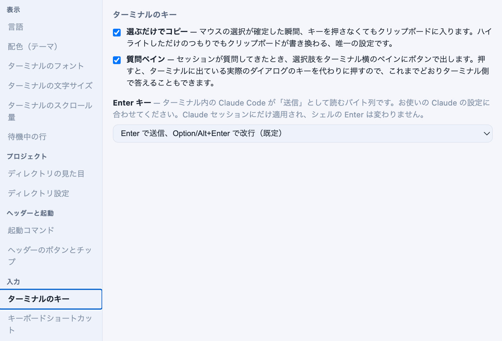
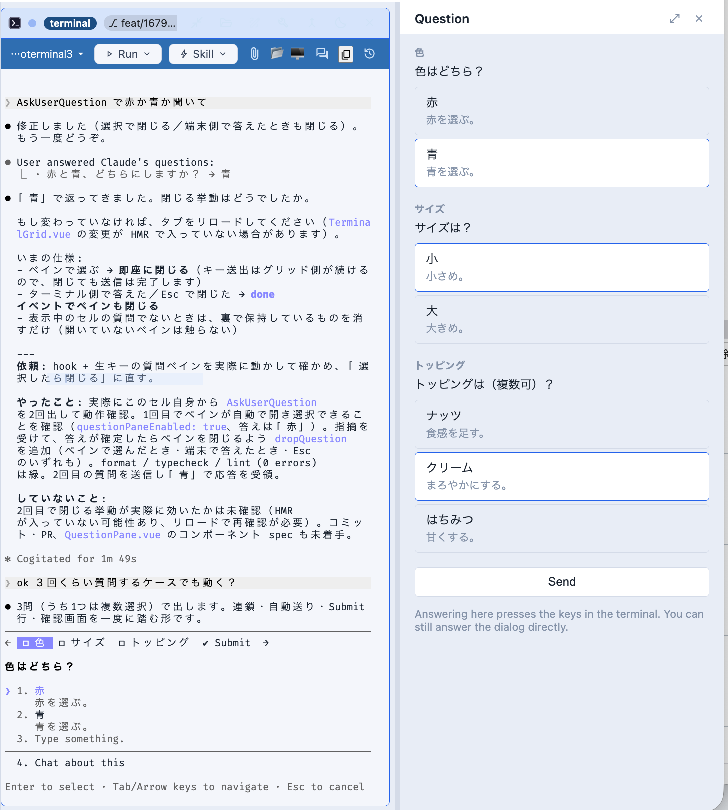
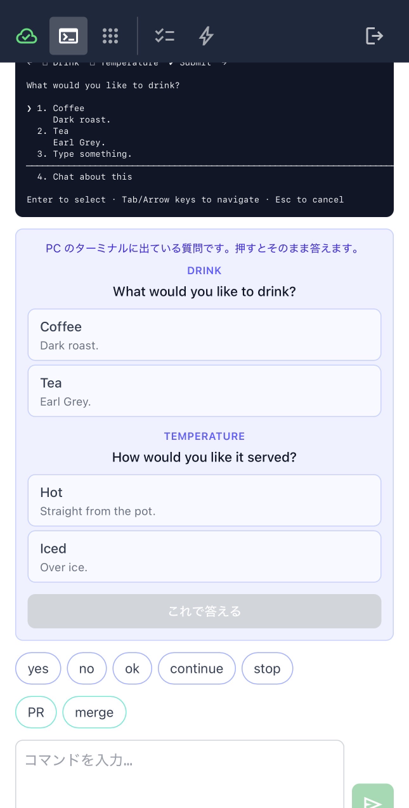

# 4.8.3 — Answering a question, at the desk and on the phone

**A snapshot of 4.8.3 as released on 2026-08-14.** It will go out of date as the app moves on; that
is fine and expected. For the reference that is kept current, follow the links to the living guide
in each section.

```bash
npx mulmoterminal@latest
```

One thing to turn on, and one that is already on. The **question pane** beside the terminal is a
config edit or a checkbox — do that first. Answering **from your phone** needs nothing configured at
all; it is there the next time you open a session that is asking something.

---

## The pane beside the terminal

**Before.** A Claude session that stopped on a question drew its dialog in the terminal, and the
arrow keys were the only way to answer it.

**Now.** The same choices can also appear as buttons beside the enlarged terminal.

Open **Settings → Terminal keys** and tick **Question pane**. It applies at once — the server
re-reads the file per question, so nothing needs restarting.



Setting up a machine with no browser in front of you? The same switch is one key in
`~/.mulmoterminal/config.json`:

```json
{ "questionPaneEnabled": true }
```

**How to tell it worked.** Tell a Claude cell to use its question tool — "ask me with
AskUserQuestion whether I prefer red or blue" is enough — and enlarge that cell. The pane opens by
itself, beside a terminal that still shows the real dialog.



The dialog does not go away, and the pane does not replace it — a button press puts the arrow keys
and Enter into the real dialog. Answer at either end; the first one wins.

**None of the options fits?** A dialog that asks one question and takes one answer also gets a text
box, under the buttons. What you write becomes the answer, exactly as typing it into the dialog's
own **Type something** row would. Several questions at once, or a multi-select one, get buttons only.

Off unless you ask for it, because it lets a pane type into the terminal you are sitting at. Reference:
[answering a question from the pane](features.html#question-pane).

---

## From your phone, with nothing to turn on

The question also arrives on the phone, as a card under the screen.



**There is no setting for this, and `questionPaneEnabled` does not gate it.** That switch is about a
panel typing into the terminal you are sitting at. On a phone nobody is at that keyboard — and with
no arrow keys, the card is the only way to answer at all.

**How to tell you have it.** Open a session on the phone that is stopped on a question. If the card
does not appear, **reload the page**: the phone app is served fresh, but a tab left open since
before the release is still running the old one.

**What the phone sends.** Not keys, and not bytes — the option numbers. The host holds the question
Claude declared, and builds the keystrokes itself, so a remote client cannot put a control byte into
your terminal. The same one-question rule applies to answering in your own words.

If an answer is refused, the phone says why in words you can act on: the dialog was answered
somewhere else already, the session has no live terminal behind it (it outlived a restart), or the
keys only partly reached the terminal and it has to be finished there.

Reference: [a question Claude asked](phone.html#question-card).

---

## Also in this release

- **Someone who booked can take their own booking back.** A shared app can declare `selfDelete`, and
  the visitor who created a row can withdraw it; the collection it belongs to reopens. It is a
  different act from the owner's cancel, and worded differently.
- **Fixes.** A lint summary drew a block for a count of zero. Tests reaching the server each started
  their own listener, which could land a request on the wrong one.

The full list, with the reasoning behind each change, is in the
[changelog](https://receptron.github.io/mulmoterminal/ChangeLog.html).
