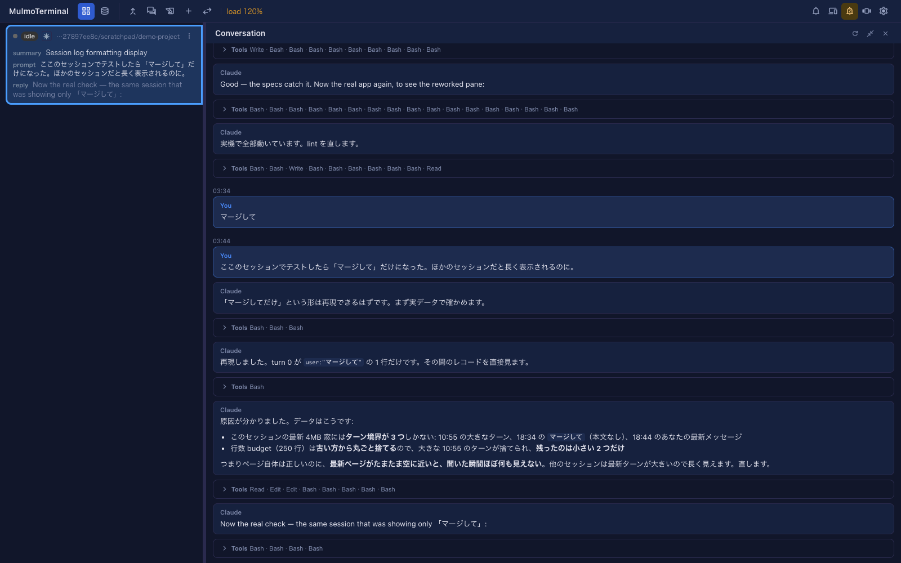

# 5.0.0 — Read the conversation, not the screen

**A snapshot as of 5.0.0 (released 2026-09-18).** It will go stale as the app moves on — that is
expected, and the living reference is the guide each section links to.

**Nothing to configure.** There is a button, and it is there as soon as you upgrade:

```bash
npx mulmoterminal@latest
```

**Nothing breaks, either.** The major number marks what this release is *for*, not a change you
have to act on: no config key changed meaning, no path moved, and nothing you had set up stops
working.

---

## The feature {#the-feature}

A Claude cell runs on the terminal's **alternate screen**, which keeps no scrollback. So the
conversation above the fold was not scrolled off — it was gone, and the only way back to what an
agent said an hour ago was to ask it again.

Enlarge a cell and press the **speech-bubble** button in its header. The terminal steps aside and
the session's own conversation takes its place.



It is not a screen capture. It reads the agent's own transcript, so there is no ANSI debris, nothing
is lost to a redraw, and a turn begins where the agent recorded it beginning rather than where a
line happened to wrap.

**A frame per speaker.** What you asked sits in one, what the agent answered in another, each named.
A turn changes hands several times — you ask, it answers, it runs three things, it answers again —
and the frames follow that rather than listing rows.

**The reply is rendered.** Headings, lists, tables and fenced code are drawn as the document the
agent wrote, not as the characters it is made of. What **you** typed is left exactly as you typed
it: a line that starts with `#` is a line that starts with `#`, not a heading.

**The tool traffic is folded away.** A turn's `Bash`, `Read` and `Edit` calls are most of its bulk
and almost none of what you came back to read, so each run of them collapses to one line saying what
ran — `Bash · Read · Edit`. Click it when you want the output.

## Scrolling back {#scrolling-back}

**Scroll up and it keeps going**, a page at a time, to the session's first turn. Your place is kept
as pages arrive above you; the pane does not jump.

When it opens, it also fills the screen before handing it to you: a session whose newest turns are
small — a one-word instruction, a prompt that was queued and never answered — would otherwise open
on those alone, with the substantial turn just above the fold. Scrolling is for going further back,
not for finding the conversation.

Two things it deliberately does **not** do:

- **It does not follow a running turn.** It is a snapshot of the moment you opened it. The terminal
  beside it is the live view, and a pane that moved while you were reading the part you scrolled
  back to find would be worse at its one job. The **reload** button in its header fetches the newest
  turns again.
- **It does not cross into other sessions.** One session, back to its first turn. Another session's
  conversation is opened from that session.

## Which agents it can read {#agents}

| Agent | Conversation pane |
|---|---|
| Claude | yes |
| Codex | yes |
| Cursor | yes — the tool *results* are missing, because cursor writes none |
| Copilot | yes — no tool rows at all, because copilot records none |
| Grok · Muse · Antigravity | not yet |

An agent in the last row does not fail silently: the pane says its conversation lives somewhere no
reader here can read yet. A **shell** cell has no conversation and never will, so it simply has no
pane worth opening.

A conversation you ended with `/clear` says so too, rather than showing you the one you ended.

The living reference is [Features](features.html).

## How to tell you have it {#how-to-tell}

Enlarge a cell. If its header has a speech-bubble button between the outbox and the merge arrows,
you have 5.0.0.

## Also in this release {#also}

Nothing here needs anything from you.

- **A link in a reply opens in a new tab.** Clicking one used to navigate the whole app away —
  taking every live terminal, open pane and unsaved editor buffer with it, with no way back.
- **A remote image in a reply is not fetched.** An `` fetches the moment it is on screen, so a
  reply carrying one told that host who opened the pane and when — and replies are written by agents
  that read the web and other people's repositories. The URL becomes a link instead, which fetches
  when you decide to open it. Images that stay on this machine are still drawn.
- **A failed page says so.** When a read fails while scrolling back, the pane says it could not read
  the turns before this one, rather than telling you that you have reached the beginning.
