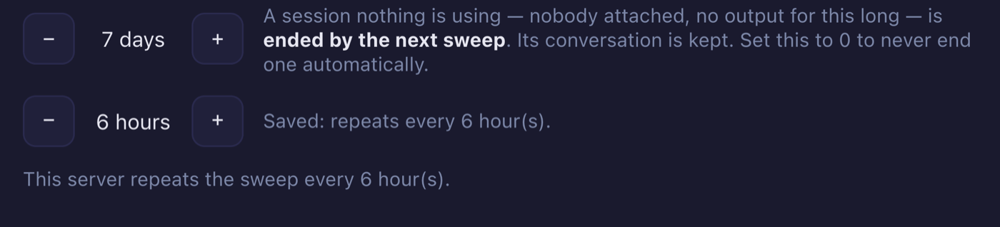

# 5.4.0 — The interface speaks your language, and a long-running server tidies up after itself

**A snapshot as of 5.4.0 (released 2026-09-20).** It will go stale as the app moves on — that is
expected, and the living reference is the guide each section links to.

Two of the three things here need you to do something: pick a language, and decide a cadence. The
third needed a setting and does not have one, which is the point of it.

## 1. The interface in Simplified Chinese, Traditional Chinese or Korean

**Where**: the gear in the header, then **Language for this app** near the top of Settings.


It is kept **per browser**, like the theme — your phone and your desktop can each be in a different
language, and nothing about it is sent to your agent.

**What is translated.** Settings, and the status words the grid and the roster keep on screen. The
rest of the app is still English, and the line under the picker says so rather than letting you
discover it. Those status words were chosen first because they are on screen the whole time you are
working, so they are read more than anything else in the app.

**What it does NOT touch**: what your agent writes, and what the terminal shows. Those are the
agent's language and your shell's, not this app's.

**"My browser's language" now asks the browser properly.** It used to compare against a list this
repo maintained. It asks CLDR instead, which is why `zh-HK` lands on Traditional — and so does
`zh-yue`, because the canonical form of that tag replaces its prefix and CLDR expands it under
Traditional Hong Kong. The line under the picker names the tag your browser actually **asked for**,
separately from what it **resolved to**, so a surprising result tells you which half to look at.

**If a sentence reads wrong to you, it probably is.** Everything checkable by machine was
checked — key sets, placeholders, Simplified/Traditional character bleed, term consistency,
punctuation width — and none of that reads a sentence. Please open an issue; a correction to a
translation is a welcome PR and needs no discussion first.

## 2. A server you leave running can now sweep idle sessions on a timer

Until now the sweep that ends detached sessions ran **once, at server start**. If your server stays
up for days, a session that went detached this morning was not looked at again until you restarted
— which made restarting the only way to tidy up.

**Where**: Settings, in the same block as the idle-days stepper you already have.



Or in `~/.mulmoterminal/config.json`:

```json
{
  "sessionIdleReapDays": 7,
  "sessionReapIntervalHours": 6
}
```

**The default is `0`, which means off**, and that is deliberate: upgrading must not start ending
sessions on a server that was running happily. `0` keeps exactly the behaviour you have — one sweep
at start, and nothing after it.

**It applies from the next server start.** The cadence is read once, at boot, and the timer is
deliberately not re-armed when you save — a stream of edits would reset the countdown forever. So
between saving and restarting there are two different numbers, and the screen distinguishes them:
the hints say what is **saved**, and one line says what this server actually **armed**.

**How to tell it is working**: after a restart, the line under the stepper says *This server repeats
the sweep every N hour(s)*. If it says *The saved cadence above applies from the next start*, you
have saved it but not restarted yet.

**What the sweep will and will not end** has not changed, and neither has `sessionIdleReapDays`.
This release only changed how often the question is asked. The living
reference for both keys is the [configuration guide](config.html#settings-modal).

## 3. The Markdown preview comes back where you were reading

Nothing to configure. Open a `.md` in the Files pane, press **Preview**, scroll down, go somewhere
else, and come back: you are where you were, not at the top.

It also holds while the file changes **under** you — which it does, constantly, because the agent
working in that directory is editing the same files. The preview re-renders and you stay halfway
down instead of being thrown to the first line. That works whether the preview is the view that is
up or the editor is.

**How to tell you have it**: scroll a long Markdown file in Preview, ask your agent to append a
section to it, and watch. Before this release the preview jumped to the top when the file changed.

For the curious, this is the part that had no obvious solution: the preview is an iframe the app
deliberately cannot read into — it renders Markdown that nothing sanitises, so it is sandboxed with
no access to the app's origin. Reading a scroll position out of it without giving up that
containment is what took the work. The document reports its own position through a single script
the server signs per response; the file's own scripts carry no such signature and stay as inert as
they have always been.

## 4. A crashed server comes back, and other repairs

**Nothing to configure** in any of these.

- **`npx mulmoterminal` now supervises the server it started.** A crash is restarted with backoff
  and your browser tab reconnects to the sessions tmux kept, instead of staring at a dead port.
  `yarn dev` has done this for a long time; the shipped launcher did the opposite, which was
  backwards — the person running `npx` is the one who cannot fix it, and from a phone there is no
  terminal to start it in. A stop you asked for is still a stop. **Not on Windows**, where Node has
  no real signals and a stop cannot be told from a crash.
- **Session state queued at shutdown now reaches disk.** A burst of writes at exit was lost
  *whole* — the process left before the first of them got a turn.
- **The phone cannot reach a session by a partial id.** `tmux` resolves a target by prefix when
  nothing matches exactly, so an id that was merely the beginning of another session's name reached
  that other session.
- **"New terminal in this directory" works on sessions that outlived a restart.** tmux surviving a
  restart is the design, so this used to fail after every one — on a row that was displaying the
  directory it claimed not to know.
- **Git status polling no longer piles up.** Several cells on one checkout used to each run their
  own reads; concurrent reads of one directory now join a single one.
- **The Files pane restores its remembered folders faster** — the same listings, fetched level by
  level instead of one directory at a time.

## Upgrading

```bash
npx mulmoterminal@latest
```

Nothing in this release changes a config file you already have, and every new key defaults to the
behaviour you had before it. If you keep a pinned version, `5.4.0` is a drop-in.
