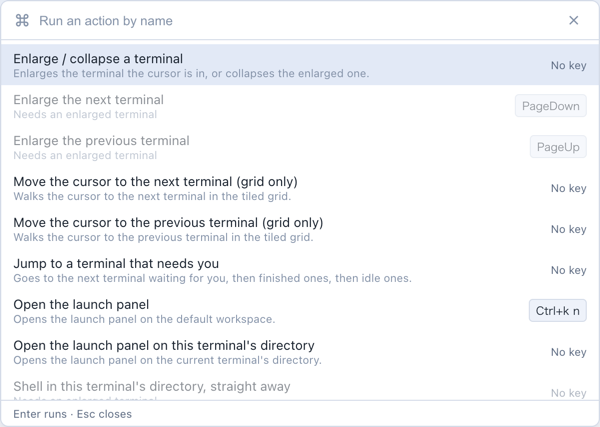
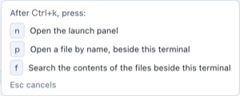
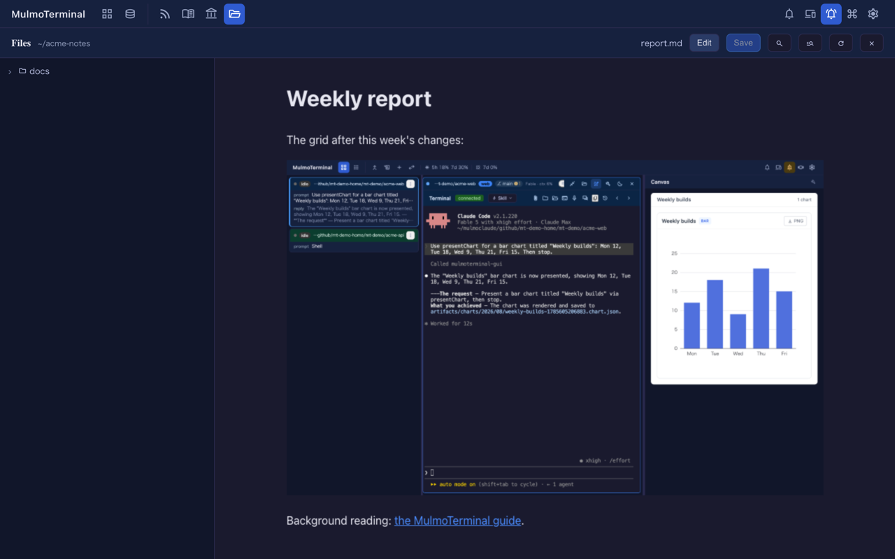

# 6.4.0 — a command palette, two-key shortcuts, and a preview in your theme

**A snapshot as of 6.4.0 (released 2026-09-26).** It will go stale as the app moves on — that is
expected, and the living reference is the guide each section links to.

## A command palette

The toolbar has a new **Commands** button (the ⌘ icon, next to Settings). It lists every grid
action with a one-line description and the key you bound to it, if any. Type part of a name or
the action id (`find`, `zoom`) and press `Enter`; `Esc` closes it.



- An action that cannot run in the current view is greyed out with the reason — "Needs an enlarged
  terminal", for example. Over another view or the launch panel, every row says "Only while the
  terminal grid is in front".
- `copy` and `paste` are not listed: they act on a terminal's selection, from inside it.

**A key for it is not set by default.** Nothing in `keymap` is bound unless you bind it. To open
the palette with VS Code's key, add this to `keymap` in `~/.mulmoterminal/config.json` — on a Mac
the `p` must be **lowercase**, because with Cmd held the browser reports the lowercase letter:

```json
"command-palette": "Cmd+Shift+p"
```

Then **restart the server and reload the tab** — `config.json` is read once at startup.

**How to tell it worked.** The ⌘ button is in the toolbar, and your key opens the list.

The keymap reference: [Keyboard shortcuts](config.html#keymap).

## Two-key shortcuts

A `keymap` binding can be two keys separated by a space, like tmux's prefix or Emacs's `C-x b`.
One first key can lead to several actions:

```json
{
  "keymap": {
    "files-find": "Cmd+k p",
    "files-search": "Cmd+k f",
    "zoom-toggle": "Cmd+k z"
  }
}
```

After the first key, a small box in the bottom-right lists what can follow it:



- `Esc`, any key not in the list, or three seconds ends the wait. None of these keys reaches the
  terminal.
- `copy`, `paste` and `send` take a single key only.
- Give a sequence a first key nothing else uses; the startup check warns and names every binding
  on that key if you don't.
- A binding with a space in it used to be accepted as one key and never fired. It is now reported
  as an error at startup, naming the entry.

More: [Two-key sequences](config.html#keymap-sequence).

## The Markdown preview follows your theme

The Files pane's **Preview** used to follow the OS light/dark setting, so a dark app theme on a
light OS showed a white box. It now uses the app's theme — built-in or your own:



- It follows a theme change at once, and keeps your place in the document.
- The new tab a clicked `.md` opens still follows the OS setting — it has no app to ask.

**How to tell you have it.** With a dark theme and a light OS, press **Preview** on a `.md`: the
document is dark.

## Fixed

- The two-key hint rendered in a serif font; it now uses the app's font.
