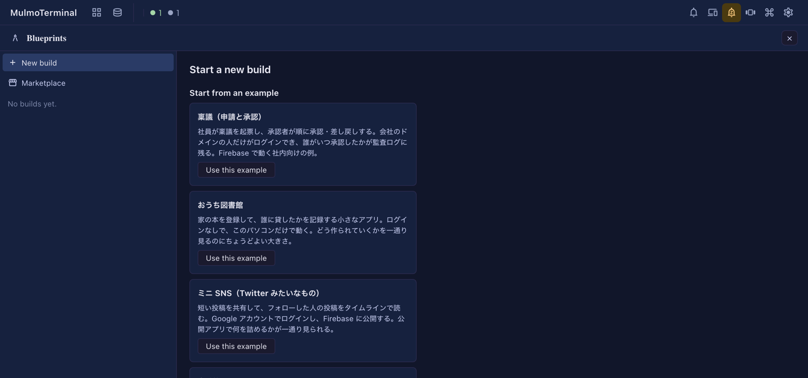
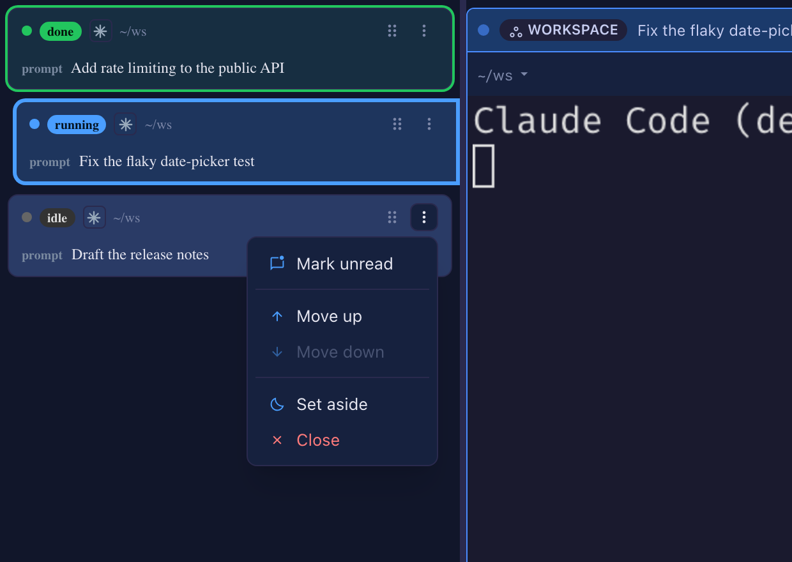

# 6.5.0 — Blueprints (experimental), and marking a session unread

**A snapshot as of 6.5.0 (released 2026-09-27).** It will go stale as the app moves on — that is
expected, and the living reference is the guide each section links to.

## Blueprints (experimental)

The toolbar has a new **Blueprints** button. A blueprint asks you about the app you want, writes
the answers up as a specification, and then has Claude Code build it step by step — each step
checked by a script before the next one starts. It stops only for what a person must decide:
approving the specification, anything that costs money, publishing.

- **Start with a local build.** The `local` base (Express + SQLite + Vue) stays on your machine and
  needs no cloud account. Pick the **おうち図書館** (home library) example to see a whole run.
- **Trust the folder first.** A build runs with nobody watching, so it only starts inside a folder
  Claude Code already trusts, and the folder must not be a git repository.
- **It uses more Claude than a chat** — every step is its own Claude Code session.
- The packs and their questions are in Japanese for now; the screens follow your language setting.
- **Only one MulmoTerminal per machine runs builds.** A second one can show them but refuses changes.

**How to tell you have it.** `npx mulmoterminal --version` says 6.5.0, and the top bar has the
**Blueprints** button.

The whole walkthrough, what to try and how to report back: [Blueprints](blueprints.html).

## Mark a session unread from the roster

When you enlarge a terminal, each row of the cockpit roster now has a ⋮ menu — in every sort order,
not only manual. A right-click anywhere on the row opens the same menu.

- **Mark unread** puts the green *done* colour back on an idle row, so you can come back to it
  later. Only the colour comes back: no sound, no push. Opening the terminal clears it as before.
- **Mark read** clears a row that is waiting on you.
- **Set aside** and **Close** do what the terminal's own header buttons do. **Close** ends the
  session at once, and leaves any worktree on disk.
- **Move up / Move down** are still there in manual sort.

Mark unread and Close sit at opposite ends of the menu, so a slip cannot end a session. None of
this enlarges the row you act on.

**How to tell you have it.** Enlarge a terminal: every roster row has a ⋮, and on an idle row the
first item is **Mark unread**.

More: [Zooming into one (the cockpit roster)](basics.html#zooming-into-one-the-cockpit-roster).

## New in the guide

- [Shared apps](shared-apps.html) now walks through one app from start to finish — taking
  attendance — and says where a shared app meets a MulmoClaude collection.
- Shared apps has a Japanese version.
