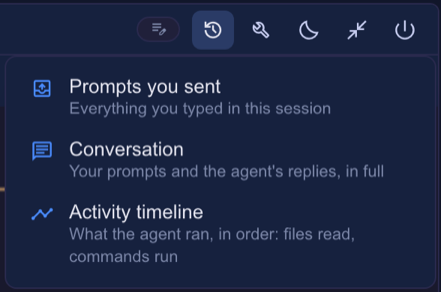
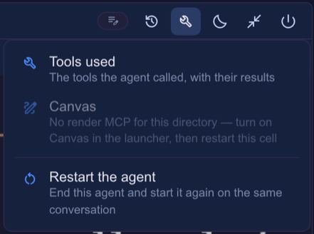
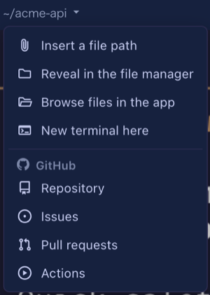

# 6.6.0 — A tidier cell header, and document blueprints

**A snapshot as of 6.6.0 (released 2026-09-29).** It will go stale as the app moves on — that is
expected, and the living reference is the guide each section links to.

Most of this release is the header of a cell, reorganised so that a tiled cell carries fewer icons
and each one says what it is. Nothing needs configuring to get it; the one config change to know
about is at the end of the first section.

## The cell header: History and Tools

Row 1 of a cell now ends **History · Tools · set aside · expand/restore · close**. The five
look-alike pane buttons are gone; each menu lists its views with an icon, a name and one line.



- **History** — *Prompts you sent*, *Conversation*, and the *Activity timeline* (Claude cells;
  it moved here from row 2).
- **Tools** — *Tools used*, *Canvas* (listed but disabled, with the fix, where the directory has no
  render MCP), *Collections* (only where the directory has them), and below a divider **Restart the
  agent** (same conversation, new process).



- The panes open beside an **enlarged** cell. On a tile the menus still show, with only the
  timeline and Restart pickable; the panes say "Enlarge the cell to open this beside it".
- An open pane shows as a pressed menu icon and a checked entry; choosing it again hides the pane.
- **Expand / restore** moved to the right end, next to close. The **+** that sat beside close is gone —
  start terminals from the toolbar's **+** (or `terminal-new-here`).

**If you added a `restart` button yourself** (`run: "action"`, `action: "restart"`), it now duplicates
the Tools menu's entry. Remove it from `buttons` if you like; it keeps working if you leave it.

Living guide: [Reading a cell](basics.html), [Icons and tooltips](header.html#icon-label).

## The path menu, on every cell

Click the directory path on a cell's header for everything to do with that place. It is on agent,
Run command and launcher cells alike (a Run command has no prompt, so no *Insert a file path*).



- **Insert a file path** leads (it used to be the paperclip on row 2); the four file items follow
  the UI language.
- The repository section is headed by where the repository lives: **GitHub** (Repository / Issues /
  Pull requests / Actions) or **GitLab** (Repository / Issues / Merge requests / Pipelines — for
  gitlab.com and any host in `gitlabHosts`).
- The **Files** button on row 1 is gone; *Browse files in the app* opens the same pane.

Living guide: [The path menu](header.html#path-menu).

## Header buttons: folders and GitHub icons

Row 2 is yours to configure, and two things are new. A **folder** groups buttons under one icon
(one level only), and an `icon` can name one of GitHub's own shapes with `github:<name>` —
`repo`, `issue-opened`, `git-pull-request`, `play`, `mark-github`.

```json
{
  "buttons": [
    { "id": "pr", "icon": "github:git-pull-request", "label": "Open this branch's PR", "run": "open", "when": "isGitRepo", "open": { "pr": true } },
    { "id": "ops", "icon": "construction", "label": "Operations", "items": [
      { "id": "test", "icon": "science", "label": "Run the tests", "run": "shell", "cmd": "yarn test" },
      { "id": "compact", "icon": "compress", "label": "Compact this conversation", "run": "input", "text": "/compact" }
    ] }
  ]
}
```

Put it in `~/.mulmoterminal/config.json` (every terminal) or a project's `.mulmoterminal.json`, and
restart MulmoTerminal. The default row 2 is now just *Open this branch's PR* (shown when the branch
has one) — *Insert a file path* moved to the path menu.

Living guide: [Group buttons into a folder](header.html#folder), [Icons and tooltips](header.html#icon-label),
[Customizing the header](config.html#header).

## Toolbar

- **Rooms, Blueprints and Worklog** are behind one menu (the widgets icon), each with a line saying
  what it is. Entries for something not set up (no room yet, the worklog off) are left out.
- **Pull requests** shows GitHub's mark, and appears only once a repository is configured.
- The **grid ordering** button opens a menu of Auto / Manual / Priority with the current one
  checked, instead of cycling on each click.
- **Accounting** moved onto the Collections screen.
- Every icon's tooltip shows **at once** on hover, not after the browser's delay.

Living guide: [Configuration](config.html).

## The cockpit roster and the filmstrip

- In **manual** order, drag a roster row by its **header** — the separate drag handle is gone. The
  row's ⋮ still has Move up / down for the keyboard.
- A **filmstrip thumbnail** (the strip under an enlarged cell) now has the same ⋮: mark unread /
  read, move left / right, set aside, close.
- Closing from the ⋮ or the keyboard asks keep / remove for a worktree cell, as the cell's own close
  does.
- New keymap action **`mark-unread`**: the ⋮'s *Mark unread / read* from the keyboard. It is unbound
  until you bind it.

Living guide: [Zooming into one](basics.html), [Keyboard shortcuts](config.html#keymap).

## Blueprints: documents, not only apps

Choose the base 文書のフォルダ (a folder of documents) and a blueprint works on writing, checked by
chaff (fetched on its own; nothing to install). New kinds: **style** (take a house style from model
texts), **write**, **polish**, **review** (a contract's missing references and contradictions,
quoted), **verify** (an itinerary's weekdays, order and totals, checked by machine) and **ask**
(answers with where in the document they are written).

- 「例から始める」 has document examples with sample documents placed in the folder, so you can try
  them without documents of your own.
- A finished build shows its **report** in the run view, and lists the **files it changed** — each
  opens in the Files view with one click.
- Refusals and the executor's own step notes are shown in your language.
- Builds that share a folder each keep their own answers, and two never run there at once.
- A folder inside a git worktree is trusted through its main repository, as Claude Code does.

Living guide: [Blueprints](blueprints.html) (see "What we would like you to try").

## Node.js too old

`npx mulmoterminal` on Node older than 22.12 now stops at once with a banner and the upgrade steps,
instead of starting a server that died with `bad option`.

Living guide: [Getting started](getting-started.html).
