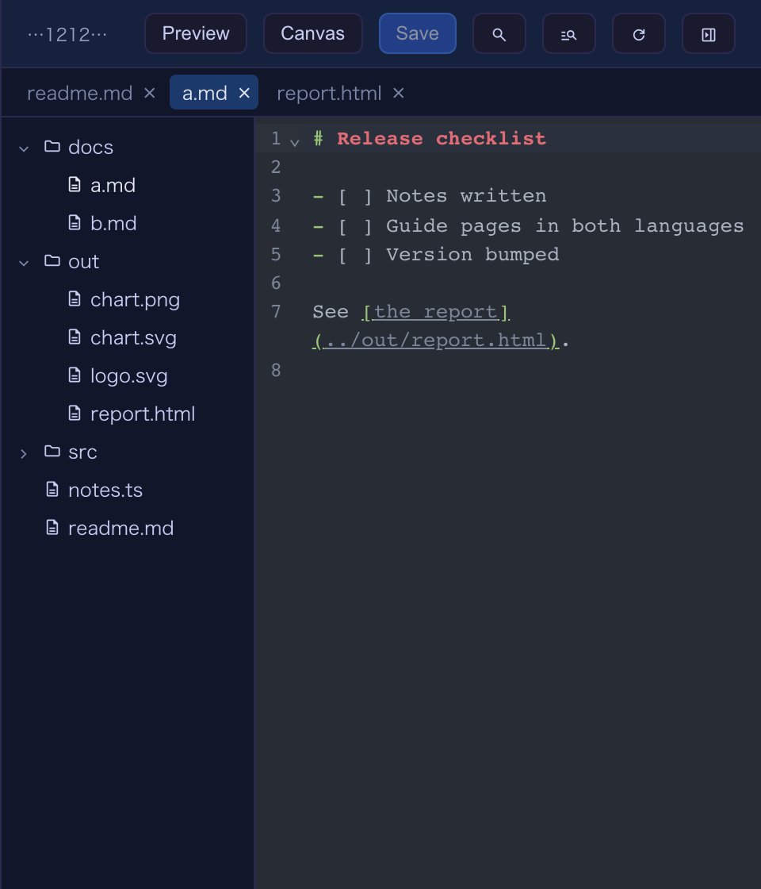
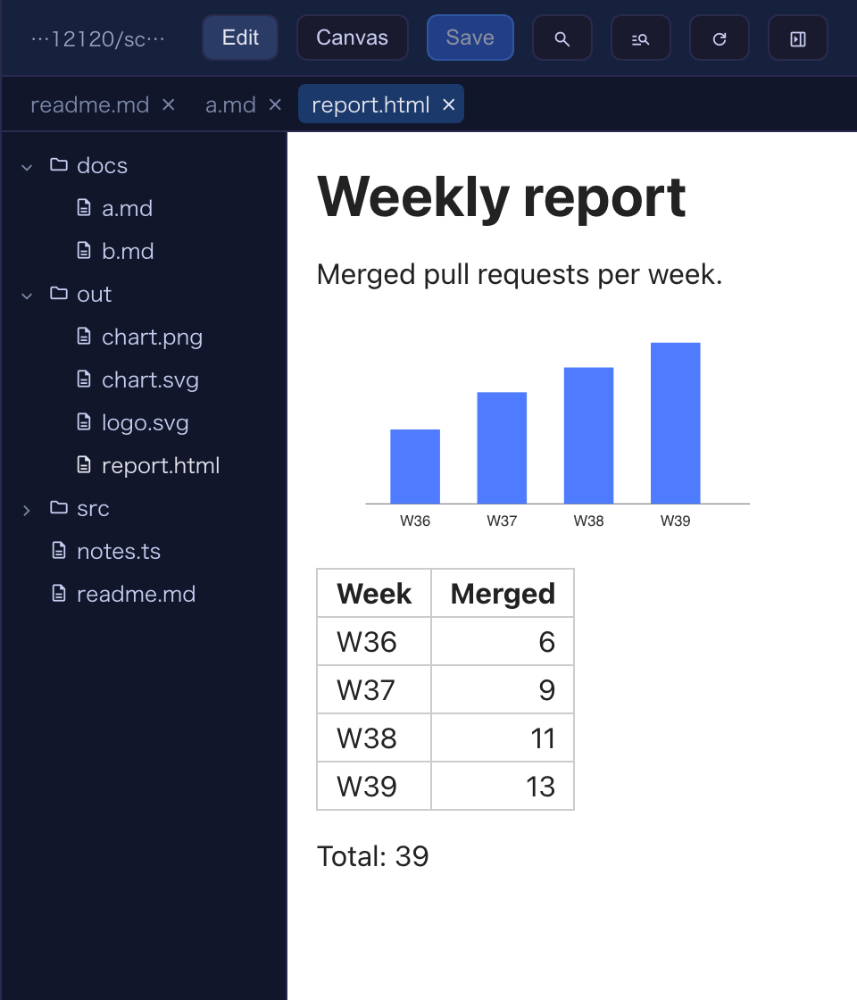

# 6.8.0 — Tabs and HTML previews in the Files pane, and a command palette that reaches everything

**A snapshot as of 6.8.0 (released 2026-09-29).** It will go stale as the app moves on — that is
expected, and the living reference is the guide each section links to.

Nothing needs configuring. The only optional steps are the Files pane tab keys and palette-only
`commands`, both below.

## The Files pane: tabs, links and HTML previews

Enlarge a cell and open its Files pane (the **folder** toggle in the header), as before.

**Several files as tabs.**

- A plain click in the tree still **replaces** the file in front — if you never ask for a tab, the
  pane looks exactly as it did.
- **Cmd+click** a file (Ctrl+click on Windows and Linux), or pick **Open in a new tab** from its
  right-click menu, to open it in a new tab. On a Mac, Ctrl+click is a right-click, so use Cmd+click.
- The tab strip appears under the header once **two** tabs are open. Two files with the same name are
  labelled with their parent folder (`a/index.ts`, `b/index.ts`); hover a tab for its full path.
- Switching tabs **saves the file you leave**, and each tab comes back where you were in it (editor or
  Preview, cursor, scroll).
- A file that already has a tab is not opened twice — the tree, the finder, search and a path clicked
  in the terminal all go to that tab.
- Close a tab with its **×**, a middle click, or **Delete** while it has focus; ←/→ (and Home/End)
  move between tabs.



**Keys for the tabs (optional).** Three new actions have **no default binding**:
`files-tab-close`, `files-tab-next`, `files-tab-prev`. They work while a terminal is enlarged and its
Files pane is open; with the pane closed they do nothing (they do not open it). `files-tab-close` can
also close the last tab, leaving the pane empty. They are listed in the command palette already
(greyed out with "Needs the Files pane open" when the pane is closed). To bind keys, add them to
`keymap` in `~/.mulmoterminal/config.json`, restart the server, then reload the browser tab:

```json
{
  "keymap": {
    "files-tab-close": "Cmd+k w",
    "files-tab-next": "Cmd+k ]",
    "files-tab-prev": "Cmd+k ["
  }
}
```

These are two-key sequences: press `Cmd+k`, then the second key. Off a Mac, pick a first key your
browser lets through instead of `Cmd+k`. VS Code's `Cmd+W` / `Ctrl+W` and `Ctrl+Tab` cannot be used —
the browser keeps them.

**Links in a Markdown Preview.** A link to another file (`./b.md`, `../README.md`) now opens in a
**new tab** of the pane — in Preview when it is Markdown — instead of a broken page. A link starting
with `/` is read from the pane's root folder. A link above the pane's folder is not opened; the pane
says so.

**HTML pages and images.**

- An `.html` file opens as text, with a **Preview** that shows the page itself. It is sandboxed: its
  scripts run but cannot fetch; images beside it load, a relative stylesheet or script does not. The
  Preview has a white background, as a browser would.
- An `.svg` gets a Preview that draws it.
- A PNG, JPEG, GIF or WebP shows as the picture (**Open in OS** is still there), even a screenshot too
  large to edit. A chart that is redrawn is fetched again.
- A path to any of these clicked in the terminal opens in the pane when the pane is up; an HTML page
  or an SVG comes up in its Preview. PDF and video still open in a browser tab.
- In the full-screen `/files` view, a picture or page outside the workspace and the running sessions'
  directories is refused, as before; the text still opens.



How to tell it worked: Cmd+click two files in the tree and the tab strip appears; ask an agent for an
HTML report, click its path in the terminal, and the page shows beside the terminal.

Living guide: [Editing files beside a terminal](features.html#editing-files-beside-a-terminal).

## The command palette reaches everything

Open the palette with the toolbar's **Commands** button, or your `command-palette` key — which now
works **on every screen**, not only the grid (a single key; a two-key sequence still works on the
grid only). Besides the grid's actions it now lists:

- **Screens** — Grid view, Collections, Feeds, Accounting, Files, Wiki, Pull requests, Rooms,
  Blueprints, Worklog (Pull requests, Rooms and Worklog only when set up). Picking one goes there.
- **Terminals** — by path: type part of it (`term4` finds `~/ss/llm/mulmoterminal4`); the memo and
  summary are searched too. Picking one goes to it.
- **Settings sections** — "Open in Settings" on each section.
- **Switches** — theme, the app's language, sound, the enlarged view (roster or thumbnail strip) and
  the cell order. The one in effect says "Current".
- **The acting terminal's header buttons and `commands`** (see below). The acting terminal is the
  enlarged one, else the one holding the cursor.
- **Collection actions** — every collection's own actions ("Invoices: Summarise"), which start the
  chat the collection's button would.
- **New terminal: <dir>** — the workspace and each recent directory, opening the default agent there
  (Claude when your default is a custom agent).
- **Start <agent> here** for each Agent Picker option (your custom agents and Shell included) and
  **Launch: <label>** for each of your `launchers`, in the acting terminal's directory (the workspace
  when there is none), placed next to it. They start with the default model and account.
- **Resume: <title>** — past conversations of that directory, leaving out one already open or held
  elsewhere.
- **Wiki: <title>** — each Wiki page, found by its title, slug, description or tags.

While the grid is full, the rows that open a terminal are greyed out with the reason.

**Narrow the list with a leading symbol:** `>` shows only what runs (actions, commands, collection
actions and the new / start / launch / resume rows), `@` only terminals, and `?` lists the symbols.
`/text` opens the Files pane's **find by name** with `text` already typed, and `#text` opens **search
in files** and runs it — while a terminal is enlarged, as for those two actions.

**Palette-only commands.** Something you run now and then does not need a header button. Write it
under `commands` instead of `buttons` — exactly the same shape — in `~/.mulmoterminal/config.json` or
the project's `.mulmoterminal.json`:

```json
{
  "commands": [
    { "id": "release", "label": "Cut a release", "run": "shell", "cmd": "yarn release" }
  ]
}
```

It appears only in the palette, runs for the acting terminal as the same button would, and a
command whose id a button already has is dropped.

Living guide: [Keyboard shortcuts](config.html#keymap) (the `command-palette` row) and
[Commands for the command palette only](header.html#commands).

## Tooltips in your language, now the toolbar too

The toolbar's hover tips and screen-reader labels — its buttons, notifications, remote host, load
gauge, sound and star buttons, the grid-status strip — and the rate-limit gauge's hover and notes now
follow the UI language in all five languages. That completes the work begun in 6.7.0: Settings, the
grid's status words and every button's hover tip and screen-reader label are translated; the rest of
the app's words are still English. Nothing to configure.

Living guide: [Settings modal](config.html#settings-modal).

## `init` says when Node or Claude Code is behind

Run it as before:

```bash
npx mulmoterminal@latest init
```

It now compares your Node with the latest LTS of the same major, and Claude Code with its `stable`
release on npm. When either is behind, it prints how to update under the existing line — for Node,
your install tool's upgrade commands; for Claude Code, `claude update` for the native installer, or
the npm command for a global npm install (both when it cannot tell). Offline, it prints one `○` line
saying it could not check, and carries on. Starting MulmoTerminal normally does not run this check.

Living guide: [Check your machine — `init`](getting-started.html#init).

## Blueprints: documents

- **Review gates say what to read.** When a document build stops with 「承認が必要です」 (approval
  needed), **Read these before approving** lists the files to check; click one to open it. The gate
  no longer asks for a specification a document build does not write, and it names the step your
  approval lets start.
- **Readable, not JSON.** What a gate lists — findings, facts, the outline, the gathered model texts,
  the polish list — is a plain-text view (`.blueprint/findings.txt`, `facts.txt`, `outline.txt`,
  `sources.txt`, `polish.txt`). A build started before this release still points at the JSON.
- **The build list names what each build makes** (「文書を読み解く」, 「事実を確かめる」, …), so two
  builds in one folder can be told apart.
- **Writing, then polishing, starts filled in.** After 文書を書く (write) finishes, **What to do next**
  offers 文書を整える (polish) with the documents just written, the same style, 「手引き（STYLE.md）の
  決まりにも合わせる」 (follow the guide too) and a file limit already filled in — press **Start**.
- Document packs run chaff 0.11.

Living guide: [Blueprints — Documents](blueprints.html#documents).

## Blueprints: the new-build form

- **Project folder** offers the folders of your earlier builds and the folders saved in MulmoTerminal
  when you click it. Typing a path still works.
- **An untrusted folder.** If **Start** is refused because Claude Code does not trust the folder,
  press **Open Claude Code here** under the message: a new terminal opens where the trust counts, and
  you answer Claude Code's prompt yourself. Come back to Blueprints and what you had filled in is put
  back — press **Start** again. A build that stops for the same reason partway through shows the same
  button on its run view; after answering, select the build and press **Try again**.
- A form that opens filled in (from **What to do next**, or on coming back) scrolls to the filled
  part, and the example cards now tile across the pane.

Living guide: [Trust a folder for the builds first](blueprints.html#trust).

## Blueprints: web apps end with a security review and a start page

On the `local` and `firebase` bases:

- Just before the end comes a **Security review** step (セキュリティ診断). The agent reviews the app against OWASP Top
  10:2025, fixes what it can, and writes `.blueprint/security-review.md`. On local, the check starts
  the app and sends it what an attack would (a foreign `Host`, a change from another site, a malformed
  JSON body) and requires each to be refused, and audits the dependencies. On Firebase the review
  comes before publishing to production and ends by redeploying dev.
- **Every step is done.** is followed directly by **how to start using the app**
  (`.blueprint/start-here.md`): how to start it and the address to open, a checklist that tries each
  must-have, and where the data is. On Firebase, the production URL and how to make the next change.
  A build finished before this release has no such page, and the section is simply not shown.

Living guide: [Your first build: "おうち図書館" (home library)](blueprints.html#your-first-build-おうち図書館-home-library).

## Blueprints: from a collection to an app

Choose **コレクションからアプリにする** (from a collection) as the kind, then pick a collection in the
workspace under 元にするコレクション (the source collection). Pressing **Start** copies the shape of
that collection, and of every collection it links to, into `.blueprint/source/` of the new folder, and
the build writes a local app from it. The collection itself is not changed. For now only the shape is
copied — not the records — and a shared app's collections cannot be picked yet.

Living guide: [From a collection to an app](blueprints.html#from-collection).

## Shared apps: publishing no longer drops people silently

If a publish would take people off the live roster — for example, another owner invited someone and
your `app.json` predates it — the agent's publish now **names them, with their roles, and stops**.
Publish again with the removals confirmed only if you mean it; otherwise update `app.json` first.
`check` names the same people, and a successful publish lists who was removed. Ask the agent as
before; nothing to configure.

Living guide: [Publish, and afterwards](shared-apps.html#publish-and-afterwards).

## Fix: the roster menu in the light themes

In Daylight and Solarized Light, the hovered item in a roster row's ⋮ menu was unreadable (a dark
hover under dark text). It now uses the theme's hover colour. To check, switch to Daylight, enlarge a
cell, and hover an item in a roster row's ⋮ menu.

Living guide: [Make your own colour scheme](config.html#custom-themes).
