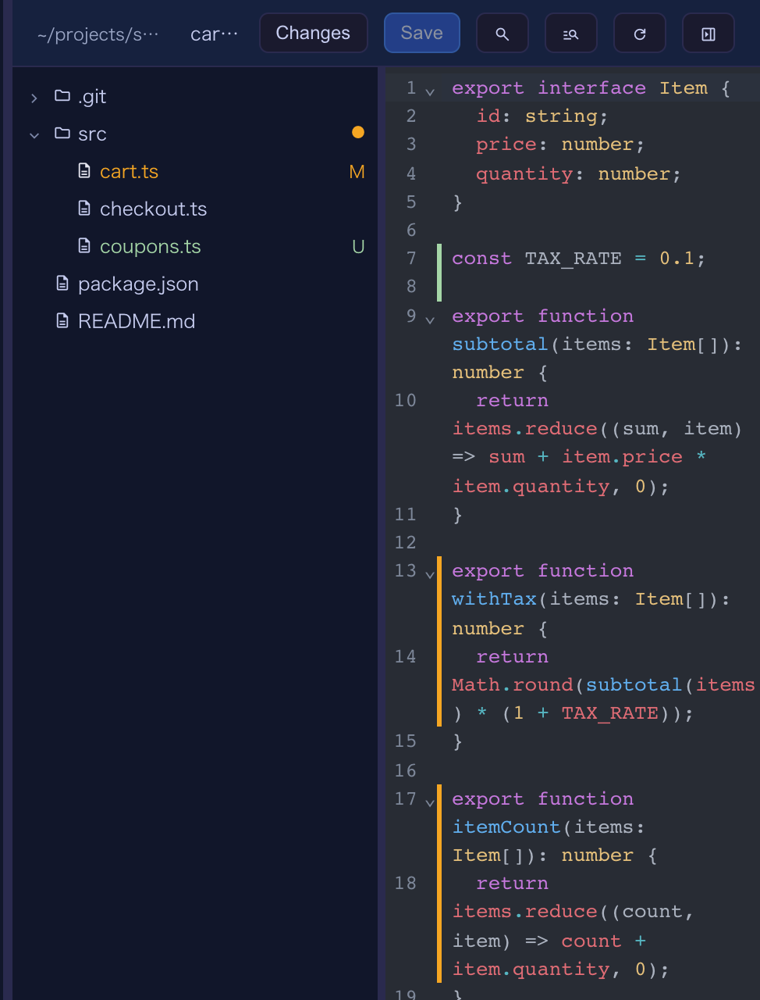
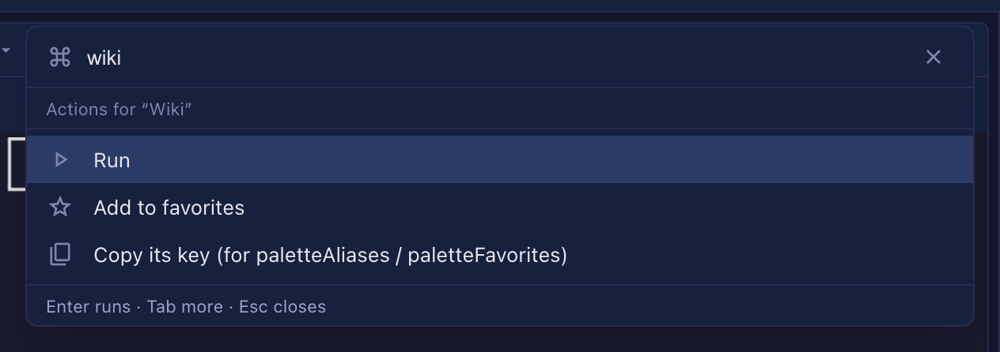

# 7.0.0 — What changed in the Files pane, and a command palette that learns what you use

**A snapshot as of 7.0.0 (released 2026-09-29).** It will go stale as the app moves on — that is
expected, and the living reference is the guide each section links to.

Nothing needs configuring. The only optional step is writing palette aliases and favorites in the
config file, below.

## The Files pane shows what changed

Enlarge a cell and open its Files pane (the path menu's **Browse files in the app**, or the **folder**
toggle), as before.

**In the tree**, inside a git repository, a changed file carries a letter and a colour: **M** (amber)
modified, **A** added, **U** untracked and **R** renamed (green). A folder holding a change carries an
amber dot, so a collapsed tree still says where an agent has been writing. It refreshes when the tree
loads or is reloaded, when a file is saved, and every 30 seconds while the page is visible.

**In the editor**, a bar beside the line numbers marks what changed since the last commit: green for
new lines, amber for changed ones, and a notch where lines were removed. It follows your typing.
Press **Changes** in the pane's header to see the removed lines in place, as a diff; press it again to
hide them. A file that is new or outside git has no marks and no **Changes** button.



Also in the pane:

- **The tree follows the tab in front.** Switching tabs (or opening a file from a link or a path in the
  terminal) opens that file's folders and brings its row into view.
- **The tree can be resized.** Drag the line between the tree and the editor, or focus it and use the
  arrow keys, Home and End. The width is remembered. A name too long for the tree shows in full when
  you hover it.

How to tell you have it: open the pane in a repository with an uncommitted change — the file shows
**M** and its changed lines have a bar.

Living guide: [Editing files beside a terminal](features.html#editing-files-beside-a-terminal).

## The command palette learns what you use

Open the palette with its key or the toolbar's **Commands** button, as before.

**New rows:**

- **PRs and Issues.** Where the GitHub view is set up (Settings → Pull request repos), the open PRs and
  Issues of those repos are listed as "PR #12: …" / "Issue #34: …", found by title, repo or number.
  Picking one opens it in a new tab (GitHub, or GitLab for a GitLab repo). Type the number bare (`12`)
  or after the repo (`app#12`): a leading `#` searches file contents. The list is read on the first
  opening and reused for a few minutes.
- **Your past prompts.** The recent prompts sent in the terminal the palette acts on are listed, newest
  first, as "Prompt: <first line>", found by any of their text. Picking one brings that terminal forward
  and puts the prompt back at its input **without sending it**, so you can edit it first.

**Ordering.** Rows you pick often and recently come first — with nothing typed, and among rows that
match equally well. A worse match is never lifted over a better one. This is remembered per browser,
only once a pick has actually run, and not for rows that point somewhere different next time
(terminals, launchers, a terminal's commands, collection actions, Wiki pages, the sound switch, past
prompts, and the `/` / `#` rows).

**A second panel of actions — press Tab.** With a row selected, **Tab** shows what else you can do
with it: **Run**, **Add to favorites** / **Remove from favorites**, and **Copy its key**. Esc (or
Shift+Tab) goes back to the rows.



**Aliases and favorites (optional).** Both live in the global config, `~/.mulmoterminal/config.json`,
and name a row by its key — which the second panel's **Copy its key** gives you:

```json
{
  "paletteAliases": { "wk": "screen:wiki", "z": "zoom-toggle" },
  "paletteFavorites": ["screen:wiki", "settings:theme"]
}
```

- Typing an alias exactly (case and surrounding spaces do not count) puts its row first.
- With nothing typed, favorites come first, in the order written. **Add to favorites** in the second
  panel writes this list for you, one entry at a time, keeping entries added elsewhere.
- Merge these into your existing file rather than replacing it, then restart the server and reload the
  tab. A key that names no row is ignored.

The `mulmoterminal-keys` skill has the full table of row keys and can write these for you.

Living guide: [Keyboard shortcuts (`keymap`)](config.html#keymap), whose `command-palette` row
describes the palette.

## Fix: the Run / Skill / Mulmo menus stay inside the window

In a session cell's second header row, the **Run**, **Skill** and **Mulmo** dropdowns opened in place,
so near the cell's right edge they were cut off. They now open under their button, kept inside the
window, and a long list scrolls without closing. To check, open **Skill** on the rightmost cell of a
row.

## Blueprints: from a collection's records, to Firebase, and from a shared app

- **Records come along.** A build from a collection can copy its records, and the images and files they
  point at, and move them into the local app. The move is checked by machine against the source.
  Records may hold personal data, so the question has no default.
- **Firebase too.** The same build runs on the Firebase base: records go to Firestore and files to Cloud
  Storage, into the emulators first, then into production after a second approval, with your own
  Google sign-in.
- **A shared app as the source.** A folder with an `app.json` and shared collections is listed under
  Shared apps in the source picker, and its declaration of who may do what is carried into the spec.
- **Smaller fixes.** A later step hears what you decided in an earlier one; an answer or a review names
  a place the way the document does ("Section 3.2", 「…」) instead of chaff's address; a build does not
  start in, or write through, a `.blueprint` folder that is a link; the guide says which language the
  screen and the packs use; the document packs run chaff 0.13.

Living guide: [From a collection to an app](blueprints.html#from-collection).
