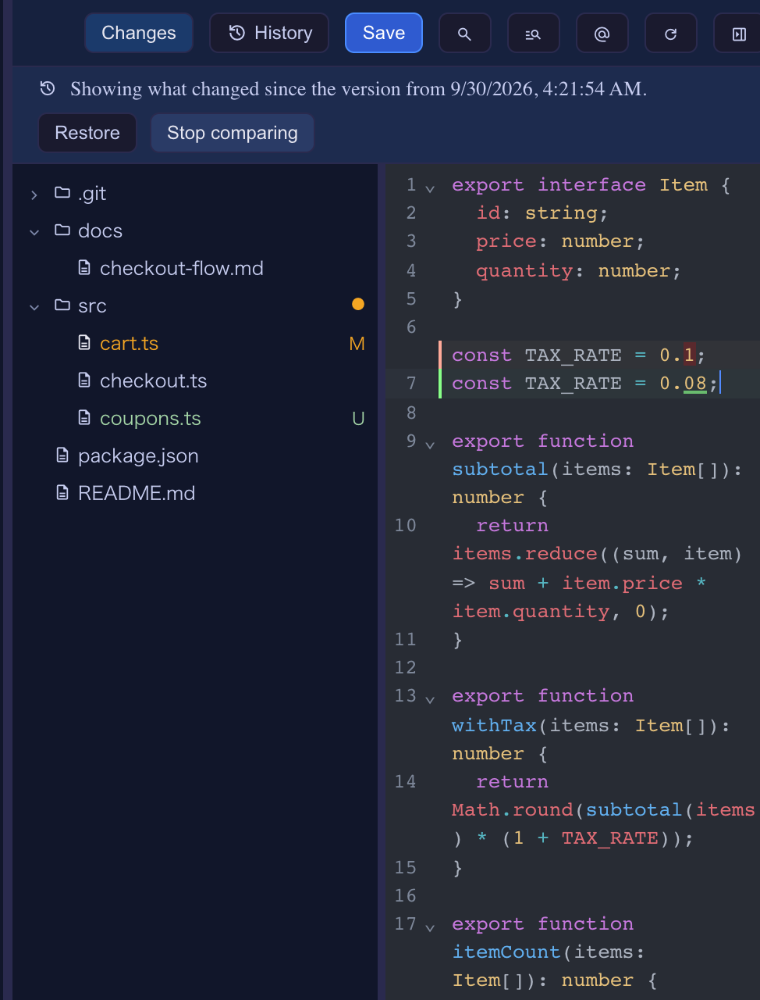
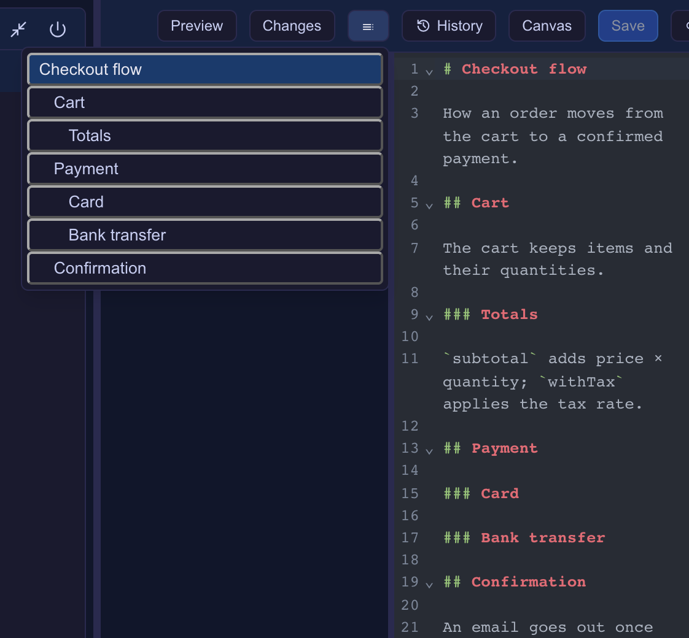
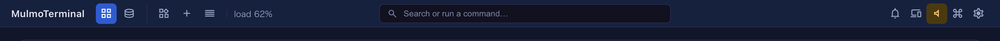

# 7.1.0 — The Files pane keeps history, outlines Markdown and points the agent at lines

**A snapshot as of 7.1.0 (released 2026-09-30).** It will go stale as the app moves on — that is
expected, and the living reference is the guide each section links to.

Nothing needs configuring. The optional steps are binding the new `focus-mode` and
`files-insert-selection` actions, and switching on the top bar's search box — all below.

## The Files pane: history, outline, tables, and lines for the agent

Enlarge a cell and open its Files pane (the path menu's **Browse files in the app**), as before.

**History.** The pane already kept copies of a file (when it opens, before it is overwritten, and a
buffer a conflict reload throws away), but nothing read them back. **History** in the pane's header now
lists them, newest first:

- **Compare** marks what changed against that version instead of against the last commit, with the
  removed lines shown, and a banner naming the version with **Restore** and **Stop comparing**.
- **Restore** puts that version in the editor **as an edit**: it can be undone, the file is marked
  unsaved, and saving keeps the text you replaced as a version too.



**Outline** (Markdown files). The **Outline** button in the header (a list icon) shows the file's headings, indented by
level, with the one you are under marked. Picking one goes there — the line in the editor, or the
heading in the Preview.



**A table for CSV / TSV.** A `.csv` or `.tsv` now has a **Preview** like Markdown's, drawn as a table
in the app's colours.

**Point the agent at the lines you selected.** Select some lines and press **@** in the pane's header:
`@path#L12-18` (or `#L12` for one line, or the path alone with nothing selected) is typed at the cell's
prompt, unsent. Unsaved edits are saved first, since the agent reads the file on disk. The keymap
action `files-insert-selection` does the same (no default binding).

Living guide: [Editing files beside a terminal](features.html#editing-files-beside-a-terminal).

## Clicking a path in the terminal

- **`path:line` opens at that line.** `src/a.ts:42`, `src/a.ts:42:7` (gcc, eslint, `grep -n`) and
  `src/a.ts(12,5)` (tsc) are now one link, and the file opens with the caret there.
- **An HTML path opens as the page.** With no Files pane up, clicking an `.html` path an agent printed
  used to show its source; it now opens the rendered page.

## Focus mode: the browser's tab keys for your keymap

A browser keeps `Cmd`/`Ctrl`+`W`, `T` and `N` for itself, so a binding on one never fires. The new
action **`focus-mode`** puts the app full screen and, where the browser has Keyboard Lock (Chrome, Edge,
Arc — on `https` or `localhost`), hands **only those tab keys** to your keymap. `Esc` leaves, as always.
A note at the bottom says whether the keys were handed over, and why not when they were not.

Bind it in `keymap` (it has no default binding), or pick **Focus mode** in the command palette on the
Terminals screen:

```json
{ "keymap": { "focus-mode": "Ctrl+Shift+f" } }
```

**Settings now says which keys a browser keeps.** In Settings → Keyboard shortcuts, a binding the
browser keeps on your platform carries a **never fires** mark (its tip names a way out), and a note
under the list names those keys. The server's startup check warns about them too.

Living guide: [Keyboard shortcuts (`keymap`)](config.html#keymap).

## A search box in the middle of the top bar (opt-in)

Switch on **Search box** in Settings → **Grid header read-outs** (`paletteSearchBox`), and the top bar
shows, on every screen, a box that opens the command palette. It is off by default; the **Commands**
button and the palette's key are unchanged. On a narrow window the box shrinks, and it is left out
below tablet width.



## Fix: the Markdown Preview's messages

The Files pane now listens only to the Markdown Preview document it asked for. A Markdown file could
navigate its own preview frame and send the pane messages as if it were the preview; each preview now
carries its own token, and messages without it are dropped. Nothing to configure.

## Blueprints

- **A Cloudflare base.** A Worker serves the API, D1 holds the data and the same Worker serves the Vue
  screen, checked locally with `wrangler dev` before publishing. **From a collection** runs on it too,
  moving records into D1 and files into R2.
- **The build list puts what waits for you first**: waiting for you (an approval, an answer, a stop),
  in progress, and done.
- **Documents**: the facts view writes `$320` and `(Thursday)` for an English document; a weekday
  mismatch records the actual weekday the way the document writes it; a time range with AM/PM once
  keeps both times; a total's difference is stated the right way round; an answer about a contract
  names the paragraph the way the contract does; every rule a style turns on is shown firing; the
  document packs run chaff 0.14.
- **Smaller fixes**: the new-build form opens on the documents base again, whatever order the disk
  lists the packs in; a form kept while trusting a folder survives a reload; builds keep TypeScript at
  6, which the actions check needs.

Living guide: [From a collection to an app](blueprints.html#from-collection).
