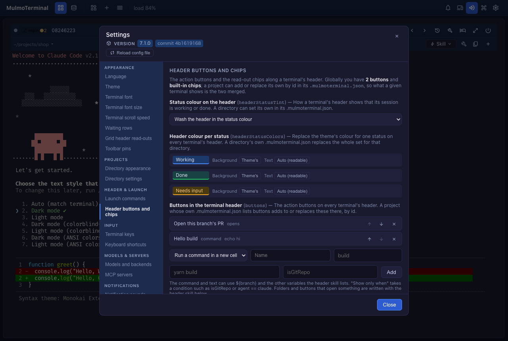
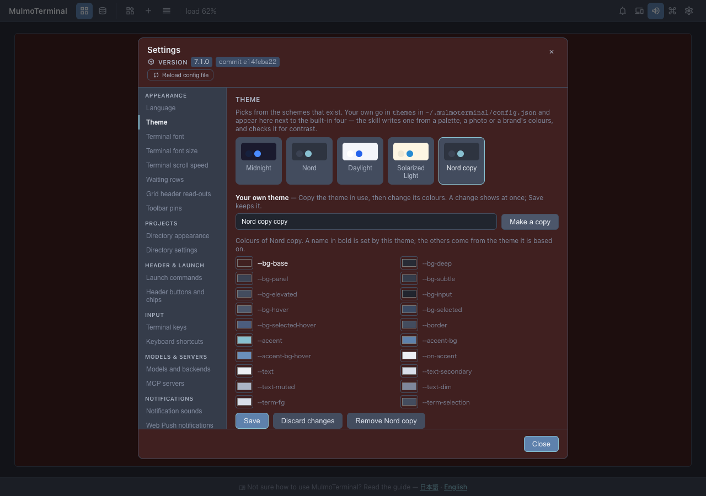

# 7.2.0 — Change settings in Settings instead of asking the agent

**A snapshot as of 7.2.0 (released 2026-09-30).** It will go stale as the app moves on — that is
expected, and the living reference is the guide each section links to.

Nothing needs configuring. Everything below is either on screen already or a control in **Settings**
(the gear at the top right). Settings that used to need a conversation with an agent — the header,
the models, your keys, your own theme — now have a control of their own. The skills are still there
for what a form cannot do, such as designing a theme from a photo.

## New features

### The header: buttons, chips and status colours

**Settings → Header buttons and chips** now changes, for every terminal:

- **Buttons** ([#2680](https://github.com/receptron/mulmoterminal/pull/2680)) — add one that **runs a
  command in a new cell** or **types text into the agent** (`/compact`), with an optional icon and a
  condition such as `isGitRepo`. The arrows move a button and the cross removes it. **Back to the
  built-in button** puts the PR button back. Folders and buttons that open something are still written
  as before ([the header guide](header.html#first-button)).
- **Chips** ([#2672](https://github.com/receptron/mulmoterminal/pull/2672)) — add a built-in read-out
  (branch, context left, tokens, …) or text of your own, remove one, move one, or go back to the
  default set.
- **Header colour per status** ([#2640](https://github.com/receptron/mulmoterminal/pull/2640)) — a
  background and a text colour for *working*, *done* and *needs input*, with a sample header beside
  each. **Status colour on the header** ([#2632](https://github.com/receptron/mulmoterminal/pull/2632))
  chooses how the status shows at all.

The open terminals change as soon as you press a button — no reload.

### Your own theme

**Settings → Theme → Your own theme** ([#2673](https://github.com/receptron/mulmoterminal/pull/2673)):
pick the theme closest to what you want, press **Make a copy**, then change any colour with the picker
next to it. The whole app repaints as you choose, so you judge it on the real screen. **Save** keeps
it; closing Settings without saving puts the saved colours back; **Remove** deletes the copy. The theme
skill is still the way to design one from a mood or a picture
([custom themes](config.html#custom-themes)).

### Models, agents and accounts

In **Settings → Models and backends**:

- **Default agent** ([#2632](https://github.com/receptron/mulmoterminal/pull/2632)) — what a new
  terminal starts, from a list.
- **Custom agents** and **accounts** ([#2649](https://github.com/receptron/mulmoterminal/pull/2649))
  — add one with a name and a command (or a config directory), remove one with its cross.
- **Backends** ([#2665](https://github.com/receptron/mulmoterminal/pull/2665)) — add OpenRouter, a
  company gateway or a local model with its URL, the *name* of the environment variable holding the
  key, and the model ids. The form refuses a URL ending in `/v1` and a pasted key, the two mistakes that
  break a session silently ([backends](config.html#providers)).

The Agent Picker follows at once. Playful effects is now an on/off switch under **Theme**.

### Keyboard shortcuts by pressing them

**Settings → Keyboard shortcuts** ([#2668](https://github.com/receptron/mulmoterminal/pull/2668)):
press **Change** on an action, then the keys you want. **Clear** unbinds it. A key that cannot be
written in a binding (the space bar, a numpad key, `+`), or one that would clash with another binding,
is refused with the reason. **Recommended keys**
([#2642](https://github.com/receptron/mulmoterminal/pull/2642)) lists a starter set for your platform
and adds it with one button ([keymap](config.html#keymap)).

### A directory's own settings, in the Files pane

- **Settings → Directory settings** ([#2676](https://github.com/receptron/mulmoterminal/pull/2676)):
  expand a directory and press **Open in Files** beside its `.mulmoterminal.json`. Where it has none,
  **Create .mulmoterminal.json and open it** writes an empty `{}` first.
- The editor **knows the file** ([#2670](https://github.com/receptron/mulmoterminal/pull/2670)): it
  offers the keys as you type (`Ctrl+Space`) and underlines a value the server would reject.
- **Save applies it at once** ([#2659](https://github.com/receptron/mulmoterminal/pull/2659)), and a
  note under the editor says whether the file is JSON and which keys did not take
  ([per-project settings](config.html#per-dir)).

### Reload config.json without a restart

The **Reload config file** button under the version at the top of Settings
([#2663](https://github.com/receptron/mulmoterminal/pull/2663)) reads `~/.mulmoterminal/config.json`
again after you or an agent edited it by hand. A file that does not parse, or a keymap that would stop
the server, is refused with the reason and the running settings stay.

### More in the Files pane

- **New file, New folder, Rename, Move to Trash** in the tree's row menu (right-click)
  ([#2637](https://github.com/receptron/mulmoterminal/pull/2637)). On macOS, drag a trashed item back
  out of the Trash; Finder's *Put Back* does not know where it came from
  ([#2646](https://github.com/receptron/mulmoterminal/pull/2646)).
- **Editor and Preview side by side** for Markdown — the split icon next to **Preview**. The Preview
  follows the heading you are editing under
  ([#2629](https://github.com/receptron/mulmoterminal/pull/2629)).
- Code blocks in the Preview are **coloured**
  ([#2613](https://github.com/receptron/mulmoterminal/pull/2613)) and have a **copy** button that shows
  the file's own text before copying it ([#2664](https://github.com/receptron/mulmoterminal/pull/2664)).

### One name for every operation

Each thing you can do to a terminal — open its Files pane, its prompts, its transcript, its tools,
copy its last code block, insert a path, reveal the folder, dictate, show its diff, write a note, park
it, … — now has **one name** that works three ways: as a header button (`"run": "action"`), as a
keyboard shortcut in `keymap`, and as a row in the command palette
([#2614](https://github.com/receptron/mulmoterminal/pull/2614),
[#2636](https://github.com/receptron/mulmoterminal/pull/2636),
[#2656](https://github.com/receptron/mulmoterminal/pull/2656)). The toolbar's screens and switches
([#2648](https://github.com/receptron/mulmoterminal/pull/2648)) and the grid's page tabs
([#2660](https://github.com/receptron/mulmoterminal/pull/2660)) have names too
([header actions](header.html#run-action)).

### The server on another machine (experimental)

Run MulmoTerminal on a Linux box or a VPS and use it from your laptop's browser through an SSH tunnel
([#2671](https://github.com/receptron/mulmoterminal/pull/2671)). Started inside an SSH login, it prints
the `ssh -L …` command to run on your own machine. `"remoteServer": true` in that server's config
([#2675](https://github.com/receptron/mulmoterminal/pull/2675)) hides what would act on the server's
screen (file dialogs, "reveal") and always uploads a dropped file. Setup: [remote server](remote.html).

### Blueprints

- A **Supabase** base: data and sign-in in Supabase, the screen served from Cloudflare
  ([#2589](https://github.com/receptron/mulmoterminal/pull/2589)), and building from a collection on it
  ([#2679](https://github.com/receptron/mulmoterminal/pull/2679)).
- A finished build can be **put away** from the list and brought back; nothing is deleted
  ([#2628](https://github.com/receptron/mulmoterminal/pull/2628)).
- Polish asks **what kind of document** it is and measures it as that
  ([#2652](https://github.com/receptron/mulmoterminal/pull/2652)), reads it for what that kind needs — a
  conclusion first in a report, who and by when on a request
  ([#2685](https://github.com/receptron/mulmoterminal/pull/2685)) — and two new examples under
  "Start from an example" show it on a report and a blog post
  ([#2688](https://github.com/receptron/mulmoterminal/pull/2688)).

### Stop one server of several

With two MulmoTerminal servers running, `mulmoterminal stop --port 3002` stops only the one on that port
([#2684](https://github.com/receptron/mulmoterminal/pull/2684)); plain `mulmoterminal stop` still stops them all.

## What looks different

- **A What's new dialog** opens once after an upgrade with this page (and any versions you skipped),
  in Japanese or English ([#2661](https://github.com/receptron/mulmoterminal/pull/2661)).
- **A + on each terminal's second header row** opens the launch panel on that terminal's directory
  ([#2630](https://github.com/receptron/mulmoterminal/pull/2630)).
- The Settings sections above have gained controls; their skill buttons are still at the bottom.
- The blueprint agent writes to you **in the language of your screen**
  ([#2638](https://github.com/receptron/mulmoterminal/pull/2638)), and quotes English headings in
  English ([#2633](https://github.com/receptron/mulmoterminal/pull/2633)).

## Under the hood

Nothing to do for any of these.

- Changing the work log, feed refresh or calendar sync switches, or how often idle sessions are swept,
  takes effect without a restart ([#2645](https://github.com/receptron/mulmoterminal/pull/2645),
  [#2666](https://github.com/receptron/mulmoterminal/pull/2666)).
- Lists in the config are changed **one entry at a time** against the file, so a change made in another
  tab or by an agent since Settings opened is kept, not overwritten.
- A config write no longer drops a `keymap` entry a newer version added
  ([#2657](https://github.com/receptron/mulmoterminal/pull/2657)).
- The `files-*` shortcuts and the palette's `/` and `#` now work on the full-screen Files view
  ([#2662](https://github.com/receptron/mulmoterminal/pull/2662)).
- A Files write aimed at a folder that no longer exists is refused instead of landing in the workspace
  ([#2676](https://github.com/receptron/mulmoterminal/pull/2676)).
- Blueprints: polish can end when there is nothing to polish
  ([#2667](https://github.com/receptron/mulmoterminal/pull/2667)), the document packs use chaffjs 0.15
  ([#2644](https://github.com/receptron/mulmoterminal/pull/2644)), and a page-render check no longer
  fails on its own clean-up ([#2572](https://github.com/receptron/mulmoterminal/pull/2572)).
- The Preview's copy buttons follow a change of the app's language without reopening the file
  ([#2682](https://github.com/receptron/mulmoterminal/pull/2682)).
- Internal: a type rename in the Preview code-block dialog
  ([#2678](https://github.com/receptron/mulmoterminal/pull/2678)), and a test that left a process running
  ([#2658](https://github.com/receptron/mulmoterminal/pull/2658)).
