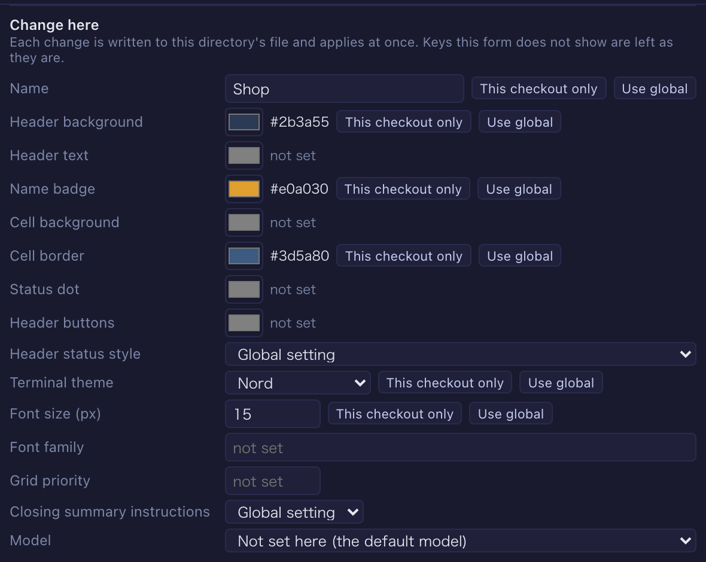

# 8.0.0 — Every directory setting in a form, one click from its terminal

**A snapshot as of 8.0.0 (released 2026-09-30).** It will go stale as the app moves on — that is
expected, and the living reference is the guide each section links to.

Nothing to configure. Everything below is already on screen, or a control inside **Settings** (the gear,
top right). Writing `.mulmoterminal.json` by hand or with an agent still works — this adds a way to write
the same keys, it does not replace one.

## New features

### Change a directory's settings in a form

Expand a directory in **Settings → Directory settings** and **Change here** appears under the values in
force ([#2722](https://github.com/receptron/mulmoterminal/issues/2722)). A change is saved as soon as you
leave the field (or pick the colour or option) and reaches open terminals without a restart. **Use global**
on a row takes that key out of the file.

Every key the file can hold is there:

- **Looks** ([#2733](https://github.com/receptron/mulmoterminal/pull/2733)) — name, the seven chrome colours
  (header, cell, badge…), terminal theme, font size, font family and grid priority.
- **Status colours and palette** ([#2737](https://github.com/receptron/mulmoterminal/pull/2737)) — how the header
  shows a running session, its colour per status (the same editor as the global setting), and the terminal's
  23-colour palette.
- **Model and reach** ([#2742](https://github.com/receptron/mulmoterminal/pull/2742)) — the model this directory's
  sessions start on (from the providers registered in the global settings that can start a session), the
  closing-summary switch, and extra directories sessions may read and edit.
- **Pictures and sounds** ([#2743](https://github.com/receptron/mulmoterminal/pull/2743)) — the icon (found
  automatically / none / an image), the terminal background (picture, strength, fit), and the attention sounds
  (a shipped preset or a file in the directory, also per kind).
- **Header** ([#2746](https://github.com/receptron/mulmoterminal/pull/2746)) — buttons, chips and command-palette
  entries, with the same editors as the global lists. A directory's buttons are added to the global ones; its
  chips replace the global set.
- **Lists and variables** ([#2750](https://github.com/receptron/mulmoterminal/pull/2750)) — the skills the Skill
  menu offers and their order (suggested from every skill the directory can see), the Mulmo menu's decks, and
  per-worktree variables (a port, or a unique name).

A save writes only the key it changes: keys the form does not show, and the file's order, are left as they
are, and the file it replaces is backed up where the Files view keeps its backups. A file that is not valid
JSON is not written; the form names it so you can fix it. More in the [configuration guide](config.html#per-dir).

### Move a key to this checkout only

With one repository cloned in several places, you may want a colour or a rank for one checkout only.
**This checkout only** on a row moves the key into `.mulmoterminal.local.json`, and **Share** moves it back
to `.mulmoterminal.json` ([#2750](https://github.com/receptron/mulmoterminal/pull/2750)). The value moves as
written, and a key in the local file is marked *this checkout only*.

### Open a directory's settings from its terminal

Click the directory in a terminal's header: the menu now has **This directory's settings**
([#2752](https://github.com/receptron/mulmoterminal/pull/2752)). Settings opens on Directory settings with
that directory's row open — even a directory that is not in the recent list.

### Past release notes in Settings

**Settings → Release notes** lists every version up to the one you run, newest first, and shows the chosen
version's setup guide ([#2719](https://github.com/receptron/mulmoterminal/pull/2719)) — the page the What's
new dialog shows once after an upgrade.

### Two document tasks in Blueprints

- **用語をそろえる (glossary)** ([#2720](https://github.com/receptron/mulmoterminal/pull/2720)) — collects the
  terms documents define, terms defined twice and words spelled more than one way into a glossary, and, when
  asked, puts the spellings to use into the folder's `chaff.yaml`.
- **文書のフォルダに chaff を入れる (adopt)** ([#2740](https://github.com/receptron/mulmoterminal/pull/2740)) — shelves
  today's findings in a baseline so only new ones are reported, and, when asked, writes a GitHub workflow that
  puts them on a pull request's lines. The workflow is offered only where the folder is a git repository
  ([#2749](https://github.com/receptron/mulmoterminal/pull/2749)).

More in the [Blueprints guide](blueprints.html).

## What looks different

- Each directory in Settings → Directory settings has the **Change here** form above.
- Settings has a **Release notes** tab (in the Help group).
- A terminal's path menu has **This directory's settings**.
- The Blueprints new-build form asks the task first, and the base (where it runs) only when the task has more
  than one ([#2741](https://github.com/receptron/mulmoterminal/pull/2741)); a document task asks none.
- "This folder's style" is offered only in a folder that has the files it needs (`STYLE.md`, `chaff.yaml`)
  ([#2744](https://github.com/receptron/mulmoterminal/pull/2744)).
- Polishing a document tells contracts and terms, regulations, and manuals apart
  ([#2747](https://github.com/receptron/mulmoterminal/pull/2747)). To try the manual kind without documents of your own,
  the examples gain 「手順書を手順書として整える」 ([#2753](https://github.com/receptron/mulmoterminal/pull/2753)).
- Shared apps say what to press at the two places a first run stops
  ([#2738](https://github.com/receptron/mulmoterminal/pull/2738)): signed out, press **Connect** on the
  toolbar's **Remote host** control to sign in with Google; after switching a GUI tool, restart an open
  terminal for it to take effect.
- Inviting a new address to a shared app says it goes into the committed `app.json`
  ([#2736](https://github.com/receptron/mulmoterminal/pull/2736)).

## Under the hood

- A directory's all-kind `sound` also takes a shipped preset (`preset:<id>`)
  ([#2743](https://github.com/receptron/mulmoterminal/pull/2743)). Before, a preset worked only in the
  per-kind `sounds` and was silently ignored in `sound`. File paths work as before.
- The global header buttons and chips are saved through the same code as a directory's
  ([#2746](https://github.com/receptron/mulmoterminal/pull/2746)), unchanged in behaviour.
- The Blueprints document tasks run chaffjs 0.16 ([#2731](https://github.com/receptron/mulmoterminal/pull/2731)).
- A folder the server cannot read is no longer taken for one without the file
  ([#2745](https://github.com/receptron/mulmoterminal/pull/2745)).
- A shared app's headless trial run no longer stops when its preview frame is replaced
  ([#2730](https://github.com/receptron/mulmoterminal/pull/2730)).
- The guide has a page on turning a collection into an app ([#2718](https://github.com/receptron/mulmoterminal/pull/2718)).
- The FAQ explains that a Claude Code conversation moved to the background continues under a new session id,
  and how to find it ([#2739](https://github.com/receptron/mulmoterminal/pull/2739)).

Nothing here needs doing.
