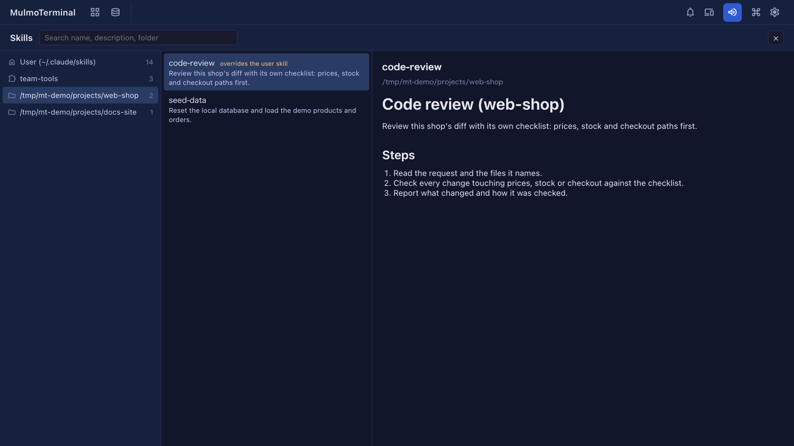

# 8.3.0 — A Skills viewer, and apps from a collection keep MulmoTerminal's look

**A snapshot as of 8.3.0 (released 2026-10-01).** It will go stale as the app moves on — that is
expected, and the living reference is the guide each section links to.

## New features

### See every skill in one place

Claude skills live in several places — your own `~/.claude/skills`, the plugins you have installed, and the
`.claude/skills` folder of each project — and until now the only way to see them all was to look through those
folders by hand. 8.3.0 adds a **Skills** screen ([#2816](https://github.com/receptron/mulmoterminal/pull/2816)).
Nothing to configure:

1. In the toolbar, open **More features** (the `widgets` icon) and pick **Skills**.
2. The left column lists the places: **User (~/.claude/skills)**, then each plugin that is switched on, then every
   folder a terminal has run in that has skills. A folder with no skills is not listed.
3. Pick a place, and the middle column shows its skills with their descriptions. A plugin's skills are shown by the
   name you run them with, such as `team-tools:deploy-preview`.
4. Pick a skill, and the right column shows its `SKILL.md`.

- **Search** with the box at the top. It looks at the name, the description and the folder, and every word you type
  has to match. Both the left and the middle column narrow as you type, so `deploy` shows only the places that have a
  matching skill.
- A folder's skill with the same name as one of your own is marked **overrides the user skill**: in that folder,
  Claude runs the folder's version.
- The screen reads the files each time it opens, so a `SKILL.md` you just edited shows as it is now.
- Only plugins installed for your user and switched on in `~/.claude/settings.json` are listed. A plugin installed
  for a single project is not shown yet.

Press **Esc** or the close button to go back. See [Basics](basics.html).

### An app made from a collection keeps MulmoTerminal's look

When you build an app from a collection with Blueprints, the interview now asks **見た目 (the look)**
([#2820](https://github.com/receptron/mulmoterminal/pull/2820)):

- **The same as MulmoTerminal** (the default) — the app looks as the collection does when you open it in MulmoTerminal:
  the same header, toolbar, table, kanban, calendar and record panel, in the same colours, with the collection's icon.
- **Soft**, **crisp** or **calm** — templates that keep those shapes and change only the colours and how round the
  corners are.

A new step, **Match the look**, restyles the screens the earlier steps built and writes the choice to `DESIGN.md` in
the app's folder; the steps after it follow that file. Its check builds the app and confirms the styles are really in
the build. See [The look](from-collection.html#design).

## What looks different

- **More features** has a new **Skills** entry, between Blueprints and Worklog
  ([#2816](https://github.com/receptron/mulmoterminal/pull/2816)).
- A build from a collection has one more step, **Match the look**, and one more question in the interview
  ([#2820](https://github.com/receptron/mulmoterminal/pull/2820)).

## Under the hood

- The guide has a [Feature list](feature-list.html): every capability MulmoTerminal has today, one line each with the
  release it arrived in ([#2819](https://github.com/receptron/mulmoterminal/pull/2819)). It is kept current at each
  release.

Nothing here needs doing.
