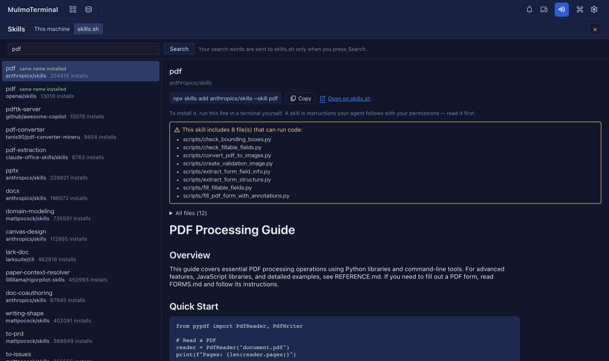

# 8.4.0 — Find a skill on skills.sh, and Claude cells keep their scrollbar

**A snapshot as of 8.4.0 (released 2026-10-02).** It will go stale as the app moves on — that is
expected, and the living reference is the guide each section links to.

## New features

### Find a skill you do not have yet

The Skills viewer (8.3.0) shows the skills already on your machine. 8.4.0 adds a second mode that searches
[skills.sh](https://skills.sh), the public directory of agent skills, so you can find one and **read it before
you install it** ([#2837](https://github.com/receptron/mulmoterminal/pull/2837)). Nothing to set up.

1. Open **More features** → **Skills**, then press **skills.sh** at the top (next to **This machine**).
2. Type a few words, for example `pdf`, and press **Search**. Nothing is sent while you type — your words go to
   skills.sh only when you press the button.
3. The left column lists what skills.sh found, best match first, with the repository it comes from and how many
   times it has been installed. **same name installed** means you already have a skill with that name.
4. Pick one. On the right you see its `SKILL.md`, a list of every file it would bring, and — in a yellow box — the
   files that can **run code** (scripts such as `scripts/*.py`).

**Installing is up to you.** The viewer never installs anything. It shows the line to run —
`npx skills add <owner/repo> --skill <name>` — with a **Copy** button, and a link to the skill's page on skills.sh.
Run it in a terminal when you have decided. A skill is a set of instructions your agent follows with your
permissions, which is why the files that run code are listed first.

If skills.sh cannot be reached, the viewer says so and links to the site, where you can search in the browser.

You can now also open the Skills viewer from the **command palette** (type `Skills`), or bind it to a key or a
header button with the action `screen-skills`
([#2821](https://github.com/receptron/mulmoterminal/pull/2821)). See [Configuration](config.html#keymap).

### Choose the language a blueprint build reports in

The new-build form in **Blueprints** has a **report language** select beside the usecase and base
([#2836](https://github.com/receptron/mulmoterminal/pull/2836)). It starts as the screen's language. What the agent
writes to you — reports, questions, replies — comes in the language you pick; the documents themselves keep their
own language. A task continued from "Next steps" keeps the same choice. See [Blueprints](blueprints.html).

## What looks different

- The Skills viewer has a **This machine / skills.sh** switch at the top
  ([#2837](https://github.com/receptron/mulmoterminal/pull/2837)).
- In the Skills viewer, an image inside a `SKILL.md` now appears as a link instead of a picture — on disk and on
  skills.sh alike — so opening a skill never makes the page fetch anything
  ([#2837](https://github.com/receptron/mulmoterminal/pull/2837)).
- The new-build form has one more field, **report language**
  ([#2836](https://github.com/receptron/mulmoterminal/pull/2836)).

## Under the hood

- **A Claude cell keeps its scrollbar** ([#2833](https://github.com/receptron/mulmoterminal/pull/2833)). Claude Code
  can switch on its fullscreen display by itself, and then the cell had no scrollbar and you could not select more
  than one screen of text. MulmoTerminal now starts Claude with that display off — **unless you chose it**: if your
  Claude settings set `tui`, or you set `CLAUDE_CODE_NO_FLICKER` or `CLAUDE_CODE_DISABLE_ALTERNATE_SCREEN`
  yourself, your choice is kept. How to tell you have the fix: open a new Claude cell, let it print more than a
  screen, and scroll up with the scrollbar. Restarting an existing cell picks it up. See the
  [FAQ](faq.html#claude-fullscreen).
- **A local app made by Blueprints accepts its own changes under `yarn dev`**
  ([#2832](https://github.com/receptron/mulmoterminal/pull/2832),
  [#2834](https://github.com/receptron/mulmoterminal/pull/2834)). Saving from the app's own screen used to fail with
  "changes from another site are not accepted" during development. New builds set up the dev proxy so this does not
  happen, and a check catches it. An app built before 8.4.0 can be fixed by asking for the proxy to keep its host.
- Duplicated code was moved into shared pieces, with no change in behaviour
  ([#2823](https://github.com/receptron/mulmoterminal/pull/2823),
  [#2824](https://github.com/receptron/mulmoterminal/pull/2824),
  [#2825](https://github.com/receptron/mulmoterminal/pull/2825),
  [#2826](https://github.com/receptron/mulmoterminal/pull/2826),
  [#2827](https://github.com/receptron/mulmoterminal/pull/2827),
  [#2828](https://github.com/receptron/mulmoterminal/pull/2828),
  [#2829](https://github.com/receptron/mulmoterminal/pull/2829)), and dependencies were updated
  ([#2830](https://github.com/receptron/mulmoterminal/pull/2830)).

Nothing here needs doing.
