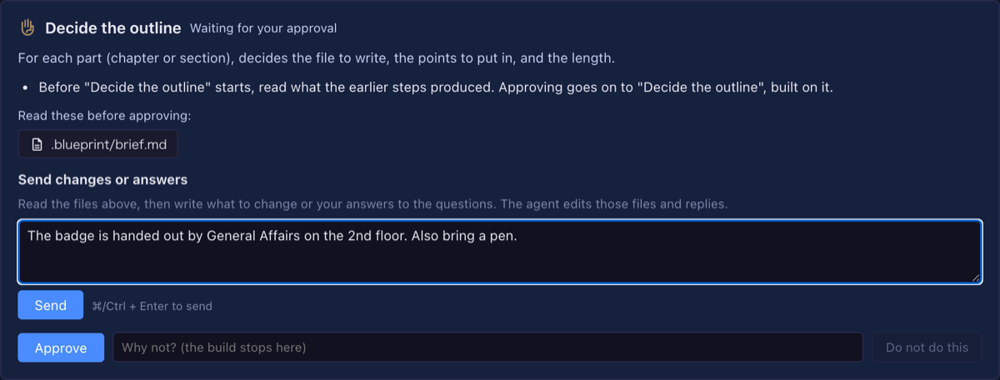

# 8.5.0 — Answer a blueprint's questions at the approval screen, and blueprints in English

**A snapshot as of 8.5.0 (released 2026-10-02).** It will go stale as the app moves on — that is
expected, and the living reference is the guide each section links to.

## New features

### Send changes and answers before you approve

A document build (write, polish, review and the rest) stops at a review gate and asks you to read what the
earlier steps wrote — the brief, the outline, the house style. Until now you could only **approve** or **stop**
there. The brief's open questions (who hands out the badge, how the password is given) had nowhere to be answered,
so the document came out with blanks in it.

8.5.0 adds a box under the files to read: **Send changes or answers**
([#2855](https://github.com/receptron/mulmoterminal/pull/2855)). Nothing to set up.

1. Open **Blueprints** and pick a build that says **Needs your approval**.
2. Open the files under **Read these before approving**.
3. Write what to change, or your answers to its open questions, in the box and press **Send** (or ⌘/Ctrl + Enter).
4. The agent edits the files the next step reads and replies. An answered question leaves the open questions and
   becomes a fact the next step uses.
5. Send again as many times as you like, then **Approve**.

After each change the step that wrote those files is checked again. If the changed files no longer pass, the
conversation says so with the check's output, and **Approve is refused until a later change passes**
([#2857](https://github.com/receptron/mulmoterminal/pull/2857)) — you can send a fix, or stop the build.

How to tell it worked: try the **Write a document (to your style)** example for a new starters' guide, answer the brief's open
questions at the outline gate, and the finished document carries your answers instead of blanks. See
[Blueprints](blueprints.html#documents).

### Blueprints in English

With the screen in English, the blueprint packs now show in English: their names and descriptions, the questions
of the new-build form, the examples, and the step names in the build list and the run view
([#2838](https://github.com/receptron/mulmoterminal/pull/2838),
[#2843](https://github.com/receptron/mulmoterminal/pull/2843),
[#2847](https://github.com/receptron/mulmoterminal/pull/2847)). Answers you pick are stored the same way in either
language, so a build started on a Japanese screen reads the same on an English one. The report language
(8.4.0) still decides what the agent writes to you.

### Polish a document as any of 24 kinds

Polish and adopt ask what kind of document it is, so chaff measures it by the right genre. The list now covers
every genre chaff has — added are owned-media articles, press releases, meeting notes, regulations, FAQs, glossaries,
judgments, patents, plays, speeches and transcripts — each with what to look out for when reading it
([#2853](https://github.com/receptron/mulmoterminal/pull/2853)).

### Pick an answer from choices

When a step's agent has to ask you something with a few clear options, it can now offer them as buttons, each with
what choosing it costs, and mark the one it would pick as **recommended**
([#2854](https://github.com/receptron/mulmoterminal/pull/2854)). Press one to answer, or still write your own.

### See a build's work list as a table

A build that works through a list — the refactor task tidying a repository one change at a time — now shows that
list under the current step: each item's order, title, kind and status (to do, in progress, needs your decision,
done, left alone). The one waiting for you is tinted. Click a row to see why it is on the list, how it was
checked, the files, its pull request and a note ([#2856](https://github.com/receptron/mulmoterminal/pull/2856)).

### `~` in the launch directory

The launch form accepts a directory written as `~/projects/app`; it is expanded to your home directory, and the
worktree list follows it too ([#2842](https://github.com/receptron/mulmoterminal/pull/2842)).

## What looks different

- A document build's approval card has the **Send changes or answers** box, and the conversation under it
  ([#2855](https://github.com/receptron/mulmoterminal/pull/2855)).
- On an English screen, Blueprints' packs, form questions, examples and step names are English
  ([#2838](https://github.com/receptron/mulmoterminal/pull/2838),
  [#2843](https://github.com/receptron/mulmoterminal/pull/2843),
  [#2847](https://github.com/receptron/mulmoterminal/pull/2847)).
- The kind-of-document question in polish and adopt has a longer list
  ([#2853](https://github.com/receptron/mulmoterminal/pull/2853)).
- A build with a work list shows it as a table in the run view
  ([#2856](https://github.com/receptron/mulmoterminal/pull/2856)).
- A question may come with choice buttons, one marked recommended
  ([#2854](https://github.com/receptron/mulmoterminal/pull/2854)).

## Under the hood

- **A cell that failed to start no longer keeps the "all tools" claim**
  ([#2849](https://github.com/receptron/mulmoterminal/pull/2849)). When starting a Claude, Codex or Copilot cell
  threw an error, the record that it carries every GUI tool stayed behind. It is now released, so the next cell
  in that directory is not affected.
- Duplicated code in the session routes, the heat figures and the agent spawners was moved into shared pieces, with
  no change in behaviour ([#2839](https://github.com/receptron/mulmoterminal/pull/2839),
  [#2844](https://github.com/receptron/mulmoterminal/pull/2844),
  [#2845](https://github.com/receptron/mulmoterminal/pull/2845),
  [#2846](https://github.com/receptron/mulmoterminal/pull/2846)).
- The feature reference lists the Skills viewer
  ([#2840](https://github.com/receptron/mulmoterminal/pull/2840)).
- A build started before 6.8.0 and still waiting at a document gate shows the older spec conversation instead of
  the new box. Start the task again to get it.

Nothing here needs doing.
