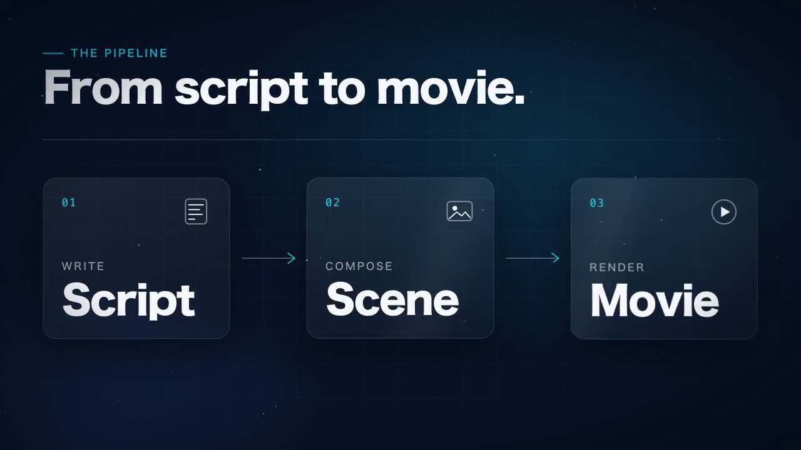

# 9.0.0 — Remotion scenes in MulmoCast videos, choosing files for your phone, and movies that no longer "fail" after a minute

**A snapshot as of 9.0.0 (released 2026-10-07).** It will go stale as the app moves on — that is
expected, and the living reference is the guide each section links to.

## New features

### Animated scenes in MulmoCast videos (Remotion)

A beat in a MulmoCast video can now be a **`remotion` scene**: you say in words what the scene shows,
Claude Code writes it as a [Remotion](https://www.remotion.dev) animation, and it becomes that beat's
video — moving text, drawn lines, 3D, and so on
([#2906](https://github.com/receptron/mulmoterminal/pull/2906),
[#2912](https://github.com/receptron/mulmoterminal/pull/2912)).

[](../videos/v9.0.0-remotion.mp4)

*Two scenes made from the GUI panel with this release — click the picture to play them (10 s, no sound).*

How to try it:

1. **Install the packages once, in your home folder.** They are optional and MulmoTerminal does not
   install them. The command is on the [MulmoCast videos](mulmocast.html#remotion) page.
2. **Check:** run `npx mulmoterminal@latest init`. The list should show
   `✓ remotion — Remotion scenes in MulmoCast videos`. If it says `optional` or `missing: …`, the
   packages are not where MulmoCast can see them yet.
3. **Ask for one by name**, for example *"make the second beat a remotion scene: the title appears,
   then three boxes joined by arrows"*, and make the movie from the GUI panel as usual. Agents only
   use these scenes when you ask, because they cannot tell whether the packages are installed.

Each scene is written by Claude Code running **on the MulmoTerminal server, as your default login**,
a few times per scene, so expect a minute or more for each one.

**Writing the scene yourself instead.** You can hand the beat a finished animation file (`code`) —
then nothing calls Claude Code at all, and it is drawn as it is
([#2914](https://github.com/receptron/mulmoterminal/pull/2914)). The format and the rules are in
[Pass a finished component instead](mulmocast.html#remotion-code).

### Choose which files the phone may open (MulmoTerminal's side)

A project can now choose which of its files the phone may list and open — Markdown, HTML, PDF and
pictures — by naming folders and file types in its `.mulmoterminal.json` under `mobileFiles`
([#2913](https://github.com/receptron/mulmoterminal/pull/2913)):

```json
{ "mobileFiles": { "dirs": ["output"], "extensions": ["md", "html", "pdf", "png"] } }
```

Nothing is shared unless a project says so, and only from the folders it names. Settings → Directory
settings shows the key as **Phone files**. The reference is
[Files the phone may open](config.html#mobile-files).

- **This release is the MulmoTerminal half.** The phone screen that lists and opens these files comes
  with a MulmoServer update ([receptron/mulmoserver#343](https://github.com/receptron/mulmoserver/issues/343));
  until then there is nothing to see on the phone. Declaring `mobileFiles` now does no harm and is
  ready when it lands.
- When it does, PDFs, pictures and larger files are handed to the phone through a storage area only
  your account can read, and deleted after an hour.

## What looks different

- **No false "Movie generation failed" any more.** Making a movie that took longer than a minute used
  to show a red *"Movie generation failed: signal is aborted without reason"* while the movie was in
  fact still being made — and it then appeared next to the error. The panel now waits for it
  ([#2910](https://github.com/receptron/mulmoterminal/pull/2910)). Remotion scenes almost always take
  that long, which is how this was found.
- The [MulmoCast videos](mulmocast.html) guide page is new, in both languages.

## Under the hood

- **A custom view's data request is narrower.** A collection's custom view that asks for its records
  now gets only the rows (`ids`) and fields (`fields`) it names, as MulmoClaude already did. A view
  that asks for a large collection **without** naming either now gets an error instead of everything —
  the views the agent writes already name them
  ([#2902](https://github.com/receptron/mulmoterminal/pull/2902)).
- **The headless Chrome Remotion uses is downloaded again after each MulmoTerminal update**, into
  MulmoTerminal's own folder (about 90 MB, once per version). Nothing needs doing
  ([#2914](https://github.com/receptron/mulmoterminal/pull/2914)).
- Updated libraries: mulmocast 2.14.0, the MulmoCast panel 5.1.0 (which tells agents about Remotion
  scenes) and the shared core it needs
  ([#2903](https://github.com/receptron/mulmoterminal/pull/2903),
  [#2907](https://github.com/receptron/mulmoterminal/pull/2907),
  [#2912](https://github.com/receptron/mulmoterminal/pull/2912)).

**How to tell you have it:** `npx mulmoterminal@latest init` lists a `remotion` line among the tools.
