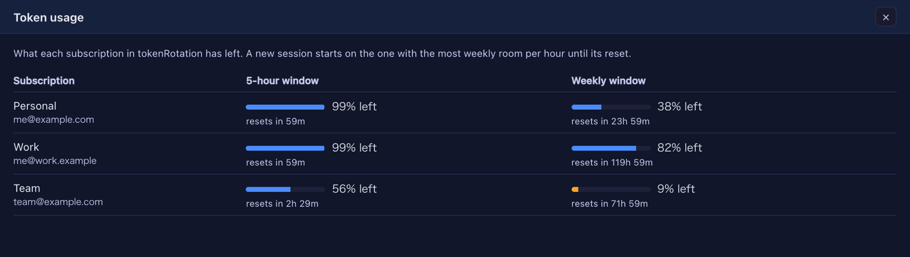

# 9.2.0 — Several Claude subscriptions, used evenly, picked for you

**A snapshot as of 9.2.0 (released 2026-10-07).** It will go stale as the app moves on — that is
expected, and the living reference is the guide each section links to.

## New features

### Token rotation (beta): several subscriptions, used evenly

Use Claude Code hard enough and a week's allowance can be gone in a day. The usual answer is several
accounts and switching between them day by day — but how much you use changes from day to day, so what
you really want is all of them used evenly, every day. Balance them well and you may find you can cancel
one.

For heavy vibe coders, MulmoTerminal now **picks the subscription with the most room every time a
session starts, and moves a session that is running low to another one without losing the
conversation** ([#2920](https://github.com/receptron/mulmoterminal/pull/2920),
[#2921](https://github.com/receptron/mulmoterminal/pull/2921),
[#2922](https://github.com/receptron/mulmoterminal/pull/2922)).

- **How it picks**: by how much of each weekly window would otherwise be lost at its reset — room about
  to reset is used first, so every subscription's week drains as evenly as possible. A subscription whose
  5-hour window is at 90% or more, or whose week is at 98% or more, is skipped.
- **Switches at 98%**: when the subscription a session runs on reaches 98% in either window, the session
  moves at the end of its turn — never in the middle of one.
- **Carries on past a limit**: the usage figures can be a few minutes old, so a session can hit the limit
  before 98% is seen. It then moves the moment Claude Code reports the limit. The message that hit the
  limit is not re-sent — send it again.
- **Conversations carry across subscriptions**, as with `/login`: everything stays in one place, so any
  session resumes on any subscription.
- **Tokens stay hidden**: never shown, never written to the config. An entry says only where the token is
  kept (a keychain item) and, as a label for you, the sign-in address.

How to try it:

1. For each subscription, run `claude setup-token` in your own terminal (it signs in through the browser).
2. Store the token in the keychain — with nothing after `-w` it asks for the value, so the token never
   reaches your shell history:

   ```sh
   security add-generic-password -a mulmoterminal -s mulmoterminal-token-personal -w
   ```

3. Add `tokenRotation` to `~/.mulmoterminal/config.json`:

   ```json
   "tokenRotation": {
     "enabled": true,
     "includeDefaultLogin": false,
     "tokens": [
       { "id": "personal", "label": "Personal", "email": "me@example.com", "keychain": "mulmoterminal-token-personal" },
       { "id": "work", "label": "Work", "email": "me@work.example", "keychain": "mulmoterminal-token-work" }
     ]
   }
   ```

4. Settings → **Reload config file**. No restart needed.
5. Open a new cell: it starts on the subscription chosen for it, and its header names it.

Or ask the `mulmoterminal-model` skill to "rotate my subscriptions" and it walks you through it.

Good to know:

- **The subscription changes when a process starts**: a new cell, closing and reopening a conversation,
  the restart button, or a move at the limit. Cells already open keep theirs; close and reopen one to
  switch it (the conversation carries on). Reloading the browser does not.
- **Once every subscription is a token, set `includeDefaultLogin` to `false`.** With `true` the account you
  are signed into with `/login` is one more candidate — but it is always one of your tokens, so it is
  counted twice, and which one changes whenever you `/login` again.
- **Ignore the account name in Claude Code's `/status`.** Claude Code may keep naming your `/login` account;
  usage is counted against the subscription in the cell's header. `Auth token: CLAUDE_CODE_OAUTH_TOKEN` in
  `/status` means the cell runs on a rotation token.
- **A subscription that is out of its allowance drops out by itself** until it resets. Leave it in the
  config and it is used again after the reset.
- **Only plain Claude cells rotate.** Provider, custom-agent and account cells are left as they are.
- Whether rotating several subscriptions suits Anthropic's terms is yours to check.

The reference is [Token rotation](token-rotation.html).

## What looks different

- **A cell's header names the subscription it runs on**, with the same mark accounts use; hover it for the
  address ([#2922](https://github.com/receptron/mulmoterminal/pull/2922)).
- **The toolbar's usage gauge** gets one entry per subscription; hover it for the name and address. A
  subscription that is out of its allowance says so instead of "no answer"
  ([#2922](https://github.com/receptron/mulmoterminal/pull/2922)).
- **More features → Token usage** lists every subscription's 5-hour and weekly room and when each resets.
  It is in the menu only while token rotation is on
  ([#2922](https://github.com/receptron/mulmoterminal/pull/2922)).

  

- When a session moves, the cell shows one line saying which subscription it moved from and to
  ([#2921](https://github.com/receptron/mulmoterminal/pull/2921)).

## Under the hood

- Nothing changes unless you configure `tokenRotation`.
- A turn that ends on an error (a usage limit, for one) now clears the cell's working dot, which used to
  stay lit ([#2921](https://github.com/receptron/mulmoterminal/pull/2921)).
- The design note was brought up to date
  ([#2923](https://github.com/receptron/mulmoterminal/pull/2923)). Nothing needs doing.

**How to tell you have it:** with `tokenRotation` configured, More features lists **Token usage**, and a
new Claude cell's header names a subscription.
