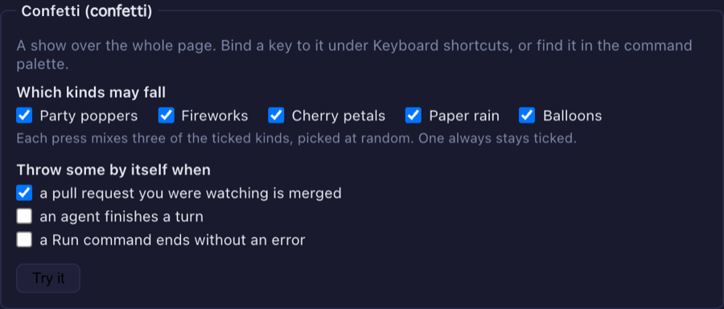

# 9.4.0 — Confetti, from a key, a merge or Settings

**A snapshot as of 9.4.0 (released 2026-10-08).** It will go stale as the app moves on — that is
expected, and the living reference is the guide each section links to.

## New features

### Confetti

A celebration over the whole page: party poppers from the bottom corners, fireworks, cherry petals, paper
rain and balloons. One press is a show — it comes in waves for several seconds, and **mixes three of the
styles you allow, picked at random** ([#2929](https://github.com/receptron/mulmoterminal/pull/2929)). Confetti
arrived in 9.3.0 without a word about how to use it; this page is that word, and 9.4.0 adds the box in Settings.
It never gets in the way: it takes no clicks, and if your system asks for reduced motion, there is none.

There are four ways to throw it:

1. **Try it now.** Settings → **Theme** → **Confetti** → **Try it**.
2. **From the command palette.** Open it (your `command-palette` key, or the toolbar's Commands button), type
   `confetti`, press `Enter`.
3. **From a key.** Bind the `confetti` action in Settings → **Keyboard shortcuts**, or write it in the config:

   ```json
   { "keymap": { "confetti": "Cmd+Shift+u" } }
   ```

   Pick a combination your browser does not keep for itself; the shortcuts page warns about the ones that
   never fire. The key works on every screen, not only the terminal grid.
4. **By itself, when something happens.** Tick the events you want in **Settings → Theme → Confetti**.
   None are on until you say so, and the same event within a few seconds is one celebration:

   | Event | When it fires |
   |---|---|
   | A pull request you were watching is merged | a cell was on the PR and saw it turn merged — not for a PR that was already merged when you opened the cell |
   | An agent finishes a turn | every turn, so it is a lot; try it for an afternoon before leaving it on |
   | A Run command ends without an error | exit code 0 |

There is one more, and it is in no menu: press **up up down down left right left right b a** while no
terminal or text field has the focus, and every style is thrown at once.

More: [Confetti](config.html#confetti), [Keyboard shortcuts](config.html#keymap).

## What looks different

- **Settings → Theme has a Confetti box**, under the Playful effects tick
  ([#2933](https://github.com/receptron/mulmoterminal/pull/2933)):
  - one tick for each style. At least one stays ticked — the last one is greyed out — because an empty list
    would be read as every style;
  - one tick for each event that sets confetti off by itself;
  - a **Try it** button.

  Ticks save the moment you click them, with no restart. If the save is refused, the tick goes back.

  

## Under the hood

- Nothing changes unless you tick something or bind a key; confetti is off for every event until you ask.
- A hand edit of `config.json` needs a server restart and a tab reload; the ticks do not.
- The feature list now names the confetti action
  ([#2931](https://github.com/receptron/mulmoterminal/pull/2931)). Nothing needs doing.

**How to tell you have it:** Settings → Theme shows a Confetti box with a Try it button, and pressing it throws
confetti over the page.
