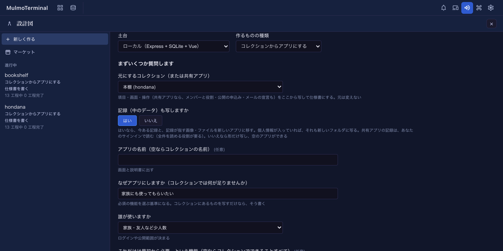
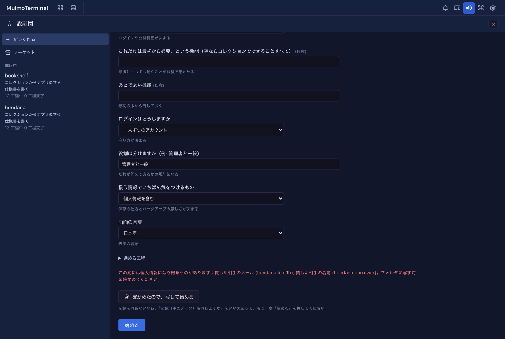
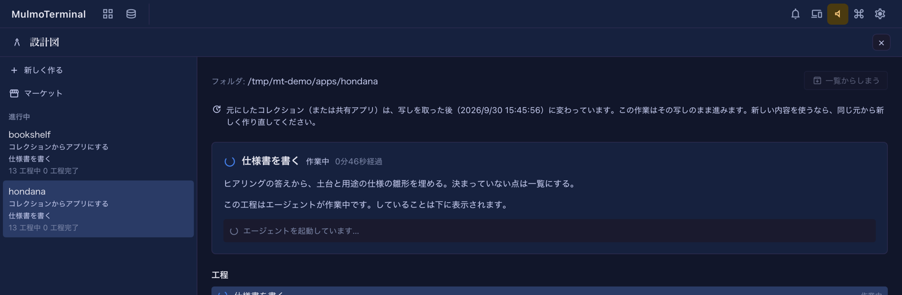

# コレクションからアプリにする
{: .no_toc }

コレクションで作ったもの（本棚・出欠表・申込みの受付など）を、**自分のコードとして持つアプリ**にします。
項目・画面・操作を仕様書に写し、記録（中のデータ）も新しいアプリへ移せます。元のコレクションは変わりません。

この機能は、試験中の [設計図](blueprints.html) の「作るものの種類」の一つです。設計図そのものの準備
（Claude Code・作業用フォルダの信頼）は、先に [設計図の案内](blueprints.html#trust) を済ませてください。

1. TOC
{:toc}

## どんなときに使うか

コレクションは、エージェントと話しながらすぐに形を変えられるのが強みです。一方で、次のようなときは
アプリにした方が扱いやすくなります。

- 自分以外の人に、決まった画面から使ってもらいたい（家族や社内で使う、公開する）。
- ログインや役割（管理者と一般など）で、誰が何をできるかをきちんと分けたい。
- 自分のサーバーやクラウド（Firebase・Cloudflare・Supabase）で動かし、コードとして手元に置きたい。

アプリにしたあとも、元のコレクションはそのまま使えます。二つを同期する仕組みはありません（下の
「[写しを取った後に元が変わったら](#source-changed)」）。

## 土台を選ぶ

「土台」は、できあがるアプリがどこで動くかです。まずは **ローカル** で試すのがおすすめです。
自分の PC の中だけで完結し、費用もクラウドの設定も要りません。

| 土台 | できるアプリ | 記録の置き場所 | 画像・ファイル | 用意するもの（全員に要るものに加えて） |
|---|---|---|---|---|
| ローカル | Express + SQLite + Vue。自分の PC で動く | SQLite | `data/files/` | なし |
| Firebase | Firebase の Web アプリ。開発用と本番用の二つのプロジェクト | Firestore | Cloud Storage | Google アカウント、請求先アカウント、`firebase` CLI、`gcloud`、JDK 21 以上 |
| Cloudflare | Cloudflare Workers のアプリ | D1 | R2 | Cloudflare のアカウント（無料でよい）。`wrangler` はプロジェクトに入る |
| Supabase | Vue の画面を Cloudflare で配り、Supabase と直接話すアプリ | Postgres | Supabase Storage | Docker Desktop（起動しておく）、Supabase と Cloudflare のアカウント。CLI はプロジェクトに入る |

全員に要るものは、Node.js 22.13 以上・`yarn`・ログイン済みの Claude Code・git です
（[設計図の案内](blueprints.html#用意するもの)）。Firebase では、`firebase` と `gcloud` に **同じ Google
アカウント** でログインしておく必要があります。

## 始める

1. 上のバーの「その他の機能」メニュー（`widgets` アイコン）から **設計図** を開き、**新しく作る** を押します。
2. **土台** を選び、**作るものの種類** で **コレクションからアプリにする** を選びます。
3. **プロジェクトのフォルダ** に、信頼済みの親フォルダの中のフォルダを入れます（まだ無い名前でよい）。
4. 質問に答えて **始める** を押します。

### 質問の意味

| 質問 | 何に使うか |
|---|---|
| 元にするコレクション（または共有アプリ） | 写す元。ワークスペースと保存したフォルダのコレクションと、`app.json` を持つ共有アプリが並ぶ |
| 記録（中のデータ）も写しますか | **はい** なら記録と、記録が指す画像・ファイルも新しいアプリへ移す。**いいえ** なら形だけで、空のアプリができる。既定値はなく、毎回選ぶ |
| アプリの名前 | 画面と説明書に出す名前。空ならコレクションの名前 |
| なぜアプリにしますか | 必須の機能を選ぶ基準になる。写すだけなら、そう書けばよい |
| 誰が使いますか | ログインや公開範囲が決まる |
| これだけは最初から必要、という機能 | 最後に一つずつ、動くことを試験で確かめる。空ならコレクションでできることすべて |
| あとでよい機能 | 最初の版から外しておく |
| ログインはどうしますか | なし / 共有のパスワード一つ / 一人ずつのアカウント |
| 役割は分けますか | 管理者と一般、など。一人ずつのアカウントのときに聞かれる |
| 扱う情報でいちばん気をつけるもの | 保存の仕方とバックアップの厳しさが決まる |
| 画面の言葉 | 日本語・English・両方 |
| 見た目 | MulmoTerminal と同じ（既定）・やわらかい・くっきり・落ち着いた。[見た目](#design) |

## 何が写されるか

「始める」を押した時点で、作るフォルダの `.blueprint/source/` に写しを一度だけ取ります。

- 選んだコレクションと、`ref`・埋め込み・逆引き・集計でつながっているコレクションすべての形（`schema.json`、
  `SKILL.md`、宣言されたビューとアクションのテンプレート）。つながり先が見つからなければ、仕様書の
  「決めていないこと」に並びます。
- 記録も写すときは、各コレクションの記録（`records.jsonl`）と、記録の画像・ファイルの項目が指すファイル。
- 共有アプリなら、アプリの宣言（`app.json`）と全コレクションの形。
- 何をいつ写したか（`source.json`）。

写す量の合計には **200 MB** の上限があります。超えるときは始める前に断られるので、記録を写さずに
始めてください（形だけならほぼ必ず収まります）。

### 個人情報を写す前の確認 {#personal-data}

写しに個人情報になり得るものが入るときは、「始める」を押すと **一度だけ止まり**、何が写るかを並べて
見せます。

- 記録を写すとき：メールの項目すべてと、名前・メール・電話・住所・生年月日・郵便番号を表す項目（キーか
  ラベルで見分けます。表の項目の中の列も含みます）。
- 共有アプリでは、メンバーのメールアドレス。これは `app.json` と一緒に写るので、記録を写さなくても出ます。

内容を確かめて **確かめたので、写して始める** を押すと始まります。記録を写したくなければ、「記録（中の
データ）も写しますか」を **いいえ** にして、もう一度「始める」を押します。答えを変えると、確認はやり直しに
なります。

見分け方は広めに取っています。個人情報でない項目が並ぶこともありますが、確認が一度増えるだけです。

### 共有アプリを元にするとき

- 記録も写すときは、**あなたのサインイン** で Firestore から読みます。先に [共有アプリ](shared-apps.html)
  へ接続しておいてください。
- あなたの役割が全件を読めるもの（owner・editor・viewer）である必要があります。一部しか読めない役割だと
  写しが欠けるので、始める前に理由を示して断ります。
- アプリの宣言（メンバーと役割、公開の申込み、見える範囲、メール、集計）は、仕様書の「誰が何をできるか」に
  一つ残らず写され、土台ごとの仕組み（ローカル・Cloudflare はサーバーの規則、Firebase はセキュリティ
  ルール、Supabase は行ごとの権限）で守られます。

## 仕様書で決めること

最初の工程「仕様書を書く」では、写しから仕様書の下書きを作り、承認を待ちます。承認の前に、画面の会話で
直せます。

- 元の項目・ビュー・アクション・自動取り込みが、どのコレクションのものかが分かる名前（`books.title`、
  `books.views.board`、`books.actions.tidy` の形）で一つ残らず並びます。欠けていると、この工程は先へ
  進みません。
- アクション（エージェントに頼む操作）と自動取り込みには、それぞれ扱いが提案されます。
  - **機能にする**：アプリの機能として作る。値を変えるだけの操作（`mutate`）は必ずこれ。
  - **人が手で行う**：README に手順を書く。
  - **やめる**：理由を仕様書に書く。
- 仕様書で決めた表と列の名前は、記録を移す工程が機械で突き合わせるときの約束になります。

### 項目の型がどうなるか

| コレクションの型 | ローカル・Cloudflare（SQLite / D1） | Firebase（Firestore） | Supabase（Postgres） |
|---|---|---|---|
| string / text / email / markdown | TEXT | string | text |
| number | REAL（整数なら INTEGER） | number | numeric（整数なら integer） |
| boolean | 0 / 1 | boolean | boolean |
| date / datetime | ISO 8601 の TEXT | ISO 8601 の string | date / timestamptz |
| enum | TEXT と値の制約 | string | text |
| ref | 参照先への外部キー | 参照先の文書 ID | 参照先への外部キー |
| image / file | `data/files/`（Cloudflare は R2）のパス | Cloud Storage のパス | Storage のパス |
| table | 子の表 | 文書の中の配列 | 子の表 |
| derived / rollup / backlinks / embed / toggle / flag | 保存せず、計算して見せる | 同じ | 同じ |

## 工程の流れ

土台ごとに、次の工程を順に進めます。（承認）の付いた工程は、あなたが画面で承認するまで待ちます。

| | ローカル | Firebase | Cloudflare | Supabase |
|---|---|---|---|---|
| 1 | 仕様書を書く | 仕様書を書く | 仕様書を書く | 仕様書を書く |
| 2 | 道具の確認（承認） | 道具とサインイン（承認） | 道具の確認（承認） | 道具の確認（承認） |
| 3 | アプリの雛形 | 開発用と本番用のプロジェクト（承認） | アプリの雛形 | アプリの雛形 |
| 4 | データの形 | アプリの雛形 | データの形 | データと権限 |
| 5 | **記録を移す** | ログイン | **記録を移す** | **記録を移す** |
| 6 | API | データの形とセキュリティルール | API | 画面 |
| 7 | 画面 | **記録を移す（エミュレータ）** | 画面 | ログイン |
| 8 | ログイン | 機能と画面 | ログイン | **見た目を合わせる** |
| 9 | **見た目を合わせる** | **見た目を合わせる** | **見た目を合わせる** | 起動して確かめる |
| 10 | 起動して確かめる | 必須の機能を試験で確かめる | 起動して確かめる | 必須の機能を試験で確かめる |
| 11 | 必須の機能を試験で確かめる | アクションを機能にする | 必須の機能を試験で確かめる | アクションを機能にする |
| 12 | アクションを機能にする | 開発用に公開 | アクションを機能にする | セキュリティ診断 |
| 13 | セキュリティ診断 | App Check と予算アラート（承認） | セキュリティ診断 | Supabase と Cloudflare に公開（承認） |
| 14 | 使い方の説明とバックアップ | セキュリティ診断 | Cloudflare に公開（承認） | **記録を本番に移す**（承認） |
| 15 |  | 本番に公開（承認） | **記録を本番に移す**（承認） | 使い方の説明と引き継ぎ |
| 16 |  | **記録を本番に移す**（承認） | 使い方の説明と引き継ぎ |  |

各工程では、エージェントが作業し、終わると機械の判定（テスト・ビルド・読み直しなど）が走ります。判定に
通らなければ、エージェントが直してもう一度判定します。

## 見た目 {#design}

作る前の質問「見た目」で、できるアプリの見た目を選びます。

- **MulmoTerminal と同じ**（既定）: MulmoTerminal でコレクションを開いたときと同じ見た目になります。見出し・操作の列・一覧の表・かんばん・カレンダー・一件の窓に、同じ部品と同じ色を使います。見出しには、コレクションのアイコンも出ます。
- **やわらかい**・**くっきり**・**落ち着いた**: 部品の形は同じまま、色と角の丸みだけが変わるひな形です。やわらかいは暖かい紙の色に丸い角、くっきりは白と黒に小さな角、落ち着いたは深い緑にやさしい灰色です。

工程「見た目を合わせる」が、それまでの工程で作った画面をこの見た目でそろえます。どの見た目にしたかは、アプリのフォルダの `DESIGN.md` に残ります。あとの工程が足す画面も、それに従います。

## 記録の移し方

記録を写したビルドでは、「記録を移す」の工程が、写した記録をアプリのデータへ移す仕組み
（`yarn import-source`）を作ります。形だけ写したビルドでは、この工程は何もしません。

- **移したあと、機械が元と突き合わせます。** 仕様どおりの表に、全件・全項目が元の値のまま入っているか、
  画像・ファイルが同じ中身で置かれているかを読み直して確かめます。
- **何度走らせても同じ結果** になるように作られます（主キーで上書きし、行が増えません）。判定でも 2 回
  移して確かめます。
- 土台ごとの流れ：
  - **ローカル**：SQLite と `data/files/` に移します。
  - **Firebase**：まずエミュレータで移して確かめます。本番へは「本番に公開」のあと、もう一度承認して
    から移します。書き込みはあなたの Google アカウント（`gcloud auth application-default login`）で行い、
    本番を読み直して元と突き合わせます。
  - **Cloudflare**：まず手元（`wrangler` のローカルの状態）に移します。`yarn start` で開くアプリにも記録が
    入ります。本番へは「Cloudflare に公開」のあと、もう一度承認してから `yarn import-source --remote` で
    移します。書き込みは `yarn wrangler login` でログインしたアカウントで行います。
  - **Supabase**：まず手元の Supabase 一式（Docker の中）に移します。本番へは「Supabase と Cloudflare に
    公開」のあと、もう一度承認してから、公開したアプリに登録したメールアドレスを添えて
    `yarn import-source --linked --owner <メール>` で移します。移した記録の持ち主は、既定ではあなた自身の
    アカウントです。書き込みは `yarn supabase login` と `link` をしたあなたのアカウントで行い、秘密の鍵は
    使いません。

## アクションと自動取り込み

「機能にする」と決めたものは、「アクションを機能にする」の工程で作られ、それぞれに試験が付きます。

- AI が要る手順（要約・分類・下書きなど）は、**サーバー側** から Claude API を呼ぶ機能になります。
  ブラウザからは呼びません。鍵の置き場所は土台ごとに違います。

  | 土台 | 手元 | 本番 |
  |---|---|---|
  | ローカル | `.env` | — |
  | Firebase | シークレット（`firebase functions:secrets:set`） | 同じ |
  | Cloudflare | `.dev.vars` | `wrangler secret put` |
  | Supabase | `supabase/functions/.env` | `supabase secrets set` |

  鍵の値はエージェントが書かず、README にあなたが入れる場所が書かれます。鍵のファイルが `.gitignore` に
  入っていないと、判定が通りません。
- 自動取り込み（RSS・Atom・JSON）は、決まった間隔で動く処理になります。
- 必須の機能がアクションを要るときは、「必須の機能を試験で確かめる」の工程で先に作られ、アクションの工程では
  二度作りません。

## 写しを取った後に元が変わったら {#source-changed}

写しは始めたときに一度だけ取り、ビルドはその写しのまま進みます。その後に元のコレクションや共有アプリが
変わると、そのビルドを開いたときに一行で知らせます。

- 確かめるのは、ビルドを開いたときに一度だけです（共有アプリの記録は Firestore から読み直すため、何度も
  読みません）。
- 新しい内容を使いたいときは、同じ元から **新しく作り直して** ください。今のビルドの写しを差し替える
  仕組みはありません。仕様書がその写しから書かれているためです。
- 元が消えた、共有アプリからサインアウトした、などで読み直せないときは、何も表示しません。

## できあがるもの

- 作ったフォルダの中の、ふつうのプロジェクト（`package.json`、ソース、テスト）。`yarn start` で動きます。
- `README.md`：使い方、「人が手で行う」アクションの手順、鍵を置く場所。
- 最後の工程で、使い方の説明とバックアップ（ローカル）や、引き継ぎの手順（クラウド）が書かれます。
- `.blueprint/` には、仕様書・写し・工程の記録が残ります。

git で管理したいときは、ビルドが終わってから `git init` してください（途中でリポジトリにすると、フォルダの
信頼が外れて工程が止まります）。

## 困ったとき

| 症状 | 原因と対処 |
|---|---|
| 「信頼していない」と断られる | 作業用フォルダが Claude Code に信頼されていません。[設計図の案内](blueprints.html#trust) のとおり、下に出る「ここで Claude Code を開く」で答えてから、もう一度「始める」 |
| 写しの重さ（MB）と上限 200 MB を示して断られる | 記録と画像が多すぎます。記録を写さずに（形だけで）始めてください |
| 共有アプリで、接続（サインイン）が要ると断られる | 記録を写すには、あなたのサインインが要ります。[共有アプリ](shared-apps.html) へ接続してから |
| 共有アプリで、役割が全件を読めないと断られる | owner・editor・viewer の役割をオーナーにもらうか、記録を写さずに始めてください |
| Firebase の「道具とサインイン」で止まる | `firebase` と `gcloud` のログインが別のアカウント、または JDK 21 が無い。表示されるコマンドで直してから「もう一度」 |
| Supabase で「Docker が動いていない」 | Docker Desktop を起動してから「もう一度」 |
| Supabase で手元の一式が起動しない | 別のプロジェクトの Supabase 一式が同じポートを使っていると、その名前が表示されます。`yarn supabase stop --project-id <名前>` で止めてから「もう一度」 |
| 記録を移す工程の判定に落ちる | 判定の出力に、どの記録のどの項目が違うかが出ます。エージェントがそれを見て直します。何度も落ちるときは [報告](blueprints.html#報告のしかた) してください |

## 関連

- [設計図（試験中）— 試してくれる人向けの案内](blueprints.html)
- [共有アプリ](shared-apps.html)
- [7.3.0 のセットアップガイド](v7.3.0.html)
