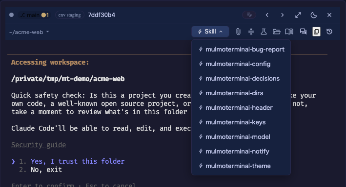

# ヘッダーのリファレンス
{: .no_toc }

- TOC
{:toc}

このページは**書くときに引く**ためのものです。上から読む必要はありません。

はじめての 1 個 —— ヘッダーの読み方・`buttons` の書き場所・`run` の 4 種類は、
[ヘッダーをカスタマイズする](header.html)にスクリーンショット付きであります。先にそちらを。

---

## 1. `${変数}` {#vars}

### どこで展開されるか {#vars-where}

| 展開される | 展開されない |
|---|---|
| `run: "input"` の `text` | `label`（ツールチップ） |
| `run: "shell"` の `cmd`（**シェルエスケープされます** → [下記](#vars-shell)） | `id` |
| `open` の `url` / `reveal` / `files` / `terminal` | `open` の `view`（決まった名前しか取らないため） |
| カスタムチップの `text` | `run: "action"` の `action`（同上） |

```json
{ "id": "files", "icon": "folder_open", "label": "Browse this project's files", "run": "open", "open": { "files": "${dir}" } }
```

### 一覧 {#vars-list}

12 個あります。「空になるとき」は、その変数が**空文字に展開される**条件です（変数そのものは消えません）。

| 変数 | 何が入るか | 例 | 空になるとき |
|---|---|---|---|
| `dir` | そのセルの作業ディレクトリの**絶対パス** | `/Users/you/acme-api` | 空になりません |
| `dirName` | `dir` の最後の要素だけ | `acme-api` | 空になりません |
| `branch` | 今いるブランチ名 | `feat/1928-docs` | git リポジトリでないとき、**detached HEAD のとき** |
| `repo` | `origin` が指すリポジトリ。**GitHub は `owner/repo`、GitLab は `host/owner/repo`**（self-hosted も同じ形） | `receptron/mulmoterminal` | リポジトリでない / `origin` が無い / **GitHub・GitLab 以外のホスト** |
| `remoteUrl` | `git remote get-url origin` の出力**そのまま**（ssh 形式なら ssh のまま） | `git@github.com:receptron/mulmoterminal.git` | リポジトリでない / `origin` が無い |
| `ahead` | upstream より**進んでいる**コミット数 | `2` | 空になりません（無ければ `0`） |
| `behind` | upstream より**遅れている**コミット数 | `0` | 空になりません（無ければ `0`） |
| `dirty` | `git status --porcelain` の行数 = **変更のあるパスの数**（ステージ済み・未ステージ・未追跡の合計） | `3` | 空になりません（無ければ `0`） |
| `agent` | このセルのエージェント。`claude` / `codex` / `antigravity` / `grok` / `muse` のどれか | `claude` | 空になりません（分からないときは `claude`） |
| `model` | そのエージェント**自身のログ**が最後のターンで名乗ったモデル ID | `claude-sonnet-4-5-20250929` | エージェントが**まだ 1 回も応答していない**とき（起動直後） |
| `task` | [管理下の worktree](worktree.html) のタスク名（`~/.mulmoterminal/worktrees/<repo>-<hash>/<task>` の `<task>`） | `fix-1928` | 管理外のディレクトリ（＝普通のリポジトリで開いたセル） |
| `session` | このセルのセッション ID（UUID） | `9f1c…-…` | セッションがまだ始まっていないとき |

> **`isGitRepo` は変数ではありません。** [`when`](#when) の中でだけ使える語で、`${isGitRepo}` と
> 書いても展開されません（下記のとおり、そのまま残ります）。

### 知らない変数は、そのまま残ります {#unknown-vars}

`${braneh}` のような打ち間違いは、**空文字になりません**。`${braneh}` という文字列がそのまま
画面に出ます。

```text
表示: ${braneh} main    ← 左が打ち間違い、右が ${branch}
```

意図的な設計です。空文字に落とすと「なぜか何も出ない」になって原因が分かりませんが、
リテラルで残れば**打ち間違いがその場で見えます**。バグではありません。

なお [`when`](#when) は**逆**に倒れます —— 知らない名前は false になり、その項目は消えます。
「表示は間違いが見える側に、条件は安全な側に」という使い分けです。

### `run: "shell"` の中では自動でエスケープされます {#vars-shell}

`cmd` の `${変数}` は、実行前にシェル用にクォートされます。ブランチ名に `;` や `$(…)` が入って
いても、コマンドとして解釈されることはありません。

```json
{ "id": "pr", "icon": "merge", "label": "Open a PR for this branch", "run": "shell", "cmd": "gh pr create --head ${branch}" }
```

エスケープされるのは**変数に入る値**だけです。コマンドの文面そのものは、あなたの設定ファイルに
書いてあるものとして信用されます。

---

## 2. `when` — 出す条件 {#when}

条件を満たさないボタンは**そもそも描かれません**（押せないボタンが並ぶより良いので）。
ボタンと**カスタムチップ**に書けます（組み込みチップは文字列なので条件を付けられません）。

### 記法 {#when-forms}

| 書き方 | 意味 | 例 |
|---|---|---|
| `isGitRepo` | git リポジトリのとき | `isGitRepo` |
| `!isGitRepo` | git リポジトリで**ない**とき | `!isGitRepo` |
| `変数 == 値` | 一致するとき | `agent == claude` |
| `変数 != 値` | 一致しないとき | `agent != codex` |
| `変数 !=`（**右辺に何も書かない**） | その変数に**値があるとき** | `repo !=` |
| `変数 ==`（右辺に何も書かない） | その変数が**空のとき** | `task ==` |

`&&` と `||` で繋げられます（`&&` が優先）。

```json
{ "id": "compact", "icon": "compress", "label": "Compact this conversation", "run": "input", "text": "/compact", "when": "agent == claude" }
```

### 書くときに間違えやすいところ {#when-gotchas}

- **値をクォートしません。** `agent == "claude"` は `"claude"`（引用符込みの 8 文字）と比べるので
  **必ず false** です。`agent == claude` と書きます。
- **括弧は使えません。** `(isGitRepo || agent == codex)` はエラーになりません。`(isGitRepo` が
  知らない語として false になり、**ボタンが黙って消えます**。`||` と `&&` の優先順位で書ける形に
  組み直してください。
- **知らない語・知らない変数名は false**（fail closed）。`agnet == claude` はボタンを消します。
  `when` が効いていないように見えたら、まず綴りを疑ってください。
- 前後の空白は無視されます。`agent==claude` も `agent ==   claude` も同じです。
- `isGitRepo` は**単独の語**です。変数ではないので `isGitRepo == true` は常に false になります。

### 右辺を空にする —— 「値があるか」を聞く {#when-empty}

`repo !=` は「`${repo}` が空でない」＝**リポジトリ名が解決できた**という意味です。
`when` でいちばん実用的な形で、[空になる条件がある 6 つの変数](#vars-list)
（`branch` `repo` `remoteUrl` `model` `task` `session`）に効きます。

`ahead` / `behind` / `dirty` は**空になりません**（値が無いときは `0`）。数を見たいなら
`dirty != 0` のように書きます。`dirty !=` は常に真です。

演算子の右に何も無ければ「空文字と比べる」という意味になります。前後の空白は無視されるので、
`"repo !="` と `"repo != "`（末尾にスペース）はまったく同じ条件です。下の JSON は後者で書いています。

#### 例: GitHub を開くボタン {#when-github}

「git リポジトリか」と「リポジトリ名が取れるか」は**別の質問**です。`when: "isGitRepo"` で出し分けると、
リモートが無いリポジトリや、**GitHub・GitLab 以外のホスト**のリポジトリでもボタンが出ます。そこでは
`${repo}` が空に解決されるので、`https://github.com/` という死んだリンクになります。
`repo !=` なら、リポジトリ名が取れたときにだけ出ます:

```json
{
  "id": "gh",
  "icon": "open_in_new",
  "label": "Open this repo on GitHub",
  "run": "open",
  "when": "repo != ",
  "open": { "url": "https://github.com/${repo}" }
}
```

> **上のボタンは GitHub のリモート専用です。** GitLab のリモートでは `${repo}` は空になりません
> —— `gitlab.example.com/team/api` のように**ホストを含む**値になる（[変数の表](#vars-list)）ので、
> `repo !=` は真になり、URL は `https://github.com/gitlab.example.com/team/api` という誤ったリンクに
> なります。ホストが混在する環境では `repo == owner/name` のようにリポジトリを名指しするか、
> ヘッダー左の[パスメニュー](header.html#path-menu)（リモートを見て自分で出し分けます）を
> 使ってください。

### `when` はセキュリティの境界ではありません {#when-security}

`when` は**表示の出し分けだけ**です。`run: "shell"` を実行できる根拠は「そのコマンドが**あなたの
設定ファイル**に書いてある」ことであって、条件が真だったことではありません。

---

## 3. 並び順と、2 つの設定ファイルの関係 {#order-merge}

| ファイル | 効く範囲 |
|---|---|
| `~/.mulmoterminal/config.json` | **すべての**ターミナル |
| `<プロジェクト>/.mulmoterminal.json` | **そのディレクトリで開いたセル**だけ |

- **`order`**（数値）で並びます。書かなかったボタンは後ろに回り、同じ値どうしは書いた順のままです。
- **global と project は `id` でマージされます。** 同じ `id` があればプロジェクト側が勝ち、
  無ければ足されます。つまり全体に共通のボタンを global に置き、プロジェクト固有のものだけ
  `.mulmoterminal.json` に書けます。
- ただし**組み込みの既定セット**は、どちらか一方でも `buttons` を書いた時点で置き換わります
  （→ [落とし穴](header.html#replace)）。
- `chips` はマージ**されません**。プロジェクト側があれば、そちらが丸ごと勝ちます。
- `skills` は**プロジェクト単位のみ**です（→ [Skill メニュー](#skills)）。
- 上限は `buttons` が 32 個、`chips` が 16 個です。超えた分は黙って捨てられます。
- `id` が重複したら、**先に書いたほうが残ります**。

---

## 4. チップ — ヘッダーに情報を出す {#chips}

`chips` は 1 段目の情報表示を並べ替え・非表示にし、自分のものを足します。書かなければ既定のままです。

```json
{ "chips": ["git", "ctx", { "label": "Which environment this project deploys to", "text": "env staging" }] }
```

### 効くのは 6 つだけ {#builtin-chips}

| id | 出るもの | `chips` で制御できるか |
|---|---|---|
| `git` | ブランチと未保存の数（`⎇ main ●1`） | できます |
| `work` | このセルがやっている PR / issue（`#977 → #966`） | できます |
| `diff` | worktree の差分バッジ（`+2 ●5`） | できます（[worktree のセルで、変更があるときだけ](worktree.html#diff-badge)） |
| `ctx` | モデルとコンテキスト使用率 | できます（エージェントが報告してから） |
| `usage` | レート制限の消費率 | できます（同上） |
| `env` | このワーキングツリーに配られた値。ポートは `:3010` でクリックでき、それ以外はそのまま表示 | できます（[プロジェクトが `worktreeEnv` を宣言しているときだけ](config.html#worktree-env)） |
| `dir` / `status` / `tools` | プロジェクトバッジ / 状態ドット / ツール履歴 | **できません** —— 構造なので、書いても効かず、書かなくても消えません |

`dir` / `status` / `tools` を書いてもエラーにはならず、黙って無視されます。

### カスタムチップ {#custom-chips}

`{ "label": …, "text": …, "when": … }` で読み取り専用のテキストを足せます。

**表示されるのは `text` です。`label` はここでもツールチップ**（ボタンと同じ）。
`text` では [`${変数}`](#vars) が展開されます。

```json
{ "label": "Which managed worktree this cell is in", "text": "task ${task}", "when": "task != " }
```

> **`chips` を書いたら、欲しいものは全部書いてください。** 書いたリストがそのまま全部になるので、
> `work` を落とすと PR / issue の表示も消えます。

---

## 5. Skill メニューを絞り込む {#skills}

ヘッダーの **Skill**（稲妻のアイコン）は、そのディレクトリで使えるスキルを一覧します（プロジェクトの
`.claude/skills` が先、次に `~/.claude/skills`。それぞれの中はアルファベット順で、同じ slug が
両方にあればプロジェクト側が勝ちます）。選ぶと**今のセッション**でそれを実行します
（Claude は `/<slug>`、他のエージェントは `Use the "<slug>" skill.`）。



数が増えて選びにくくなったら、プロジェクトの `.mulmoterminal.json` に `skills` を書くと、
**その slug だけを、その並び順で**出す許可リストになります。

```json
{ "skills": ["review-diff", "commit-msg"] }
```

- 書かなければ**全部**出ます。
- 存在しない slug は無視されます。
- **これはプロジェクト単位の設定です。** global の `config.json` には書けません。

---

## 6. レシピ集 {#recipes}

### そのまま貼れる `.mulmoterminal.json` {#recipe-full}

プロジェクトのルートに置きます。既定ボタン 2 つを自分で並べ直したうえで、GitHub・`/compact`・
テスト・再起動を足し、チップと Skill メニューも決めた「全部入り」です。

```json
{
  "buttons": [
    { "id": "pick-file", "icon": "attach_file", "label": "Insert a file path", "run": "open", "open": { "pickFile": true }, "order": 10 },
    { "id": "pr", "icon": "merge", "label": "Open this branch's PR", "run": "open", "when": "isGitRepo", "open": { "pr": true }, "order": 20 },
    { "id": "gh", "icon": "open_in_new", "label": "Open this repo on GitHub", "run": "open", "when": "repo != ", "open": { "url": "https://github.com/${repo}" }, "order": 30 },
    { "id": "compact", "icon": "compress", "label": "Compact this conversation", "run": "input", "text": "/compact", "when": "agent == claude", "order": 40 },
    { "id": "test", "icon": "science", "label": "Run the tests", "run": "shell", "cmd": "yarn test", "order": 50 },
    { "id": "diff", "icon": "difference", "label": "Show what this branch changed", "run": "shell", "cmd": "git diff --stat origin/main...HEAD", "when": "isGitRepo", "order": 60 },
    { "id": "restart", "icon": "restart_alt", "label": "Restart the agent", "run": "action", "action": "restart", "order": 70 }
  ],
  "chips": [
    "git",
    "work",
    "diff",
    "ctx",
    "usage",
    "env",
    { "label": "Which managed worktree this cell is in", "text": "task ${task}", "when": "task != " }
  ],
  "skills": ["review-diff", "commit-msg"]
}
```

覚えておくこと 3 つ:

- `buttons` を書いた時点で**既定の 2 つは消える**ので、上の 1 行目・2 行目で自分で並べ直しています。
- `chips` も**書いたリストが全部**です。`work` を落とせば PR / issue の表示も消えます。
- `skills` はプロジェクト専用のキーです。global に書いても無視されます。
- `gh` は **GitHub のリモート専用**です（→ [GitHub を開くボタン](#when-github)）。

### global に置く形（`~/.mulmoterminal/config.json`） {#recipe-global}

どのプロジェクトでも使うものは global に。キーの名前は同じで、置き場所だけが違います。

```json
{
  "buttons": [
    { "id": "pick-file", "icon": "attach_file", "label": "Insert a file path", "run": "open", "open": { "pickFile": true }, "order": 10 },
    { "id": "pr", "icon": "merge", "label": "Open this branch's PR", "run": "open", "when": "isGitRepo", "open": { "pr": true }, "order": 20 },
    { "id": "compact", "icon": "compress", "label": "Compact this conversation", "run": "input", "text": "/compact", "when": "agent == claude", "order": 30 }
  ]
}
```

プロジェクト側では、**足したいものだけ**を書きます（`id` が違えば足され、同じなら上書きです）。

```json
{
  "buttons": [
    { "id": "test", "icon": "science", "label": "Run the acceptance tests", "run": "shell", "cmd": "yarn test:e2e", "order": 40 }
  ]
}
```

### git リポジトリでないディレクトリ用 {#recipe-not-git}

`!isGitRepo` の使いどころ。リポジトリでないときだけ「ここを git にする」ボタンを出します。

```json
{
  "buttons": [
    { "id": "init", "icon": "add_circle", "label": "Make this directory a git repository", "run": "shell", "cmd": "git init", "when": "!isGitRepo" }
  ]
}
```

### worktree のセルにだけ出す {#recipe-worktree}

`task` は[管理下の worktree](worktree.html) でだけ値を持つので、`task !=` が
「このセルは worktree か」の判定になります。

```json
{
  "buttons": [
    { "id": "back", "icon": "keyboard_return", "label": "Open a terminal in this worktree", "run": "open", "when": "task != ", "open": { "terminal": "${dir}" } }
  ],
  "chips": ["git", "work", "diff", "ctx", { "label": "The task this worktree is for", "text": "${task}", "when": "task != " }]
}
```

---

## 関連 {#related}

- [ヘッダーをカスタマイズする](header.html) — 入門。ヘッダーの読み方と最初の 1 個から
- [設定 → ヘッダーのカスタマイズ](config.html#header) — 設定ファイル全体の中での位置づけ
- [設定 → プロジェクトごとの設定](config.html#per-dir) — 色・名前・並び順など、同じファイルの他のキー
- [worktree](worktree.html) — `task` / `diff` チップ / `worktreeEnv` の側から
- `/mulmoterminal-header` スキル — 対話で書いてもらう場合はこちら
