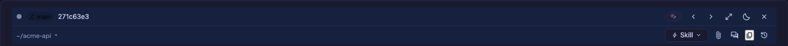
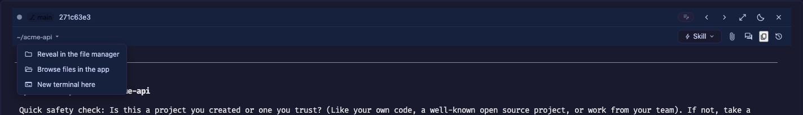
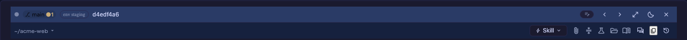
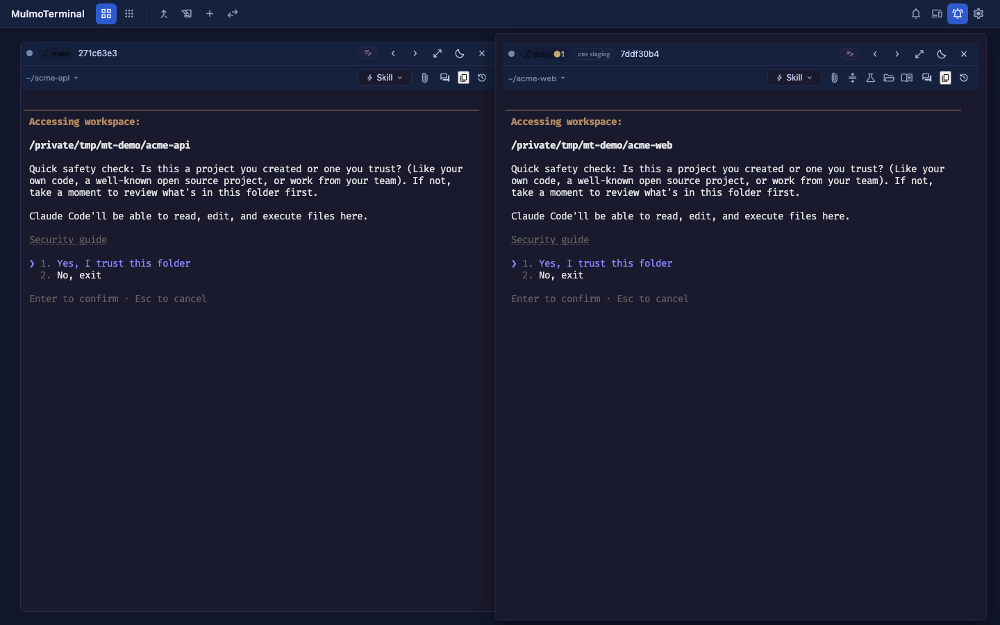
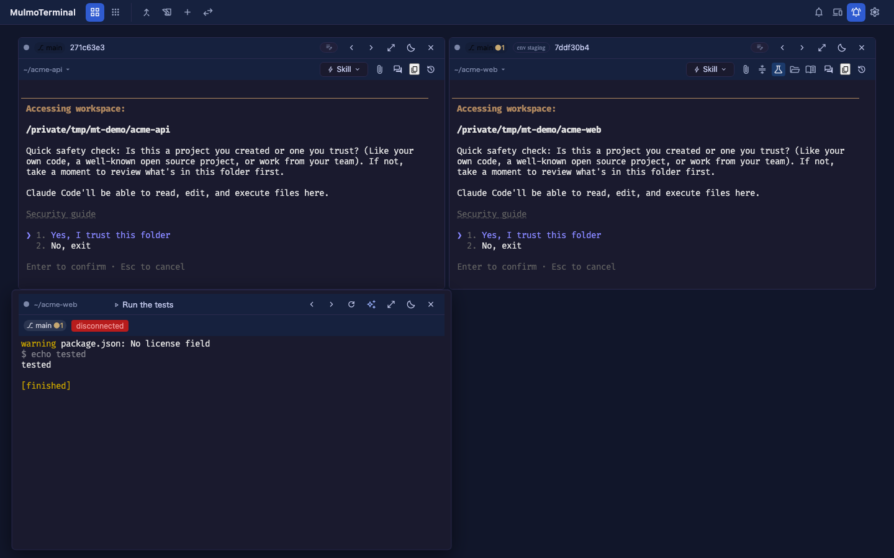

# ヘッダーをカスタマイズする
{: .no_toc }

- TOC
{:toc}

よく使う操作が「ターミナルに打ち込む」しかないと、1 日に何十回も同じ文字を打つことになります。
MulmoTerminal は、稼働中セッションのヘッダーに**自分のボタン**を足せます。設定ファイルに数行
書くだけで、`/compact` の送信も、テストの実行も、社内 wiki を開くのも、ワンクリックになります。

このページは**最初の 1 個を足すところから**順に説明します。全フィールドの一覧は
[設定 → ヘッダーのカスタマイズ](config.html#header)に。

---

## 1. まずヘッダーを読む {#anatomy}

何も設定していないセルのヘッダーです。2 段あります。



| 場所 | 何が出ているか | 設定でどうなるか |
|---|---|---|
| 1 段目 左 | 状態ドット、`⎇ main` などの**情報チップ** | [`chips`](header-reference.html#chips) で並べ替え・非表示・追加 |
| 1 段目 右 | **履歴**と**道具**のメニュー・寝かせる・拡大・閉じるなど**セルの操作** | 変えられません（アプリの構造） |
| 2 段目 左 | `~/acme-api ▾` — **パスメニュー**（後述） | 変えられません |
| 2 段目 右 | **Skill** ドロップダウンと**アイコンのボタン列** | [`buttons`](#first-button) がここに入ります |

**カスタマイズできるのは、この 2 段目の右側**です。自分のボタンは **Skill**（稲妻のアイコン）の右に
並びます。既定でそこにあるアイコンはアプリ側の固定ボタンです。

> **既定のボタンは 1 つだけです** — **Open this branch's PR**（そのブランチに開いている PR が
> あるときだけ出ます）。以前ここにあった「ファイルのパスを挿入」「ファイルマネージャで開く」
> 「アプリでファイルを見る」「ここで新しいターミナル」と GitHub のリンクは、下のパスメニューへ移りました。

### パスメニュー — ディレクトリに対する操作はここ {#path-menu}

2 段目の左にあるパス（`~/acme-api ▾`）はボタンです。押すと、そのセルのディレクトリに対する
操作が出ます。



**ファイルのパスを挿入**（OS のダイアログで選んだファイルの絶対パスをプロンプトに入れる）・
**ファイルマネージャで開く**・**アプリでファイルを見る**・**ここで新しいターミナル** が、画面の言語で並びます。
リモートが GitHub のリポジトリなら、その下に **GitHub** の欄があり **Repository / Issues / Pull requests /
Actions** が並びます。GitLab（gitlab.com、または `gitlabHosts` に書いたホスト）なら **GitLab** の欄に
**Repository / Issues / Merge requests / Pipelines** が並びます。こちらはそのサービス自身の呼び名のままです。ここは固定なので設定では変わりません。同じことをボタンでも
やりたい場合は、[`buttons`](#run) に自分で書けば両方出ます。

---

## 2. 最初のボタンを 1 個足す {#first-button}

### どのファイルに書くか {#where}

| ファイル | 効く範囲 |
|---|---|
| `~/.mulmoterminal/config.json` | **すべての**ターミナル |
| `<プロジェクト>/.mulmoterminal.json` | **そのディレクトリで開いたセル**だけ |

**ボタンが出るのはエージェントのセル**（Claude / Codex / Antigravity / Grok / Muse）です。ランチャーの
チップや Shell セル、Run コマンドで開いたターミナルには出ません —— あれはユーザー自身のコマンドラインで、
このアプリが設定したものは何も足さないからです。

まずはプロジェクト側で試すのが安全です。プロジェクトのルートに `.mulmoterminal.json` を作って、
こう書きます。

```json
{
  "buttons": [
    {
      "id": "compact",
      "icon": "compress",
      "label": "Compact this conversation",
      "run": "input",
      "text": "/compact"
    }
  ]
}
```

**サーバの再起動は要りません。** ヘッダーは、作業ディレクトリ・セッション・エージェントが
変わったときと、**ブラウザのウィンドウに戻ってきたとき**に読み直されます。エディタで保存して
ブラウザに切り替えれば、それで反映されます。

### 押すと何が起きるか {#what-happens}

`run: "input"` なので、そのセルで動いている Claude / Codex に `/compact` と**打ち込んで送信**します。
自分でターミナルに切り替えて打つのと同じことが、1 クリックで済みます。

### 大事な落とし穴 — `buttons` を書くと既定は消えます {#replace}

`buttons` を**どこかに 1 つでも書くと、組み込みの既定セットは丸ごと置き換わります**（足されません）。
上の例だけを書くと、**Open this branch's PR** が消えます。残したいなら自分で並べてください。

```json
{
  "buttons": [
    { "id": "pr", "icon": "github:git-pull-request", "label": "Open this branch's PR", "run": "open", "when": "isGitRepo", "open": { "pr": true } },
    { "id": "compact", "icon": "compress", "label": "Compact this conversation", "run": "input", "text": "/compact" }
  ]
}
```

---

## 3. アイコンとツールチップ {#icon-label}

ここが最初につまずくところです。

**`label` は画面に出ません。** ボタンが描くのは**アイコンだけ**で、`label` は
**マウスを乗せたときに出るツールチップ**（ブラウザ標準のもの）になります。

つまり `label` は「そのボタンが何なのか」を伝える唯一の手段です。`Build` のような単語より、
**`Run the tests` のように動作が分かる文**にしてください。ホバーするまで読めないのですから。

| キー | 役割 |
|---|---|
| `icon` | [Material Symbols](https://fonts.google.com/icons) の名前（`compress`、`science`、`menu_book` …）、または GitHub のアイコン（`github:repo`、`github:issue-opened`、`github:git-pull-request`、`github:play`、GitHub のロゴの `github:mark-github`）。**画面に出るのはこれだけ** |
| `emoji` | 絵文字を 1 つ。`icon` より優先されます |
| `label` | **必須**。ホバーで出るツールチップ。読み上げ（`aria-label`）にも使われます |

`icon` も `emoji` も書かないと、`bolt`（稲妻）が出ます。全部これだと見分けが付かないので、
必ず `icon` を指定してください。

下は、5 個のボタンを設定したヘッダーです。文字は 1 つも出ていないことに注目してください。



同じ画面を、設定していないセルと並べるとこうなります。左が未設定、右が上の設定を入れたもの。



---

## 4. `run` の 4 種類 {#run}

ボタンが何をするかは `run` で決めます。4 つしかありません。

### `run: "input"` — エージェントに送る {#run-input}

`text` をそのセッションに打ち込んで送信します。スラッシュコマンドや、決まり文句のプロンプトに。

```json
{ "id": "compact", "icon": "compress", "label": "Compact this conversation", "run": "input", "text": "/compact" }
```

### `run: "shell"` — コマンドを実行する {#run-shell}

`cmd` を**コマンドセル**で実行します。エージェントのセッションは邪魔されません。

```json
{ "id": "test", "icon": "science", "label": "Run the tests", "run": "shell", "cmd": "yarn test" }
```

押すと、こういうセルが開いて結果が出ます。



> `cmd` の中身は**ブラウザに渡りません**。押した時にサーバが `id` から引き直し、`${変数}` を
> シェルエスケープしてから実行します。

### `run: "open"` — 何かを開く {#run-open}

`open` の中に**書いたキー 1 つ**で、開くものが決まります。

**表は、複数書いてしまったときに効く順**（上ほど強い）でもあります。

| キー | 開くもの |
|---|---|
| `pr` | 現在のブランチの PR をブラウザで（**PR が無いときはボタン自体が出ません**）。サーバ側で `url` に解決されるため、**`url` を一緒に書いていても PR のほうが勝ちます** |
| `url` | ブラウザで URL（`http` / `https` のみ） |
| `reveal` | OS のファイルマネージャ（Finder / エクスプローラ / `xdg-open`） |
| `files` | アプリ内のファイルエクスプローラ |
| `view` | アプリ内のビュー：`prs` / `wiki` / `collections` / `accounting`（`diff` も受け付けますが、**現状は専用の画面が無くファイルビューが開きます**。worktree の差分は[差分バッジ](worktree.html#diff-badge)から） |
| `terminal` | そのディレクトリで新しい端末セル |
| `pickFile` | OS のファイル選択ダイアログ。選んだパスを入力欄に挿入します |

```json
{ "id": "handbook", "icon": "menu_book", "label": "Open the team handbook", "run": "open", "open": { "url": "https://example.com/handbook" } }
```

> **1 つのボタンには 1 つだけ書いてください。** 複数書くと上の順で**最初の 1 つだけ**が効き、
> 残りは黙って無視されます。

### `run: "action"` — このセルに対する操作 {#run-action}

セル自身に効く操作です（表の最後のツールバーの操作は、アプリに効きます）。名前は
[キーボードショートカット](config.html#keymap)と同じなので、同じ操作をボタン・キー・コマンドパレットの
どれからでも使えます（ツールバーの操作は、パレットでは画面・設定・切り替えの行として出ます）:

| `action` | 動作 |
|---|---|
| `"terminal-new-here"` | このセルのディレクトリで**起動パネル**を開く。Claude・Codex・シェルなどを選んで起動できる（2段目の **＋** と同じ） |
| `"terminal-new-adjacent"` | このセルのディレクトリで**シェル**をすぐ起動する |
| `"terminal-restart"` | このセルのエージェントを再起動する（下記） |
| `"terminal-close"` | このセルを閉じる |
| `"zoom-toggle"` | このセルを拡大する / 元に戻す |
| `"terminal-move-prev"` / `"terminal-move-next"` | このセルを1つ前 / 後ろへ移す（手動の並び順のときのみ） |
| `"mark-unread"` | このセルを未読 / 既読にする |
| `"terminal-park"` | このセルを休ませる / 起こす |
| `"terminal-timeline"` | **アクティビティのタイムライン**（Claude のセッションのみ） |
| `"terminal-talk"` | **他のターミナルと話す** |
| `"pane-files"` | このセルの横に**ファイルペイン**を開く |
| `"pane-prompts"` / `"pane-transcript"` | **送ったプロンプト** / **会話**のペイン |
| `"pane-tools"` / `"pane-canvas"` / `"pane-collections"` | **使ったツール** / **キャンバス** / **コレクション**のペイン |
| `"screen-wiki"`・`"screen-collections"` など（`screen-*` のすべて） | **その画面へ移動**する（ツールバーの入口と同じ） |
| `"settings-open"` / `"sound-toggle"` / `"view-toggle"` | 設定を開く / 通知音のオン・オフ / 拡大時の表示を一覧・サムネイル列で切り替える |
| `"order-auto"` / `"order-manual"` / `"order-priority"` | 並び順を選ぶ |

ペインのボタンは、拡大中のセルではそのペインの開閉を切り替えます。並べて表示しているセルでは、
「アプリでファイルを見る」と同じく、セルを拡大してからペインを開きます。そのセルでできないとき
（Claude 以外のセッションで `terminal-timeline`、ほかのターミナルが無いときの `terminal-talk`、手動の
並び順でないときの移動）は、何もしないのではなくセルにその旨が出ます。名前をショートカットと共通に
する前の `"restart"` も、そのまま使えます。

```json
{ "id": "restart", "icon": "restart_alt", "label": "Restart the agent", "run": "action", "action": "terminal-restart" }
```

`"terminal-restart"` は、エージェントのプロセスを終了して、**同じセル・同じディレクトリ・同じ会話のまま**起動し
直します。ランチャーに戻ってディレクトリを選び直し、*or resume here* から会話を探す必要はありません。
MCP の登録変更・`~/.mulmoterminal/config.json` の編集・plugin の更新が効くようになるのはこれです。
これらはプロセス起動時に一度だけ読まれるからです。

> **resume の代償があり、確認は出ません。** 会話は transcript から読み直され、実際にトークンを消費します。
> 作業中でもエージェントは終了します。このボタンのほかに、セルの道具メニューと
> [`terminal-restart` ショートカット](config.html#keymap)からも再起動できます。

### ボタンをフォルダにまとめる {#folder}

2 段目の幅には限りがあります。たまにしか使わないボタンは、**フォルダ**にまとめられます。
`run` の代わりに `items` を持つ項目で、画面にはアイコン 1 つだけが出ます。押すと、中のボタンが
アイコンと名前つきでメニューに並びます。

```json
{ "id": "ops", "icon": "construction", "label": "Operations",
  "items": [
    { "id": "restart", "icon": "restart_alt", "label": "Restart the agent", "run": "action", "action": "terminal-restart" },
    { "id": "test", "icon": "science", "label": "Run the tests", "run": "shell", "cmd": "yarn test" }
  ] }
```

- **入れ子は 1 段だけです。** `items` の中はボタンに限ります。フォルダの中に書いたフォルダは捨てられます。
- フォルダ自体の `when` は、フォルダごと出すかを決めます。中のボタンはそれぞれ自分の `when` を持てます。
  中のボタンがすべて隠れるときは、フォルダも出ません。
- `id` はフォルダの中と外を通して一意です。すでに使われている `id` を持つフォルダ内のボタンは捨てられます。

### コマンドパレットにだけ出すコマンド {#commands}

たまにしか実行しないものに、毎回ヘッダーのアイコンは要りません。`buttons` の代わりに **`commands`** に
書くと、**書き方はまったく同じ**（`run`、`when`、`${変数}`、フォルダ）で、**コマンドパレット**
（ツールバーのコマンドボタンか、`command-palette` に割り当てたキー）にだけ出ます。

```json
{ "commands": [
    { "id": "release", "label": "Cut a release", "run": "shell", "cmd": "yarn release" }
  ] }
```

- `~/.mulmoterminal/config.json` とプロジェクトの `.mulmoterminal.json` のどちらにも書けて、ボタンと同じく `id` でマージされます。
- パレットには、操作の対象のターミナル（拡大中のもの、なければカーソルのあるもの）の**コマンドとヘッダーのボタンが全部**並びます。
  `when` と `${変数}` はそのターミナルについて決まり、`shell` のコマンドはそこで動きます。対象のターミナルが無いときは並びません。
- ボタンがすでに使っている `id` のコマンドは捨てられます。

---

## 5. ここから先は「引く」ページへ {#next}

ここまでで、ボタンは作れます。この先 —— `${変数}` の一覧、`when` の全記法、global とプロジェクトの
マージ、チップ、Skill メニュー、そのまま貼れるレシピ —— は
**[ヘッダーのリファレンス](header-reference.html)**にあります。上から読むページではなく、
**書くときに引く**ページです。

| 知りたいこと | どこ |
|---|---|
| `${dir}` や `${task}` に何が入るか、いつ空になるか | [`${変数}`](header-reference.html#vars) |
| 出し分けの条件（`!isGitRepo`・`!=`・「値があるとき」） | [`when`](header-reference.html#when) |
| global とプロジェクト、2 つの設定ファイルの関係 | [並び順とマージ](header-reference.html#order-merge) |
| 1 段目の情報チップを並べ替える・足す | [チップ](header-reference.html#chips) |
| Skill メニューを短くする | [Skill メニュー](header-reference.html#skills) |
| 全部入りの `.mulmoterminal.json` | [レシピ集](header-reference.html#recipes) |

---

## 関連 {#related}

- [ヘッダーのリファレンス](header-reference.html) — 変数・`when`・マージ・チップ・レシピ集
- [設定 → ヘッダーのカスタマイズ](config.html#header) — 全フィールドのリファレンス
- [設定 → プロジェクトごとの設定](config.html#per-dir) — 色・名前・並び順など、同じファイルの他のキー
- [設定](config.html) → 「よく使うコマンドを Run メニューに」 — `script.json` で **Run** メニューを足す
- `/mulmoterminal-header` スキル — 対話で書いてもらう場合はこちら
