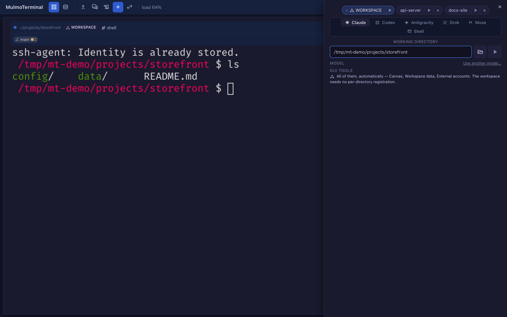

# 4.12.0 — 起動パネルと、消えたグリッドの戻し方

**4.12.0（2026-08-28 リリース）時点のスナップショットです。** アプリが進むにつれて古くなりますが、
それは織り込み済みです。生きている情報は各節からリンクしているガイド本体を見てください。

```bash
npx mulmoterminal@latest
```

まず読む価値があるのは 1 つ、**4.11.0 でグリッドが空になった方は、このリリースで戻ります**。
1 ケースだけ手を動かす必要があります。起動パネルは設定ではなく手の動かし方が変わる話で、
残りは何もしなくても効きます。

## 4.11.0 でグリッドが空になった方へ

**設定は不要です。上げれば配置が戻ります。**

### 何が壊れていたか

4.11.0 は、ブラウザを `http://localhost:<port>` ではなく `http://127.0.0.1:<port>` で開くように
なっていました。同じものに見えて違います —— ブラウザはページの保存データ（**グリッドの配置**・
テーマ・フォントサイズ）を**ホスト名ごと**に分けて持つので、ホスト名が変われば別の引き出しです。
アプリは空で立ち上がり、セッションは全部 tmux で生きているのに、配置がホスト名 1 つ隣にあることを
告げるものが画面に何もありませんでした。

消えてはいません。別の名前で仕舞われていただけです。

### 直っているかの見分け方

起動時に出る行を見てください。

```
────────────────────────────────────────────────
  ✓ MulmoTerminal is ready
  → http://localhost:34567
────────────────────────────────────────────────
```

`127.0.0.1` ではなく `localhost` になっていれば、開けば元のグリッドが出ます。

### 1 つだけ手が必要なケース

**4.11.0 をしばらく使ってグリッドを組み直した**場合、その新しい配置は
`http://127.0.0.1:<port>` 側に仕舞われたまま残ります。そのアドレスを直接開けば出てくるので、
好きな方から並べ直してください。

アプリが自動で取りに行くことはできません。機能の不足ではなくブラウザの規則です —— ページは
別のホスト名の保存データを読めません。隠しフレーム越しでも読めません。

### MULMOTERMINAL_HOST を設定している方へ

bind したアドレスも 1 行で出るようになったので、ポートを開けた相手のマシンにも行き先が伝わります。

```
  → http://localhost:34567
[mulmoterminal] Bound to 192.168.11.12 — reachable from another machine at http://192.168.11.12:34567
```

動かしているマシンでは `localhost`、他のマシンからは下の行のアドレスを使ってください。

### 同じポートを IPv6 側で他プログラムが握っている場合

まれに、同じマシンの別プログラムが同じポートを IPv6 のループバックで listen していることが
あります。`localhost` はそちらにも解決しうるので、その場合ランチャーは身を引いて理由を告げます。

```
[mulmoterminal] Something else is already listening on [::1]:34567, so the browser is being sent to
http://127.0.0.1:34567 — the address that was checked. If your layout and settings look empty, they
are filed under http://localhost:34567.
```

グリッドが空に見えるときは、このメッセージが答えです。相手のプログラムを止めて起動し直せば
`localhost` に戻ります。

ポートとホストの詳細は [4.11.0 のページ](v4.11.0.html)（`PORT` と `MULMOTERMINAL_HOST` を
ひととおり扱っています）。

## 起動フォームがパネルになりました

これまで `+` を押すと、グリッドの**末尾**に空のマスが 1 つ足される形でした。これから起動しようと
している端末が、いちばん注意から遠いところに現れることになり、拡大表示中はそもそも現れる場所が
ありませんでした。

**右端のパネル**として開くようになり、3 つの表示モードすべてで同じように出ます。



入口は 2 つで、違いは**どのディレクトリで開くか**です。

| 押す場所 | 開くディレクトリ |
|---|---|
| ツールバーの `+` | ワークスペース |
| 端末ヘッダーの `+` | **その端末の**ディレクトリ |

後者が要点です。いま居るところでもう 1 体立ち上げるのに、パスを打ち直さずに済みます。

パネルが開いている間はキーボードをパネルが持ちます。Escape で閉じ、打った文字は後ろの端末ではなく
フォームに入ります。閉じるとフォーカスは開いた場所へ戻ります。

### キーマップを設定している方へ

アクションは 3 つ、意味が変わったのは 1 つだけです。

| アクション | いまの動き |
|---|---|
| `terminal-new` | パネルを開く（以前: マスを 1 つ足す） |
| `terminal-new-here` | **新規** —— ヘッダーの `+`。その端末のディレクトリでパネルを開く |
| `terminal-new-adjacent` | 変更なし —— このディレクトリでシェルを即座に開く。フォームは出ない |

`terminal-new` を割り当てている場合はそのまま動き、パネルが開きます。`terminal-new-here` を
キーに割り当てたいとき以外、手を入れる必要はありません。割り当て方は
[キーボードショートカット](config.html#keymap)。

## 何もしなくてよい修正 2 件

**エージェントに頼んだ絵コンテのビート差し替えが、黙って行われていませんでした。** 既存の
MulmoScript のビートを 1 つ入れ替える依頼が、成功を返してファイルを触らずに終わっていたため、
何も書かれていないのにエージェントは「やりました」と答えていました。新規ファイルの作成は常に
正常で、既存ファイルの差し替えだけが該当します。修正済みで、開いているキャンバスもファイルの
変更に追随するようになりました。

**モデル選択に出る OpenRouter の価格が間違っていました。** OpenRouter のプリセット 27 件のうち
16 件が公開カタログとずれていて、上下どちらにも 2 倍以上の差があるものがあり、コンテキスト長が
実際の 2 倍になっているモデルも 1 件ありました。2026-08-28 時点のカタログと全件一致し、
フロンティアの並びも安い順に戻っています。表示価格でモデルを選んでいる方は見直す価値があります
—— かなり安くなったものがあります。→
[別のモデルで Claude Code を動かす](providers.html#add-models)
