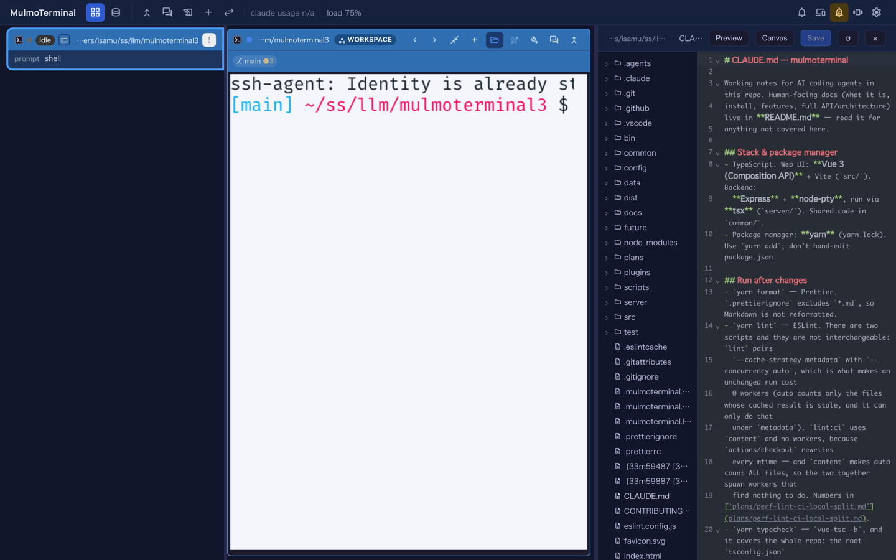
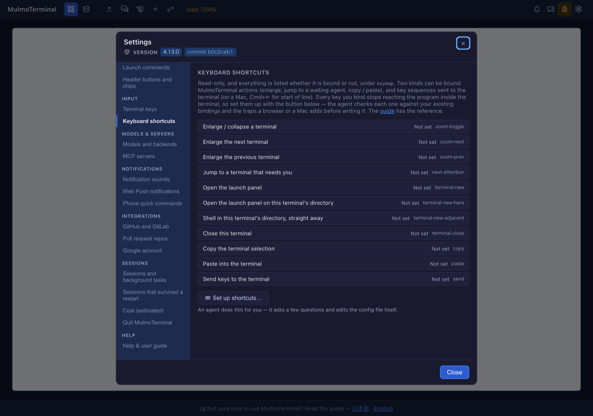

# 4.13.0 — ターミナルの隣のファイルと、挿入できるパス

**4.13.0（2026-08-29 リリース）時点のスナップショット。** アプリが進めば古くなります。それは想定どおりで、
生きているリファレンスは各節がリンクしているガイドのほうです。

```bash
npx mulmoterminal@latest
```

**設定は何も要りません。** 以下はすべて自動的に効きます。このページは「何がどこへ動いたか」の話です。

## ファイルは画面を覆わず、ターミナルの隣に開く

ターミナルのヘッダーにあるディレクトリのパスをクリックして **Browse files in the app** を選びます。
以前は画面を全画面の Files ビューに置き換えていました。いまは**拡大ターミナルの隣**にファイルペインが
開きます —— ペインの左がツリー、右が中身、ターミナルは見えたまま動いたままです。



タイル表示のときは先にそのセルを拡大します。2 手が 1 手になります。

**全画面の Files ビューが無くなったわけではありません。** 自分で書いたヘッダーボタン（`"run": "open"` と
`open.files`）からは従来どおり全画面が開きます。これは意図的で、ボタンは任意のパスを渡せるのに対し、
ペインは拡大ターミナルのディレクトリにしか root できないからです。設定は同じで行き先が 2 つ、違いは
どちらから来たかです。

ペインとターミナルの境目はドラッグバーです。掴んだまま外れなくなった経験がある方は、下の修正の項を。

## ファイルを右クリックして、パスをターミナルへ

今回の新機能です。**ツリーの行を右クリック**すると、**Insert relative path** と
**Insert absolute path** が出ます。パスはターミナルのカーソル位置 —— つまりいま打ちかけの場所に入ります。


「いま書いている途中の文」のための機能です。`read ` まで打ってからファイルを右クリックする、という使い方で、
パスを打ち直したりどこかからコピーしてくる必要がありません。relative はそのターミナルのディレクトリ基準です。

## キーボードショートカットが、全部並ぶ

**設定 → Keyboard shortcuts** に、MulmoTerminal のアクションが**割り当て済みかどうかに関係なく全部**
並ぶようになりました。何を割り当てるか決める前に、何があるのかが見えます。



この一覧は**読み取り専用**です。ここは「何があるか」を見せる画面で、編集はしません。下にある
**Set up shortcuts…** を押すと、エージェントがいくつか質問して `~/.mulmoterminal/config.json` を
書きます。これは画面でできることを遠回りにやっているのではありません —— エージェントは各キーを
**既存の割り当て**と、**ブラウザや Mac が横取りする罠**の両方に照らして確認します。手書きのキーマップが
だいたいそこで失敗するからです。

割り当てられるのは 2 種類。MulmoTerminal 自身のアクション（拡大、待っているエージェントへ飛ぶ、コピー / 貼り付け）と、
**ターミナルへ送るキー列** —— Mac なら行頭へ移動する `Cmd+←` などです。割り当てたキーはターミナルの中の
プログラムには届かなくなるので、そこが判断どころです。

リファレンスは [キーボードショートカット（`keymap`）](config.html#keymap)、送信の形は
[ターミナルへキーを送る（`send`）](config.html#keymap-send) にあります。

## 「直っている」と分かる修正

### 分割バーのドラッグがプレビューで固まらない

ターミナルとペインの境目のバーをドラッグすると、カーソルが埋め込みプレビューに乗った瞬間に
**追随が止まり**、しかも**ボタンを離してもドラッグが終わりません**でした。離した後にマウスを動かすと、
何も押していないのに幅が変わり続けます。

**直っていることの確かめ方:** ターミナルを拡大し、プレビューを含むペインを開いて、バーを**速く右へ**
振ってプレビューの上まで持っていき、そこで離します。以前は幅が固まり、その後マウスに付いてきました。
いまは最後まで追随し、離せば止まります。

### `localhost` の宛先がまた 1 つに

サーバが `127.0.0.1` に加えて `::1` も serve するようになりました。ランチャが表示するアドレスと、
ブラウザが実際に行くアドレスが一致します —— `localhost` が IPv6 を先に返すマシンでは、ここがずれていました。

**直っていることの確かめ方:** 起動バナーのポートを、URL を手で書き換えずにそのまま開けます。

### 小さいもの

- レンダリングした文書の**コードブロックのコピーボタン**が復活しました。コンポーネントのルートが
  フラグメントのとき、スタイルの当たる class が届いていませんでした。
- 起動時の**衝突警告**が、`copy` と `send` が同じキーのときに正しいほうを名指しするようになりました。
  `copy` は選択があるときだけ動くので、選択が無いときに発火するのはもう一方です。
- ヘッダーの**ボタン / チップ**を設定 API 経由で書くと配列が全置換される件を、それを書く skill が
  明記するようになりました。以前は既存のものが黙って消えていました。

## リファレンスの場所

このページはスナップショットで、現状に追随するのはガイドのほうです。
[キーボードショートカット](config.html#keymap) ·
[ターミナルへキーを送る](config.html#keymap-send) ·
[サイドペインで質問に答える](config.html#question-pane) ·
[設定ファイルの全キー](config.html#all-keys)
