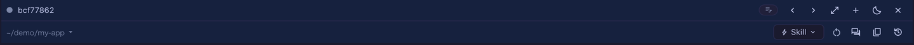

# 4.14.0 — セルを離れずにエージェントを再起動する

**4.14.0（2026-08-30 リリース）時点のスナップショット。** アプリが進めば古くなります。それは想定どおりで、
生きているリファレンスは各節がリンクしているガイドのほうです。

```bash
npx mulmoterminal@latest
```

**このページで設定が要るのは 1 つだけ**で、それは意図的です。再起動は opt-in で、自分で書くまでセルには
何も出ません。残りは何もしなくても効きます。

## いま見ているセルのまま、エージェントを再起動する

MCP サーバやプラグイン、`~/.mulmoterminal/config.json` を変えても、セルで動き続けているエージェントは
古いままです。これまでの戻り方は「セルを閉じる → ランチャーでディレクトリとエージェントを選び直す →
**or resume here** から会話を探す」でした。

**同じセル・同じディレクトリ・同じ会話**のまま再起動できるようになりました。

**既定ではセルのヘッダーに出ません。** 多くの人には不要な操作なので、opt-in の 2 面だけです（両方でも
どちらか一方でも構いません）。

### ヘッダーボタンとして

`~/.mulmoterminal/config.json` の `buttons` に足します:

```json
{
  "buttons": [
    { "id": "restart", "icon": "restart_alt", "label": "Restart the agent", "run": "action", "action": "restart" }
  ]
}
```

{: .warning }
> **`buttons` を書くと既定のボタンは消えます。** 書いた配列がそのまま全体になるので、既に使っている
> ボタンがあるなら、このエントリを**そこに足して**ください。[落とし穴の説明](header.html#replace)。

保存したら**ブラウザのタブを再読み込み**します。**エージェントの**セルのヘッダーに `restart_alt` の
アイコンが出れば、設定が効いた合図です。



Shell セルやランチャーのチップにはカスタムボタン自体が出ません（このボタンも含めて）。あれはユーザー
自身のコマンドラインで、ここで設定したものは何も足されないからです。

### キーボードショートカットとして

同じファイルの `keymap` に足します:

```json
{
  "keymap": {
    "zoom-toggle": "F9",
    "terminal-restart": "Ctrl+Alt+R"
  }
}
```

`terminal-restart` は**拡大中**のターミナルに効きます。拡大する手段をまだ割り当てていなければ一緒に
決めてください —— 上の `zoom-toggle` はそのために並べてあります。保存後にタブを再読み込みします。

### 割り当てる前に知っておく代償

{: .warning }
> **確認なしで即座に再起動します。ターンの途中でも止めます** —— `terminal-close` と同じ扱いです。
> 誤爆しないキーに割り当ててください。

会話は**トランスクリプトから読み直して**戻ります。つまり実際にトークンを消費します。無料の再読み込みでは
ありません。既定で全ヘッダーに出さないのはこれが理由で、「動いているエージェントに読み直させたい変更を
したとき」のための操作です。

### 効いたかどうかの確かめ方

そのプロジェクトの MCP サーバを登録・変更してからボタン（またはキー）を押し、戻ってきたエージェントに
ツールを聞いてみてください。会話は続きのままで、新しいサーバが一覧に出ていれば成功です。`codex` /
`antigravity` / `grok` / `muse` のセルも同じ経路で、それぞれの会話を resume します。

リファレンスはボタンが [`run: "action"`](header.html#run-action)、キーが
[キーボードショートカット](config.html#keymap) です。

## 共有アプリ: 参加者のページを自分の行だけに絞れる

**`mulmoterminal-shared-app`** スキルで共有アプリを書く人向けです。ランタイムが
`@receptron/sharedapp` 0.35.0 になり、ビューに `ownRead` を宣言できます。宣言したページには
**その人が書いた行だけ**が届きます（全行を渡して 1 行ずつ持ち主を判定する、ではなく）。

いつ使うかは **magazine** テンプレートの決定 10 に書いてあります。書き手が数人のうちは全件を渡す今の形が
正しく、それが「その URL 名はもう使われています」を**送る前に**言える理由になっています。効かなくなるのは
書庫が育ったときで、「自分の記事を直す」ためのページが本文込みで全記事を読むことになり、その読みが
アプリの年齢と一緒に増えていきます。

決定の全文はスキルに magazine テンプレートを出させて読んでください。機能全体のリファレンスは
英語ガイドの [Shared apps](../en/shared-apps.html) にあります（このページは日本語版がまだありません）。

## 知っておくとよい修正

### tmux に残った `PORT` が、アプリ自身のポートを奪わなくなりました

MulmoTerminal が自分のポートを全セルに配るのは 4.11.0 でやめました。そこで届かなかったのが
**tmux サーバ**です。tmux サーバはアプリの再起動より長生きするので、修正前に焼き付いた `PORT` は
新しいペインに配られ続け、セルで起動した dev サーバ（`next dev` など `PORT` を読むもの全部）が
MulmoTerminal の listen しているポートを掴んでブラウザが切れる、という状態が残っていました。

変わったのは 2 点です。起動時に、tmux サーバのグローバル環境にある `PORT` のうち**このアプリが listen
しているポートと同じ値**を消します。そして MulmoTerminal が新しく作る tmux サーバには、そもそもその
ポートを渡しません。

**[4.11.0 のページ](v4.11.0.html)にある手動の回避策はもう不要です。** あのページはその時点の
スナップショットなので、いまも `tmux -L mulmoterminal set-environment -gu PORT` を実行するよう
書いてありますが、今は飛ばして構いません。

**修正が入っているかの確かめ方:** セルで**新しい**ターミナルを開いて `echo $PORT` を実行します。自分で
export していない限り、何も出ないはずです。自分で設定した `PORT` はそのままです ——
`PORT=3000 mulmoterminal --port 34601` で起動すれば、その 3000 はこれまでどおりセルに入ります
（アプリが握っている値ではないからです）。

すでに開いているペインは生まれたときの環境を保持します。効くのはこれから開くペインです。

### 細かいもの

- 依存の更新: `@google/genai` 2.19、`zod` 4.5、`puppeteer` 25.9、`sharp` 0.35.4。

## リファレンスの場所

このページはスナップショットで、最新を保つのはガイドのほうです。
[ヘッダーボタン](header.html) ·
[`run: "action"`](header.html#run-action) ·
[キーボードショートカット](config.html#keymap) ·
[Shared apps（英語）](../en/shared-apps.html) ·
[設定ファイルの全キー](config.html#all-keys)
