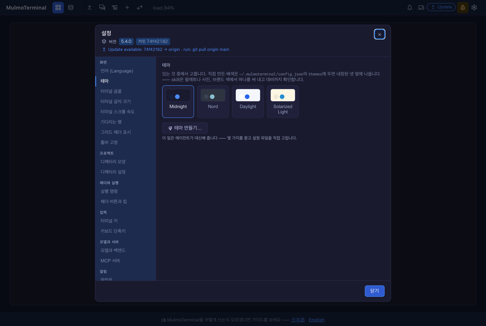
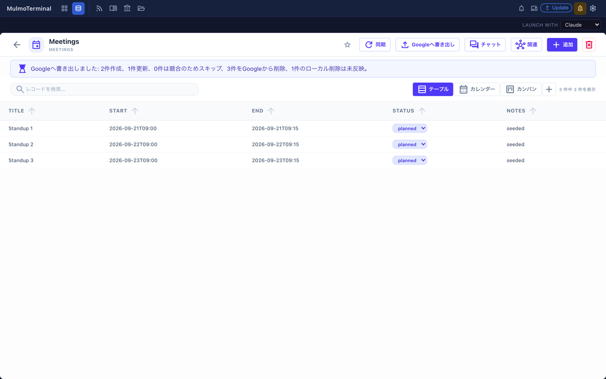

# 5.5.0 — 読めない言語からの戻り道と、何を消したか言う書き出し

**5.5.0 時点のスナップショットです（2026-09-23 リリース）。** アプリが進めば内容は古くなります。
それは前提で、各節からリンクしている「生きているガイド」が常に最新です。

どちらも設定は要りません。1つ目は、自分で選んだわけではない状況でだけ気づく変更です。2つ目は、
コレクション側が明示的に有効にしたときにだけ現れます。

## 1. 読めない言語から戻れるようにする

**有効にするものはありません。** これは「何かを間違えたあと」の話です。

5.4.0 で画面表示が5言語になりました。読めない言語を選んでしまうのは簡単です——一覧で自分の一つ上、
共有している端末、押し間違い。そしてこれまでは、ピッカーへ戻る道が全部、いま出ていった言語で書かれて
いました。ピッカーの中身自体は問題ありません。あれは自称表記なので、自分の言語の綴りを探せば見つかり
ます。**そこへ辿り着けなかった**のです。

戻り道それぞれに英語名が並ぶようになりました。設定の横一覧の項目、ピッカー自身のラベル、そして
`auto` の選択肢です。

**入っているかの見分け方**: 歯車を開いて、横一覧のいちばん上の項目を見てください。画面の言語が何で
あっても、そこに英語で `Language` と出ます。

**生きているガイド**: [どこで何を変えられるか](config.html#settings-modal)

## 2. 書き出しが、Google 側で消した件数を言う

**有効にするものはなく、コレクション側が明示的に有効にしていなければ何も変わりません。**

Google カレンダーと同期しているコレクションは `propagateDeletes` を宣言できます。これを入れると、
レコードを消したときに Google のイベントも消えます。書き出しがそれを伝えるようになり、あわせて
**反映されなかった**ローカル削除を、それとは別の小さい数として報告します。

**入っているかの見分け方**: `propagateDeletes` を有効にしたコレクションで、レコードを消してから
**Googleへ書き出し**を押してください。Google から削除した件数が文面に出ます。5.5.0 より前は、同じ
書き出しが、実際には反映された削除まで含めて全部「未反映」と言っていました。

**`propagateDeletes` を入れる前に知っておくこと**（いずれも上流の問題で、そちらで追っています）:

- Google に拒否された削除——参加者のいるイベント——は、押し出せなかったレコードと同じ一覧に入ります。
  そのため文面が「失敗」になり、**成功した作成件数が隠れます**
  （[mulmoclaude#3272](https://github.com/receptron/mulmoclaude/issues/3272)）。
- `autoPush` も一緒に入れると、予定実行の記録は自分で押したときより**薄くなります**。消えたイベントは
  どちらの経路でも1件ずつ記録され、イベント id が残るので、**予定実行の削除も辿れます**。薄いのは
  要約のほうです。自分で押した書き出しは画面と同じ数字でサーバの記録に残りますが、予定実行を報告する
  同期エンジンは削除の件数をどちらも持たず、1件ずつの行にはどのコレクションかが入りません。何が消えた
  かは分かりますが、1件ずつ読むことになります
  （詳細は [mulmoclaude#3262](https://github.com/receptron/mulmoclaude/issues/3262)）。
- この経路で消えた Google のイベントは、あなただけでなく**参加者全員**のカレンダーから消えます。

**生きているガイド**: [コレクションを見たまま進める](features.html#collection-chat)

## このリリースのその他

`@mulmoclaude/core` と同梱の8プラグインが core 5 系へ移りました。することはありません——上の書き出しが
正しく報告できるのは、この移行のためです。一覧は
[変更履歴](https://github.com/receptron/mulmoterminal/blob/main/docs/ChangeLog.md)にあります。
