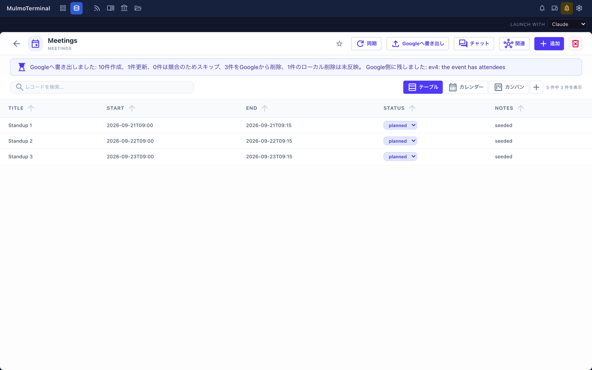

# 5.6.0 — 拒否された削除が「書き出しの失敗」に見えなくなりました

**5.6.0 時点のスナップショットです（2026-09-23 リリース）。** アプリが進めば内容は古くなります。
それは前提で、各節からリンクしている「生きているガイド」が常に最新です。

設定するものはありません。コレクションが `propagateDeletes` を有効にしていて、かつ Google が削除を
拒否したときにだけ現れます。

## 拒否された削除が、成功した書き出しを隠さなくなりました

**有効にするものはありません。**

`propagateDeletes` を入れていると、レコードを消したときに Google のイベントも消えます——ただし
Google が拒否した場合を除きます。参加者のいるイベントがそれです。これまで、その拒否は「押し出せな
かったレコード」と同じ一覧に入っていて、その一覧に1件でも入ると文面ごと置き換わっていました。
10件作成して削除が1件拒否された書き出しが、**「書き出しに失敗しました」だけ**を出し、10件のことは
どこにも出ませんでした。

いまは別々に報告されます。書き出しが何をしたか**と**、どの削除が残ったか・その理由が、両方出ます。

**入っているかの見分け方**: `propagateDeletes` を有効にしたコレクションで、参加者のいるイベントの
レコードを消してから **Googleへ書き出し** を押してください。件数**と**、残したイベントを挙げる行が
両方出ます。5.6.0 より前は、失敗の文面だけでした。

**なぜ「そっけない」ではなく「誤り」だったか**: レコードはこちらで消え、イベントはあちらに残って
います——それは伝えるべきことです。しかし書き出しの残りは成功していて、拒否を失敗として報告すると
それを捨ててしまっていました。

**生きているガイド**: [コレクションを見たまま進める](features.html#collection-chat)

## 5.5.0 のガイドの訂正

5.5.0 では `propagateDeletes` と `autoPush` の併用を「**記録が残らないもの**」として扱うよう書いて
いました。予定実行の削除は記録に残らない、と。**あれは誤りでした。** 挙動が変わったのではなく、
こちらの書き間違いです。消えたイベントは、押したときも予定実行のときも、**1件ずつイベント id 付きで
記録されています**。予定実行に無いのは*要約*のほうで、報告に削除の件数が入らず、1件ずつの行には
どのコレクションかが入りません。

[5.5.0 の頁](v5.5.0.html)は訂正済みです。`propagateDeletes` を入れる前に知っておくことのうち、
変わらないものが1つあります: **この経路で消えた Google のイベントは、あなただけでなく参加者全員の
カレンダーから消えます。**

## このリリースのその他

`@mulmoclaude/core`・コレクションプラグイン・markdown プラグイン・shapescript プラグインを上げて
います。することはありません。前の2つが上の修正を届けているものです。一覧は
[変更履歴](https://github.com/receptron/mulmoterminal/blob/main/docs/ChangeLog.md)にあります。
