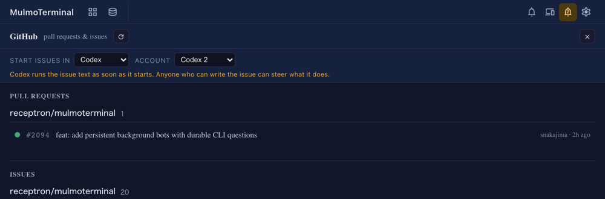

# 6.0.0 — issue の作業を始めるエージェントとアカウントを選ぶ

**6.0.0（2026-09-24 リリース）時点のスナップショットです。** アプリが進めば古くなります。それは
想定どおりで、最新の説明は各節からリンクしているガイドにあります。

設定は不要です。6.0.0 を動かせばすぐ使えます。アカウントが選べるのは、`accounts` を設定している
場合だけです（[5.8.0](v5.8.0.html) から）。

## issue の作業を始めるエージェントを選ぶ

**設定は不要です。**

PR / Issue ビューの一覧の上に **ISSUE の開始に使う**（英語表示では START ISSUES IN）の行が加わりました。
ここで選んだものが、issue の行の再生ボタン（*Work on this issue*）で開くエージェントになります。Claude Code、Codex、ほかの対応エージェントから
選べます。選ぶまでは既定のエージェントに従います。選んだものはこのブラウザに記憶され、チャットの
起動の選択とは別に保たれます。

- **アカウント。** Claude Code と Codex で `accounts` を設定していると、横にアカウントの選択が
  出ます。既定のログインのままにするか、2 つ目の契約を選びます。エージェントを変えるとアカウントは
  既定に戻ります。
- **注意書き。** Claude 以外を選んでいるあいだ、行の下に一文が出続けます。Claude は issue の本文を
  入力欄に入れるだけで、Enter を押すのは自分です。ほかのエージェントは起動した時点で本文を実行し、
  Codex 以外はツールの承認も自分で済ませます。issue の本文は、それを書いた人の文章そのものです。
- **入っていないエージェント**は一覧に出ますが選べません。記憶していた選択があとから使えなく
  なった場合は、その理由とインストール手順へのリンクが出て、開始はされません。
- すでにセッションのある worktree では、**そのセッションがそのまま再開**されます。この行の選択は
  新しいセッションにだけ効きます。
- スマホからの開始は変わりません。渡されたエージェントで、既定のログインで始まります。

**入っているかの確かめ方：** PR / Issue ビューを開きます。設定したリポに issue が出ていれば、
ヘッダーの下に ISSUE の開始に使う の行があります。

最新のガイド：[GitHub — PR / Issue 横断ビュー](github.html)（3 の節）、
[設定 → accounts](config.html#accounts)。
