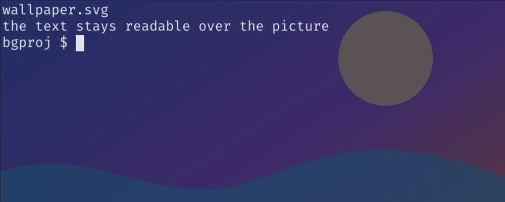

# 6.1.0 — プロジェクトのターミナルの背後に画像を

**6.1.0（2026-09-25 リリース）時点のスナップショットです。** アプリが進めば古くなります。それは
想定どおりで、最新の説明は各節からリンクしているガイドにあります。

設定するものは1つだけで、使いたいときだけです。プロジェクトの `.mulmoterminal.json` の
`backgroundImage` です。

## ディレクトリごとの背景画像

**設定する** — ディレクトリごとに `<project>/.mulmoterminal.json` へ書きます（リポジトリに入れたく
なければ `.mulmoterminal.local.json` へ）。

```json
{ "backgroundImage": { "image": "art/wallpaper.jpg", "opacity": 0.2, "fit": "cover" } }
```

文字列だけでも書けます。`"backgroundImage": "art/wallpaper.jpg"` なら不透明度 15%、ターミナル
全体を覆います。そのディレクトリのすべてのターミナルに、再起動なしで出ます。エージェントに
書いてもらえばその場で、手で書き換えたときはタブを再読み込みすると反映されます。



- **文字は読めたままです。** 画像は文字と合成して重ねます。暗いテーマでは背景より明るい部分だけ、
  明るいテーマでは暗い部分だけが見えます
- **調整するのは不透明度です。** 0 より大きく 1 以下。写真なら 0.1〜0.2 くらいが目安です
- **`fit`**: `cover` ははみ出しを切ってターミナル全体を覆い、`contain` は画像全体を収めます
- **画像の扱いは `icon` と同じ**です。ディレクトリ内のファイル（`../` で外に出るものは拒否）、
  `http(s)://` の URL、`data:image/…` のどれかです
- 自分用の画像はリポジトリに入れないのがおすすめです。`.gitignore` の対象になっている場所に置き、
  `.mulmoterminal.local.json` からそこを指してください

**入っているかの確かめ方：** 設定 → 「設定が効かないときは」に、そのディレクトリの
**Background image** の行が出ます。代わりに無視されたキーとして出ていたら、ファイルがない、
画像ではない、または不透明度が範囲外です。

最新のガイド：[設定 → ターミナルの背景画像](config.html#dir-background)。
