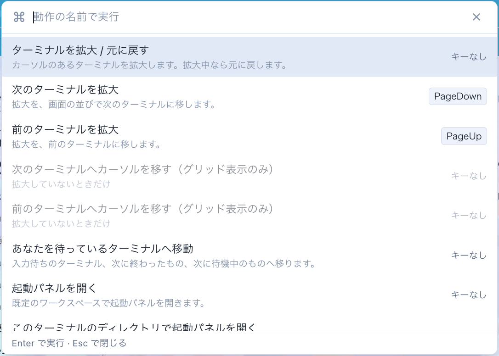
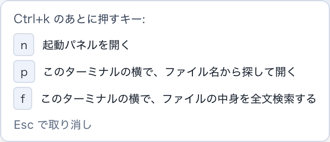

# 6.4.0 — コマンドパレット、2打のキー、テーマに合わせた Preview

**6.4.0 時点（2026-09-26 リリース）のスナップショットです。** アプリが進むにつれて古くなりますが、それは想定どおりです。常に最新の説明は、各節からリンクしているガイドにあります。

## コマンドパレット

ツールバーに **コマンド** ボタン（⌘ のアイコン、設定の隣）が増えました。グリッドの動作が、一行の説明と、割り当てたキー（あれば）つきで並びます。名前の一部か動作の id（`find`、`zoom`）を打って `Enter` で実行、`Esc` で閉じます。



- 今の表示では使えない動作は、理由を添えて灰色で出ます（「ターミナルの拡大中だけ」など）。ほかのビューや起動パネルが前面にあるときは、全行が「ターミナルのグリッドが前面にあるときだけ」になります。
- `copy`・`paste` は載せていません。ターミナルの中で、選んだ文字に対して働くものだからです。

**キーは、はじめからは割り当てていません。** `keymap` は、自分で書いたものしか割り当てません。VS Code と同じキーで開きたいときは、`~/.mulmoterminal/config.json` の `keymap` に次を足します。Mac では `p` を**小文字**で書きます（Cmd を押している間、ブラウザは小文字を報告するため）。

```json
"command-palette": "Cmd+Shift+p"
```

そのあと、**サーバを再起動して、タブを読み直します**（`config.json` は起動時に一度だけ読まれます）。

**確かめ方。** ツールバーに ⌘ のボタンがあり、割り当てたキーで一覧が開きます。

キー設定の詳しい説明: [キーボードショートカット](config.html#keymap)

## 2打のキー

`keymap` のキーは、空白で区切って2打まで書けます。tmux のプレフィックスや Emacs の `C-x b` と同じ使い方で、1つの1打目から複数の動作につなげられます。

```json
{
  "keymap": {
    "files-find": "Cmd+k p",
    "files-search": "Cmd+k f",
    "zoom-toggle": "Cmd+k z"
  }
}
```

1打目を押すと、右下に「次に押せるキー」が出ます。



- `Esc`、一覧にないキー、または 3 秒で待ちが終わります。どのキーもターミナルには届きません。
- `copy`・`paste`・`send` は1打だけです。
- 1打目には、ほかで使っていないキーを選んでください。重なっていると、起動時の確認がそのキーを使っている割り当てを全部挙げて警告します。
- これまで、空白を含むキーは「1つのキー」として受け付けられ、決して発火しませんでした。今は、起動時にその項目を名指しして誤りとして知らせます。

詳しい説明: [2打のキー（続けて押す）](config.html#keymap-sequence)

## Markdown のプレビューがテーマに合わせて描かれる

Files ペインの **Preview** は、これまで OS の明暗に従っていました。そのため、暗いテーマのアプリで OS がライトだと白い箱が出ていました。今は、アプリのテーマ（組み込みでも自作でも）の色で描かれます。


- テーマを変えるとすぐに追随し、読んでいた位置もそのままです。
- ターミナルでパスをクリックして開く新しいタブの文書は、今までどおり OS の明暗に従います（色を尋ねるアプリがいないため）。

**確かめ方。** 暗いテーマで OS をライトにして `.md` の **Preview** を押すと、文書が暗く描かれます。

## 修正

- 2打のキーの案内が明朝体（セリフ体）で出ていたのを、アプリの文字に合わせました。
