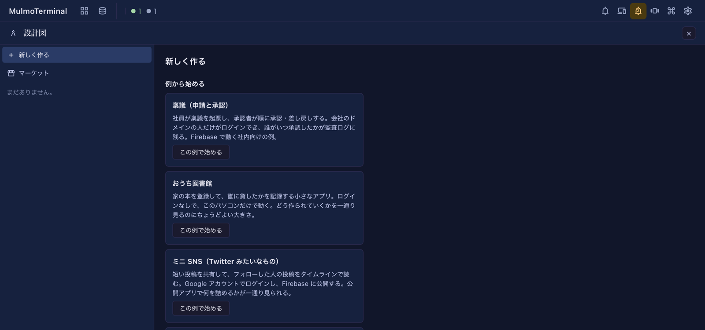
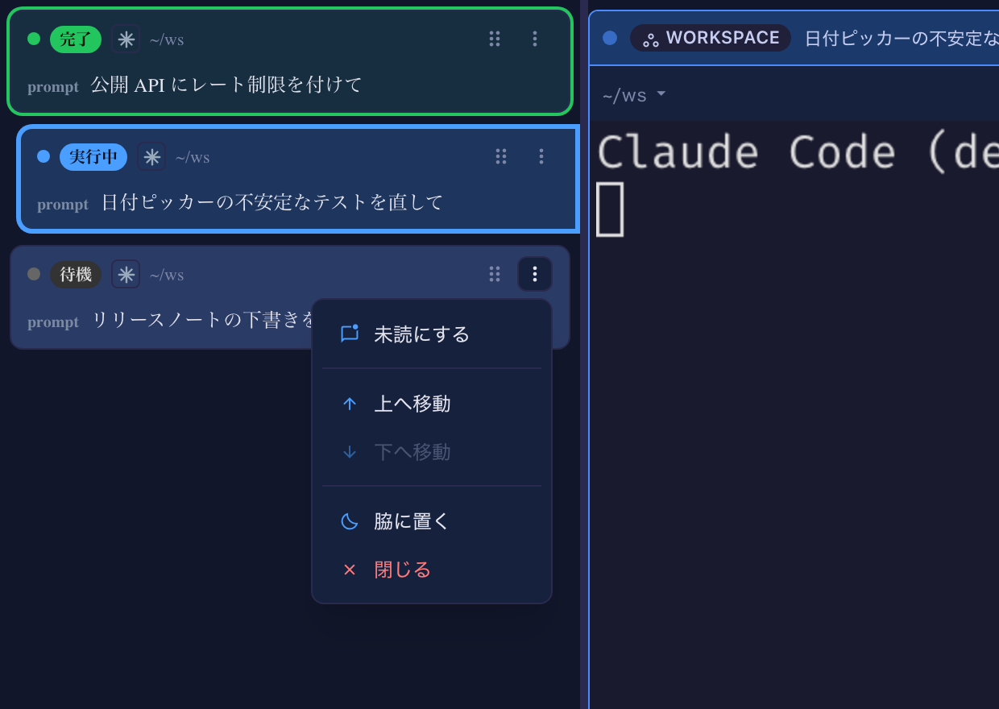

# 6.5.0 — 設計図（試験中）と、セッションを未読に戻す

**6.5.0 時点（2026-09-27 リリース）のスナップショットです。** アプリが進むにつれて古くなりますが、それは想定どおりです。常に最新の説明は、各節からリンクしているガイドにあります。

## 設計図（試験中）

上のバーに「設計図」ボタンが増えました。作りたいアプリについて質問に答えると、それを仕様書にまとめ、その仕様書から Claude Code が工程ごとに組み立てていきます。各工程は、次へ進む前にスクリプトで確かめます。止まって聞くのは、人が決めること（仕様の確認、費用のかかる操作、公開）だけです。

- **まずはローカルで。** 土台 `local`（Express + SQLite + Vue）は自分の PC の中だけで動き、クラウドのアカウントは要りません。一通りの流れを見るなら「おうち図書館」の例がちょうどよい大きさです。
- **先にフォルダを信頼しておく。** ビルドは誰も見ていないところで進むので、Claude Code が信頼済みのフォルダの中でしか始められません。作業用のフォルダは git のリポジトリにしないでください。
- **Claude の利用量はチャットより多めです。** 工程ごとに Claude Code のセッションを起こします。
- パックと質問は、いまは日本語だけです。画面は言語の設定に従います。
- **設計図を動かせるのは、1 台の PC で 1 つの MulmoTerminal だけです。** 2 つ目の MulmoTerminal は一覧を見られますが、操作は断ります。

**入っているかの確かめ方。** `npx mulmoterminal --version` が 6.5.0 で、上のバーに「設計図」ボタンがあること。

準備から最初の一回、試してほしいこと、報告のしかたまで: [設計図](blueprints.html)

## ロスターからセッションを未読に戻す

ターミナルを拡大したときのコックピットのロスターで、各行に ⋮ メニューが付きました。並び順が手動のときだけでなく、いつでも出ます。行のどこかを右クリックしても、同じメニューが開きます。

- **未読にする**: 待機（idle）の行に、緑の「完了」の色を付け直します。あとで一覧から拾い直すためのものです。戻るのは色だけで、音も通知も出ません。ターミナルを開けば今までどおり消えます。
- **既読にする**: 待ちの行の色を消します。
- **脇に置く**と**閉じる**は、ターミナルのヘッダーのボタンと同じ操作です。**閉じる**はその場でセッションを終え、worktree はディスクに残します。
- **上へ移動 / 下へ移動**は、手動の並びのときに今までどおり使えます。

「未読にする」と「閉じる」はメニューの上下の端に分けてあり、押し間違えてセッションを終えることがないようにしています。どの操作も、その行を拡大しません。

**入っているかの確かめ方。** ターミナルを拡大すると、ロスターのどの行にも ⋮ があり、待機の行では一番上が「未読にする」になっています。

詳しくは: [Claude Code を複数同時に動かす](basics.html)の「1 体に寄る（コックピット・ロスター）」

## ガイドに増えたもの

- [共有アプリ](shared-apps.html)に、一つのアプリを最初から最後まで通す例（出欠をとる）と、MulmoClaude のコレクションとの接点を足しました。
- 共有アプリのページに日本語版ができました。
