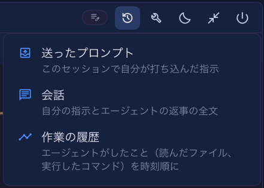
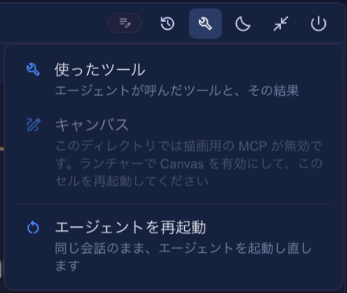
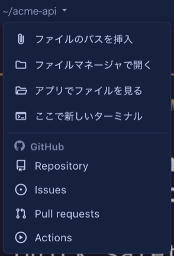

# 6.6.0 — すっきりしたセル見出しと、文書の設計図

**6.6.0 時点（2026-09-28 リリース）のスナップショットです。** アプリが進むにつれて古くなりますが、それは想定どおりです。常に最新の説明は、各節からリンクしているガイドにあります。

今回の中心は、セルの見出しの整理です。並べて表示のセルに並ぶアイコンを減らし、一つひとつが何かを言葉で示すようにしました。使うための設定は要りません。知っておくとよい設定の変更が一つだけあり、最初の節の最後に書いています。

## セルの見出し：履歴と道具

セルの 1 段目の右は **履歴・道具・寝かせる・拡大／元に戻す・閉じる** の順になりました。見分けにくかった 5 つのパネル用ボタンをやめ、メニューの中に、アイコンと名前と一行の説明で並べています。



- **履歴** — *送ったプロンプト*・*会話*・*作業の履歴*（Claude のセル。2 段目から移りました）。
- **道具** — *使ったツール*・*キャンバス*（描画用の MCP が無いディレクトリでは、直し方を添えて押せない状態で出ます）・*コレクション*（あるディレクトリだけ）、そして区切り線の下に **エージェントを再起動**（同じ会話のまま起動し直す）。



- パネルは**拡大した**セルの横に開きます。並べて表示のときもメニューは出ますが、押せるのは作業の履歴と再起動だけで、パネルには「セルを拡大すると横に開けます」と出ます。
- 開いているパネルは、メニューのアイコンが押された見た目になり、項目にチェックが付きます。もう一度選ぶと閉じます。
- **拡大／元に戻す**は右端、閉じるの隣に移りました。閉じるの隣にあった **＋** は無くなりました。ターミナルはツールバーの **＋**（または `terminal-new-here`）から始めます。

**自分で `restart` のボタン**（`run: "action"`、`action: "restart"`）を足していた場合、道具のメニューの項目と重なります。`buttons` から消してかまいません。残しておいてもそのまま動きます。

ガイド：[セルの読み方](basics.html)、[アイコンとツールチップ](header.html#icon-label)。

## パスのメニューが、すべてのセルに

セルの見出しのディレクトリのパスを押すと、その場所に関する操作がまとめて出ます。エージェントのセルだけでなく、Run のコマンドのセルとランチャーのセルにも付きました（Run のコマンドのセルには入力先が無いので、*ファイルのパスを挿入* は出ません）。



- 先頭は **ファイルのパスを挿入** です（以前は 2 段目のクリップのボタンでした）。上の 4 つは画面の言語で出ます。
- リポジトリの欄には置き場所の見出しが付きます。**GitHub**（Repository / Issues / Pull requests / Actions）か **GitLab**（Repository / Issues / Merge requests / Pipelines。gitlab.com と `gitlabHosts` に書いたホスト）です。
- 1 段目の **Files** のボタンは無くなりました。*アプリでファイルを見る* で同じパネルが開きます。

ガイド：[パスメニュー](header.html#path-menu)。

## ヘッダーのボタン：フォルダと GitHub のアイコン

2 段目は自分で設定できる場所で、新しいことが二つあります。**フォルダ**で複数のボタンを一つのアイコンにまとめられます（1 段だけ）。また `icon` に `github:<名前>` と書くと、GitHub 自身の形を使えます（`repo`・`issue-opened`・`git-pull-request`・`play`・`mark-github`）。

```json
{
  "buttons": [
    { "id": "pr", "icon": "github:git-pull-request", "label": "Open this branch's PR", "run": "open", "when": "isGitRepo", "open": { "pr": true } },
    { "id": "ops", "icon": "construction", "label": "Operations", "items": [
      { "id": "test", "icon": "science", "label": "Run the tests", "run": "shell", "cmd": "yarn test" },
      { "id": "compact", "icon": "compress", "label": "Compact this conversation", "run": "input", "text": "/compact" }
    ] }
  ]
}
```

`~/.mulmoterminal/config.json`（すべてのターミナル）か、プロジェクトの `.mulmoterminal.json` に書き、MulmoTerminal を再起動します。既定の 2 段目は *Open this branch's PR*（そのブランチに PR があるとき）だけになりました。*ファイルのパスを挿入* はパスのメニューへ移りました。

ガイド：[ボタンをフォルダにまとめる](header.html#folder)、[アイコンとツールチップ](header.html#icon-label)、[ヘッダーのカスタマイズ](config.html#header)。

## ツールバー

- **Rooms・Blueprints・Worklog** は一つのメニュー（四角と菱形のアイコン）にまとまり、それぞれ一行の説明が付きます。準備ができていないもの（部屋がまだ無い、ワークログが無効）は出ません。
- **Pull requests** は GitHub のマークになり、リポジトリを設定したときだけ出ます。
- **並び順**のボタンは、押すたびに切り替わるのではなく、自動・手動・優先度のメニューが開き、今のものにチェックが付きます。
- **Accounting** はコレクションの画面へ移りました。
- アイコンのツールチップは、ブラウザの待ち時間を待たずに**すぐ**出ます。

ガイド：[設定](config.html)。

## コックピットのロスターとサムネイル列

- **手動**の並び順では、ロスターの行を**見出し**でドラッグして並べ替えます。別にあったつまみは無くなりました。行の ⋮ の「上へ移動・下へ移動」はキーボード用に残っています。
- 拡大したセルの下に並ぶ**サムネイル**にも同じ ⋮ が付きました：未読／既読、左へ・右へ移動、寝かせる、閉じる。
- ⋮ やキーボードから閉じるとき、worktree のセルでは、セル自身の閉じると同じく残すか消すかを聞きます。
- キー操作 **`mark-unread`** が加わりました。⋮ の「未読にする／既読にする」をキーボードから行います。割り当てるまでは効きません。

ガイド：[拡大して一つを見る](basics.html)、[キーボードショートカット](config.html#keymap)。

## 設計図：アプリだけでなく文書も

土台で 文書のフォルダ を選ぶと、設計図がアプリではなく文章を扱います。確認には chaff を使います（自分で取ってくるので、入れるものはありません）。新しい種類は、**規約をつくる**（手本の文章から社内の書き方を取り出す）・**書く**・**整える**・**読み解く**（契約書の存在しない条への参照や食い違いを、原文の引用付きで）・**確かめる**（旅程表の曜日・順番・合計を機械で確かめる）・**尋ねる**（答えが文書のどこに書いてあるかを示す）です。

- 「例から始める」に文書の例が入り、見本の文書がフォルダに置かれるので、自分の文書が無くても試せます。
- 終わったビルドは、実行の画面に**報告書**を出し、**変わったファイル**を並べます。どれも一押しで Files の画面に開けます。
- 断りの理由と、実行役自身の工程の説明が、画面の言語で出るようになりました。
- 同じフォルダを使うビルドは、それぞれ自分の答えで動き、同時に二つが動くことはありません。
- git worktree の中のフォルダは、Claude Code と同じく本体のリポジトリを通じて信頼されます。

ガイド：[設計図](blueprints.html)（「試してほしいこと」）。

## 古すぎる Node.js

22.12 より古い Node で `npx mulmoterminal` を実行すると、`bad option` で落ちるサーバを起動するのではなく、すぐに止まって、大きな表示とアップグレードの手順を出すようになりました。

ガイド：[はじめに](getting-started.html)。
