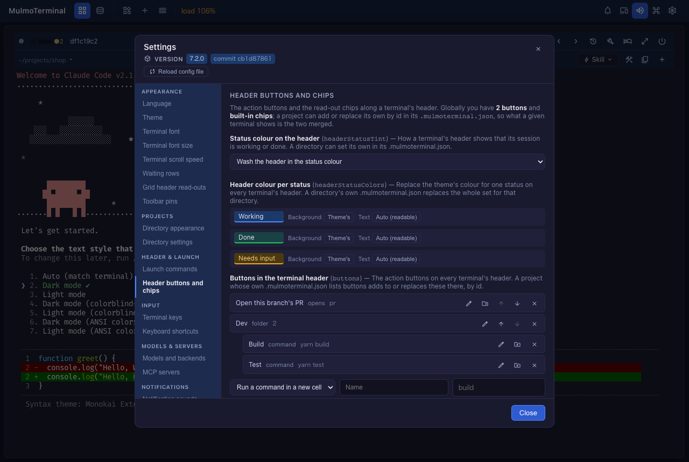

# 7.3.0 — どの種類のヘッダーボタンもフォルダも設定画面で。Files ペインで PDF・動画

**7.3.0（2026-09-30 公開）時点のスナップショットです。** アプリが変わるにつれて古くなりますが、
それは想定どおりです。最新の説明は、各節から張ったガイドを見てください。

設定の必要はありません。以下はどれも、もう画面に出ているか、**設定**（右上の歯車）の中の操作です。

## 新機能

### どの種類のヘッダーボタンも設定画面で

**設定 → ヘッダーのボタンとチップ** では、7.2.0 からコマンドを実行するボタンとエージェントに文字を
入力するボタンを足せました。今回、残りの種類も作れるようになりました。

- **何かを開くボタン**（[#2702](https://github.com/receptron/mulmoterminal/pull/2702)）— 「何かを開く」を
  選び、開くものを選びます。Web ページ（URL）、Files ビューやファイルマネージャでのフォルダ、フォルダでの
  新しいシェル、アプリの画面（変更・プルリクエスト・Wiki・コレクション・会計）、このブランチのプルリクエスト、
  ファイル選択です。
- **操作を実行するボタン** —「操作を実行する」を選び、キーボードショートカットの設定と同じ一覧から一つ
  選びます（Files ペインを開く、エージェントを再起動する、Wiki へ行く など）。
- **ボタンを直す**（[#2709](https://github.com/receptron/mulmoterminal/pull/2709)）— 行の鉛筆でその
  ボタンの中身がフォームに入り、**変更を保存** で並びの位置はそのままに置き換わります。
- **フォルダ**（[#2711](https://github.com/receptron/mulmoterminal/pull/2711)）— 行のフォルダのアイコンで、
  そのボタンを既存のフォルダか、その場で名前を付けた新しいフォルダに入れます。フォルダの中のボタンはその下に
  並び、直す・出す・外すができます。最後の 1 つを出すとフォルダは消えます。フォルダ自身の鉛筆で、名前・
  アイコン・出す条件を変えられます。

開いている端末は、押したその場で変わります。詳しくは [ヘッダーのガイド](header.html#first-button)。

### Files ペインで PDF・動画・音声

Files ペインで `.pdf`・動画・音声のファイルを押すと、PDF は枠の中に、動画と音声はブラウザのプレイヤーで
表示されます。以前のように「大きすぎて編集できない」というエラーにはなりません
（[#2716](https://github.com/receptron/mulmoterminal/pull/2716)、
[#2714](https://github.com/receptron/mulmoterminal/pull/2714)）。端末でそういうパスを押したときも、
ペインが開いていればペインで開きます。編集するには大きすぎるテキストのファイルは、エラーで止まらず、
パソコンのアプリで開く案内を出します。

### コマンドパレットにスクリプトと skill

パレットに、対象の端末の Run メニューのスクリプト（`Run: build`）と Skill メニューの skill
（`Skill: /review`）が並びます。`>` を打つと実行できるものだけに絞れます
（[#2699](https://github.com/receptron/mulmoterminal/pull/2699)）。

### 設計図

- 契約書や規程の **2 つの版を条文ごとに比べ**、新旧対照表を作ります
  （[#2705](https://github.com/receptron/mulmoterminal/pull/2705)）。
- 文書を選んだ長さに **要約** します。どの文も、機械が確かめる原文の引用で裏付けます
  （[#2712](https://github.com/receptron/mulmoterminal/pull/2712)）。
- コレクションからアプリにするときの守りが二つ加わりました。次の節で説明します
  （[#2706](https://github.com/receptron/mulmoterminal/pull/2706)、
  [#2715](https://github.com/receptron/mulmoterminal/pull/2715)）。

### コレクションからアプリにする

設計図は、ワークスペースのコレクション（または共有アプリ）を元に、**自分のコードとして持つアプリ** を
作れます。項目・画面・操作が仕様書になり、記録（中のデータ）も新しいアプリへ移せます。アプリが動く場所
（土台）は四つから選びます。

| 土台 | 記録の置き場所 | 画像・ファイル |
|---|---|---|
| ローカル（Express + SQLite + Vue） | SQLite | `data/files/` |
| Firebase | Firestore | Cloud Storage |
| Cloudflare | D1 | R2 |
| Supabase（画面は Cloudflare で配る） | Postgres | Supabase Storage |

記録の移し替えは機械が確かめます。全件・全項目が元の値のまま読み直せるかを、まず手元で、もう一度承認した
あとに本番で突き合わせます。

試し方：**設計図 → 新しく作る** で **土台** を選び、**作るものの種類** で **コレクションからアプリにする** を
選んで、元のコレクションと「記録（中のデータ）も写しますか」に答えます。

7.3.0 で加わったこと：

- **個人情報を写す前の確認**（[#2706](https://github.com/receptron/mulmoterminal/pull/2706)）。写しに、メールの
  項目、名前・電話・住所などを表す項目、共有アプリのメンバーの一覧が入るときは、「始める」で一度だけ止まり、
  それを並べて見せます。**確かめたので、写して始める** を押すか、記録を写さないように答え直します。

  

- **写した後に元が変わったときの知らせ**（[#2715](https://github.com/receptron/mulmoterminal/pull/2715)）。
  ビルドは写しのまま進みます。その後に元が変わっていると、ビルドを開いたときに一行で知らせます。新しい内容を
  使うなら、新しく作り直してください。

  

質問の意味、何が写されるか、土台ごとの工程、記録の移し方、AI の機能の鍵の置き場所、困ったときは、専用の
ページにまとめました：[コレクションからアプリにする](from-collection.html)。

## 画面の変化

- Files のツリーの右クリックメニューが画面の言語になり、ファイルの下の空いたところを右クリックすると
  **新しいファイル** と **新しいフォルダ** が出ます（[#2708](https://github.com/receptron/mulmoterminal/pull/2708)）。
- **設定 → セッションとバックグラウンド処理** に、試験的な「サーバは別のマシンで動いている」
  （`remoteServer`）のチェックが付きました（[#2701](https://github.com/receptron/mulmoterminal/pull/2701)、
  [リモートサーバー](remote.html)）。

## 見えない変化

どれも、することはありません。

- おすすめのキーは、新しい版が割り当てたショートカットのキーを使用中として扱います
  （[#2700](https://github.com/receptron/mulmoterminal/pull/2700)）。
- Files のツリーは Windows の特別な名前をさらに断り、長い拡張子でもゴミ箱へ移せます
  （[#2703](https://github.com/receptron/mulmoterminal/pull/2703)）。
- プレビューのコードブロックのコピー：語の中でつながる文字を警告しない、閉じたダイアログは開き直さない、
  ボタンがスクロールで逃げない（[#2698](https://github.com/receptron/mulmoterminal/pull/2698)）。
- Supabase の設計図：仕様で全員に開いた表が lint を通る、設定を変えたら手元の環境を起動し直す、skill の
  説明の直し、早い段階で要る機能を一度だけ作る
  （[#2686](https://github.com/receptron/mulmoterminal/pull/2686)、
  [#2687](https://github.com/receptron/mulmoterminal/pull/2687)、
  [#2690](https://github.com/receptron/mulmoterminal/pull/2690)、
  [#2695](https://github.com/receptron/mulmoterminal/pull/2695)）。
- 内部：テスト用の仮プロセスが監督役と一緒に終わるように（[#2696](https://github.com/receptron/mulmoterminal/pull/2696)）。
