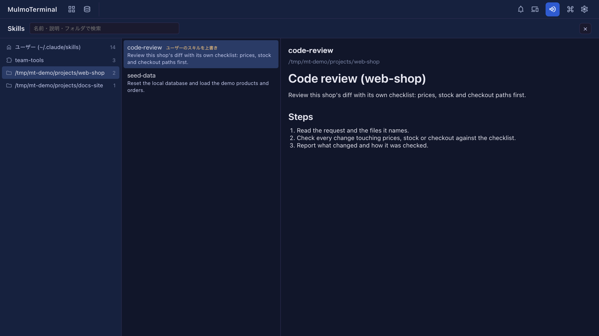

# 8.3.0 — スキルを一覧できる画面と、コレクションから作るアプリの見た目

**8.3.0 時点（2026-10-01 リリース）のスナップショットです。** アプリが変わるにつれて古くなります。それは想定どおりで、
最新の説明は各節からリンクしているガイドにあります。

## 新機能

### スキルを一か所で見る

Claude のスキルは、自分の `~/.claude/skills`、入れているプラグイン、プロジェクトごとの `.claude/skills` フォルダと、
いくつもの場所にあります。これまでは、それぞれのフォルダを手で開いて見るしかありませんでした。8.3.0 では
**Skills** 画面が加わりました（[#2816](https://github.com/receptron/mulmoterminal/pull/2816)）。設定は要りません。

1. ツールバーの **その他の機能**（`widgets` アイコン）を開き、**Skills** を選びます。
2. 左の列に場所が並びます。**ユーザー (~/.claude/skills)**、有効にしているプラグイン、ターミナルを開いたことのある
   フォルダのうちスキルがあるもの、の順です。スキルが無いフォルダは出ません。
3. 場所を選ぶと、真ん中の列にそこのスキルが説明つきで並びます。プラグインのスキルは、呼び出すときの名前
   （たとえば `team-tools:deploy-preview`）で出ます。
4. スキルを選ぶと、右の列に `SKILL.md` が表示されます。

- 上の欄で**検索**できます。名前・説明・フォルダを探し、入れた語がすべて含まれるものだけが残ります。左と真ん中の
  列がいっしょに絞られるので、`deploy` と入れると、当てはまるスキルがある場所だけになります。
- フォルダのスキルが自分のスキルと同じ名前なら **ユーザーのスキルを上書き** と出ます。そのフォルダでは、Claude は
  フォルダ側を使います。
- 画面を開くたびにファイルを読み直すので、書き換えたばかりの `SKILL.md` も今の内容で見えます。
- 出るのは、ユーザー用に入れて `~/.claude/settings.json` で有効にしているプラグインだけです。プロジェクト単位で
  入れたプラグインはまだ出ません。

**Esc** か閉じるボタンで戻ります。[基本編](basics.html) も見てください。

### コレクションから作るアプリが MulmoTerminal の見た目になる

設計図でコレクションからアプリを作るとき、質問に **見た目** が加わりました
（[#2820](https://github.com/receptron/mulmoterminal/pull/2820)）。

- **MulmoTerminal と同じ**（既定）— MulmoTerminal でそのコレクションを開いたときと同じ見た目です。ヘッダー、
  ツールバー、表、カンバン、カレンダー、レコードの画面が同じ色で並び、ヘッダーにはコレクションのアイコンが出ます。
- **やわらかい**・**くっきり**・**落ち着いた** — 形はそのままで、色と角の丸さだけを変えるひな形です。

新しい工程 **見た目を合わせる** が、それまでの工程で作った画面を整え、選んだ見た目をアプリのフォルダの `DESIGN.md`
に書きます。後の工程はこのファイルに従います。工程の確かめは、アプリをビルドして、見た目が本当にビルドに入って
いるかを調べます。[見た目](from-collection.html#design) を見てください。

## 画面の変化

- **その他の機能** に **Skills** が加わりました。設計図と Worklog のあいだです
  （[#2816](https://github.com/receptron/mulmoterminal/pull/2816)）。
- コレクションからのビルドに、工程 **見た目を合わせる** と、質問が 1 つ加わりました
  （[#2820](https://github.com/receptron/mulmoterminal/pull/2820)）。

## 見えない変化

- ガイドに [機能一覧](feature-list.html) ができました。MulmoTerminal が今できることを、入った版といっしょに 1 行ずつ
  並べたページです（[#2819](https://github.com/receptron/mulmoterminal/pull/2819)）。リリースのたびに更新します。

ここで何かをする必要はありません。
