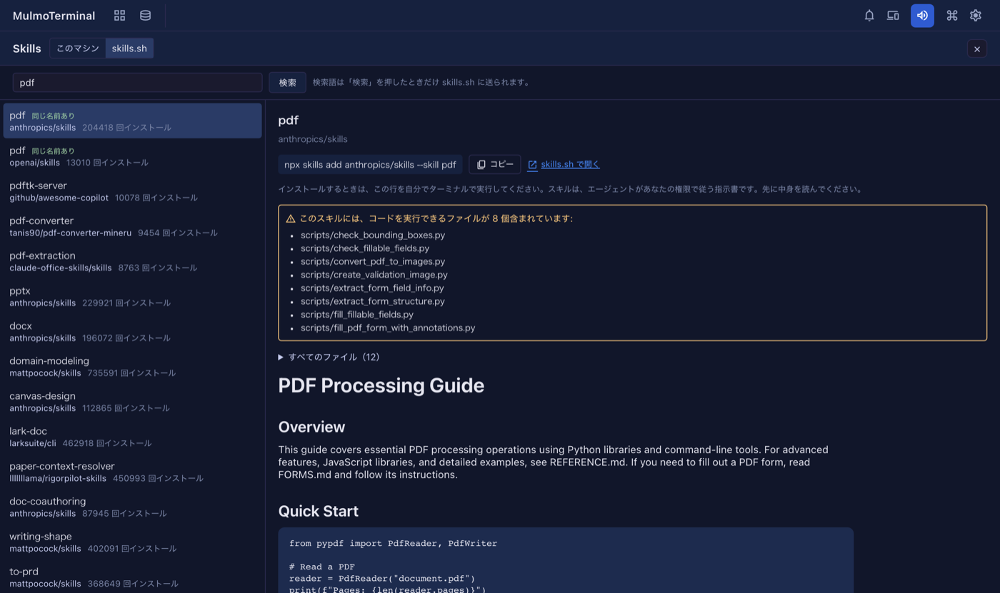

# 8.4.0 — skills.sh でスキルを探す、Claude のセルにスクロールバーが戻る

**8.4.0 時点（2026-10-02 リリース）のスナップショットです。** アプリが変わるにつれて古くなります。それは想定どおりで、
最新の説明は各節からリンクしているガイドにあります。

## 新機能

### まだ入っていないスキルを探す

8.3.0 の Skills 画面は、手元のマシンにあるスキルを見せるものでした。8.4.0 では、公開スキルの一覧
[skills.sh](https://skills.sh) を検索する切り替えが加わり、スキルを見つけて、**インストールする前に中身を読めます**
（[#2837](https://github.com/receptron/mulmoterminal/pull/2837)）。設定は要りません。

1. **その他の機能** → **Skills** を開き、上の **skills.sh** を押します（**このマシン** の隣）。
2. たとえば `pdf` と入れて **検索** を押します。入力中は何も送られません。検索語が skills.sh に送られるのは、
   ボタンを押したときだけです。
3. 左の列に、見つかったスキルが関係の深い順に並びます。取ってくるリポジトリと、インストールされた回数も出ます。
   **同じ名前あり** は、同じ名前のスキルがすでに手元にあるという意味です。
4. 一つ選ぶと、右に `SKILL.md`、持ち込むファイルの一覧、そして黄色の枠で **コードを実行できるファイル**
   （`scripts/*.py` のようなスクリプト）が出ます。

**インストールするかどうかは、あなたが決めます。** この画面は何もインストールしません。実行する行
`npx skills add <owner/repo> --skill <name>` を **コピー** ボタンつきで出し、skills.sh のページへのリンクも置きます。
決めたら、ターミナルで自分で実行してください。スキルは、エージェントがあなたの権限で従う指示書です。
コードを実行できるファイルを先に並べているのは、そのためです。

skills.sh につながらないときは、その旨と、ブラウザで検索できるサイトへのリンクが出ます。

Skills 画面は、**コマンドパレット**（`Skills` と入れる）からも開けるようになりました。操作 `screen-skills` を
キーやヘッダーのボタンに割り当てることもできます（[#2821](https://github.com/receptron/mulmoterminal/pull/2821)）。
[設定方法](config.html#keymap) を見てください。

### 設計図のビルドが報告に使う言語を選ぶ

**設計図** の新しいビルドのフォームに、用途と土台の隣で **報告の言語** を選べるようになりました
（[#2836](https://github.com/receptron/mulmoterminal/pull/2836)）。最初は画面の言語が入っています。エージェントが
あなたに書くもの（報告・質問・返事）は、選んだ言語になります。文書そのものの言語は変わりません。
「次にできること」から続けた作業も、同じ言語を引き継ぎます。[設計図](blueprints.html) を見てください。

## 画面の変化

- Skills 画面の上に **このマシン / skills.sh** の切り替えが付きました
  （[#2837](https://github.com/receptron/mulmoterminal/pull/2837)）。
- Skills 画面で、`SKILL.md` の中の画像は、絵ではなくリンクとして出るようになりました。手元のスキルでも
  skills.sh のスキルでも同じです。スキルを開いただけで、ページが何かを取りに行くことはありません
  （[#2837](https://github.com/receptron/mulmoterminal/pull/2837)）。
- 新しいビルドのフォームに **報告の言語** の欄が一つ増えました
  （[#2836](https://github.com/receptron/mulmoterminal/pull/2836)）。

## 見えない変化

- **Claude のセルにスクロールバーが戻ります**（[#2833](https://github.com/receptron/mulmoterminal/pull/2833)）。
  Claude Code は自分で全画面表示に切り替えることがあり、そうなるとセルからスクロールバーが消え、1 画面を超えて
  文字を選べませんでした。MulmoTerminal は、その表示を切った状態で Claude を起動するようになりました。
  **ただし、あなたが選んでいれば、その選択を守ります。** Claude の設定で `tui` を指定している場合や、
  `CLAUDE_CODE_NO_FLICKER` か `CLAUDE_CODE_DISABLE_ALTERNATE_SCREEN` を自分で設定している場合です。
  直ったかの見分け方: 新しい Claude のセルで 1 画面を超える出力を出させ、スクロールバーで上に戻れるか試します。
  今あるセルは、エージェントを再起動すると反映されます。[よくある質問](faq.html#claude-fullscreen) を見てください。
- **設計図で作ったローカルのアプリが、`yarn dev` で自分の画面からの変更を受け付けます**
  （[#2832](https://github.com/receptron/mulmoterminal/pull/2832)、[#2834](https://github.com/receptron/mulmoterminal/pull/2834)）。
  開発中、アプリの画面から保存すると「別のサイトからの変更は受け付けません」で断られていました。新しいビルドは
  開発用の転送をそうならない形で設定し、確認でも見つけます。8.4.0 より前に作ったアプリは、
  「転送で Host を保つように直して」と頼めば直ります。
- 重複していたコードを共通の部品にまとめました。動きは変わりません
  （[#2823](https://github.com/receptron/mulmoterminal/pull/2823)、[#2824](https://github.com/receptron/mulmoterminal/pull/2824)、
  [#2825](https://github.com/receptron/mulmoterminal/pull/2825)、[#2826](https://github.com/receptron/mulmoterminal/pull/2826)、
  [#2827](https://github.com/receptron/mulmoterminal/pull/2827)、[#2828](https://github.com/receptron/mulmoterminal/pull/2828)、
  [#2829](https://github.com/receptron/mulmoterminal/pull/2829)）。依存パッケージも更新しました
  （[#2830](https://github.com/receptron/mulmoterminal/pull/2830)）。

何もする必要はありません。
