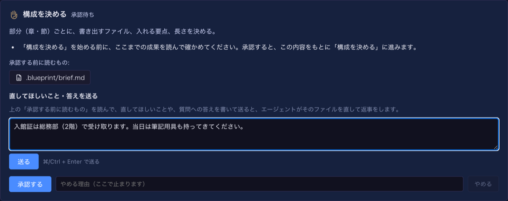

# 8.5.0 — 設計図の承認の画面で質問に答える、設計図が英語でも使える

**8.5.0 時点（2026-10-02 リリース）のスナップショットです。** アプリが変わるにつれて古くなります。それは想定どおりで、
最新の説明は各節からリンクしているガイドにあります。

## 新機能

### 承認する前に、直してほしいことと答えを送る

文書のビルド（文書を書く・整える・読み解く など）は、途中の承認で止まり、それまでの工程が書いたもの（要旨・構成・規約）を
読むように求めます。これまでは、そこで **承認する** か **やめる** しかできませんでした。要旨の「決まっていないこと」
（入館証はだれが渡すか、パスワードはどう渡されるか）に答える場所がなく、文書は空欄のまま書かれていました。

8.5.0 では、読むものの下に **直してほしいこと・答えを送る** 欄が出ます
（[#2855](https://github.com/receptron/mulmoterminal/pull/2855)）。設定は要りません。

1. **設計図** を開き、「承認が必要です」と出ているビルドを選びます。
2. 「承認する前に読むもの」のファイルを開いて読みます。
3. 直してほしいことや、「決まっていないこと」への答えを欄に書いて **送る** を押します（⌘/Ctrl + Enter でも送れます）。
4. エージェントが次の工程の読むファイルを直して、返事をします。答えた質問は「決まっていないこと」から外れ、
   次の工程が事実として使います。
5. 何度でも送れます。よければ **承認する** を押します。

直すたびに、そのファイルを書いた工程の確かめがもう一度走ります。直したファイルが確かめに通らないときは、確かめの
出力つきで会話に出て、**あとの直しが通るまで承認できません**
（[#2857](https://github.com/receptron/mulmoterminal/pull/2857)）。直してほしいことをもう一度送るか、ビルドをやめてください。

うまくいったかの確かめ方: 例の「文書を書く（規約に沿って）」で新しく入った人向けの手引きを始め、構成の承認で要旨の質問に答えてください。
できた手引きには、空欄ではなくあなたの答えが入ります。詳しくは [設計図](blueprints.html#documents)。

### 設計図が英語でも使える

画面を英語にすると、設計図のパックも英語で出ます。パックの名前と説明、新しいビルドのフォームの質問、例、ビルドの一覧と
実行の画面の工程名です
（[#2838](https://github.com/receptron/mulmoterminal/pull/2838)、
[#2843](https://github.com/receptron/mulmoterminal/pull/2843)、
[#2847](https://github.com/receptron/mulmoterminal/pull/2847)）。選んだ答えはどちらの言語でも同じに記録されるので、
日本語の画面で始めたビルドを英語の画面で見ても同じに読めます。エージェントが書く言語は、これまでどおり報告の言語
（8.4.0）で決まります。

### 24 種類の文書として整える

整える作業と chaff を導入する作業は、文書の種類を聞いて、chaff がその種類に合った物差しで測るようにします。
この一覧が chaff の持つすべての種類になりました。足したのは、オウンドメディアの記事、プレスリリース、議事録、規程、
よくある質問、用語集、判決文、特許明細書、戯曲・脚本、演説・挨拶の原稿、書き起こしです。それぞれに、読むときに
気をつける観点が付いています（[#2853](https://github.com/receptron/mulmoterminal/pull/2853)）。

### 質問に選択肢から答える

工程のエージェントが、はっきりした選択肢のある質問をするときは、選んだ場合の費用と危険を添えたボタンで出せるように
なりました。エージェントが選ぶものには「推奨」と付きます
（[#2854](https://github.com/receptron/mulmoterminal/pull/2854)）。ボタンを押せばその答えで進み、自分で書いて答えても
構いません。

### ビルドの作業の一覧を表で見る

一覧に沿って進むビルド（リポジトリを一つずつ整えるリファクタの作業など）は、その一覧を今の工程の下に表で出します。
順番、名前、種類、状態（未着手・進行中・あなたの判断待ち・完了・手を付けない）です。判断を待っている行には色が付きます。
行を押すと、一覧に入っている理由、確かめ方、ファイル、プルリクエスト、メモが見られます
（[#2856](https://github.com/receptron/mulmoterminal/pull/2856)）。

### 起動のディレクトリに `~` を書ける

起動フォームのディレクトリに `~/projects/app` のように書けます。ホームディレクトリに展開され、ワークツリーの一覧も
それに合わせて出ます（[#2842](https://github.com/receptron/mulmoterminal/pull/2842)）。

## 画面の変化

- 文書のビルドの承認のカードに「直してほしいこと・答えを送る」欄と、その下の会話が出ます
  （[#2855](https://github.com/receptron/mulmoterminal/pull/2855)）。
- 画面が英語のとき、設計図のパック・フォームの質問・例・工程名が英語になります
  （[#2838](https://github.com/receptron/mulmoterminal/pull/2838)、
  [#2843](https://github.com/receptron/mulmoterminal/pull/2843)、
  [#2847](https://github.com/receptron/mulmoterminal/pull/2847)）。
- 整える作業の「文書の種類」の一覧が長くなりました
  （[#2853](https://github.com/receptron/mulmoterminal/pull/2853)）。
- 作業の一覧を持つビルドは、実行の画面にその一覧を表で出します
  （[#2856](https://github.com/receptron/mulmoterminal/pull/2856)）。
- 質問に選択肢のボタンが付くことがあり、一つに「推奨」と付きます
  （[#2854](https://github.com/receptron/mulmoterminal/pull/2854)）。

## 見えない変化

- **起動に失敗したセルが「すべてのツール」の記録を残さなくなりました**
  （[#2849](https://github.com/receptron/mulmoterminal/pull/2849)）。Claude・Codex・Copilot のセルの起動がエラーで
  止まったとき、すべての GUI ツールを持っているという記録が残っていました。今は消えるので、同じディレクトリの次のセルに
  影響しません。
- セッションのルート、ヒートの図、エージェントの起動で重なっていたコードを共通にしました。動きは変わりません
  （[#2839](https://github.com/receptron/mulmoterminal/pull/2839)、
  [#2844](https://github.com/receptron/mulmoterminal/pull/2844)、
  [#2845](https://github.com/receptron/mulmoterminal/pull/2845)、
  [#2846](https://github.com/receptron/mulmoterminal/pull/2846)）。
- 機能の説明に Skills 画面が載りました（[#2840](https://github.com/receptron/mulmoterminal/pull/2840)）。
- 6.8.0 より前に始めて、文書の承認待ちのまま残っているビルドには、新しい欄ではなく前の仕様の会話が出ます。
  新しい欄を使うには、作業を始め直してください。

することはありません。
