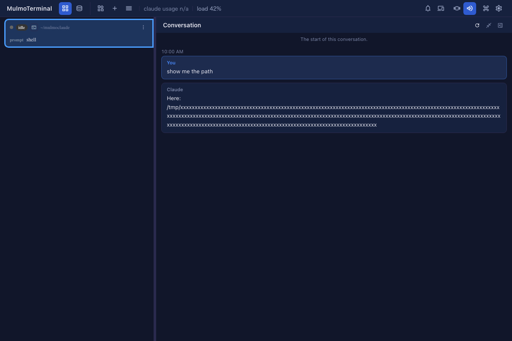

# 8.8.0 — 見た人が自分のを作れるアプリ、SNS のカード、ページの飾り、はみ出さない全面表示の会話

**8.8.0 時点（2026-10-04 リリース）のスナップショットです。** アプリが変わるにつれて古くなります。それは想定どおりで、
最新の説明は各節からリンクしているガイドにあります。

## 新機能

3 つとも共有アプリ（リンクで人に使ってもらうフォームやページ）の機能です。最新の説明は
[共有アプリ → 広める・飾る](shared-apps.html#広める飾る)にあります
（[#2898](https://github.com/receptron/mulmoterminal/pull/2898)）。

### 見た人が自分のを作れるようにする

アプリを見た人が自分の分を作れるようにしたい、とエージェントに伝えます。たとえば「この質問箱を気に入った人が、
自分用に作れるようにして」（[#2889](https://github.com/receptron/mulmoterminal/pull/2889)）。公開し直すと、
公開ページに **自分のを作る** が出ます。押した人は、自分のアカウントで空のアプリを持てます。あなたの回答は
付いていきません。

- 引き換えになるものがあり、エージェントも必ずそう伝えます。**スタッフ用のページも含めて、アプリのページが
  すべて誰でも読める状態になります。** 回答はそのままの場所にあり、開くのはページそのものです。
- 質問箱・集計・結果を見せるアンケート（survey-results）のひな型は、最初からこれが有効です
  （[#2890](https://github.com/receptron/mulmoterminal/pull/2890)）。自分だけで使いたいときは、公開する前に
  外すようエージェントに頼んでください。

### リンクを貼ったときにカードを出す

SNS で多くの人に見てもらいたい、と伝えます
（[#2893](https://github.com/receptron/mulmoterminal/pull/2893)、
[#2894](https://github.com/receptron/mulmoterminal/pull/2894)）。誰かがリンクを貼ると、投稿にアプリの名前の
カードが出ます。質問箱なら、公開した質問ごとにカードが出ます。送った人の名前は出ません。

- あなたの代わりに何かを投稿することはありません。カードは、誰かがリンクを貼ったところにだけ出ます。
- ページのアドレスが `/s/` で始まるものに変わります。
- 一度 SNS に出たカードは、公開をやめたあとも SNS 側に残ることがあります。

### 公開ページに色とバナーを付ける

ページを飾ってほしいと頼みます。たとえば「上の帯を濃い緑にして、いちばん上にロゴを入れて」
（[#2897](https://github.com/receptron/mulmoterminal/pull/2897)）。帯と背景の色、アイコン、流れる一行、
バナー画像を付けられます。色は 16 進のカラーコードで指定します。バナーは PNG・JPEG・WebP・SVG のどれかで、
SVG ならエージェントが描くこともできます。

## 画面の変化

- **会話のパネルを全面表示にしても、画面からはみ出さなくなりました**
  （[#2900](https://github.com/receptron/mulmoterminal/pull/2900)）。パスや URL のように空白のない長い行があると、
  パネルが画面の右端の外まで広がり、更新・表示切り替え・閉じるのボタンも一緒に見えなくなっていました。今は
  全面表示でも左右に並べた表示でも、パネルが画面の中に収まり、長い行は折り返して表示されます。Tools・Prompts・
  コレクション・質問のパネルも同じ仕組みで大きさが決まっていて、同じ修正が入っています。詳しくは [機能](features.html) を見てください。

  

## 見えない変化

- **文書の作業が chaffjs 0.21 で動くようになりました**
  （[#2892](https://github.com/receptron/mulmoterminal/pull/2892)）。長すぎる文が「直すもの」ではなく「参考」の
  扱いになったので、「社内のお知らせを整える」「手順書を手順書として整える」「ヘルプのページに chaff を入れる」の
  見本には、別の直す箇所を入れました。やることはありません。詳しくは [設計図](blueprints.html) を見てください。
- **共有アプリのライブラリが `@receptron/sharedapp` 0.47.0 になりました**
  （[#2895](https://github.com/receptron/mulmoterminal/pull/2895)、
  [#2896](https://github.com/receptron/mulmoterminal/pull/2896)）。上の 3 つの機能はこれに載っています。
  やることはありません。

**このリリースが入っているかの見分け方:** セルを拡大し、履歴のメニューから会話のパネルを開きます。会話に長いパスが
あっても、3 つのボタンが画面の右上に見えていれば入っています。
