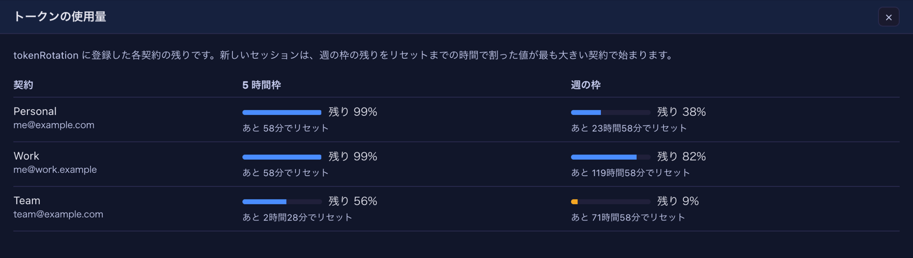

# 9.2.0 — 複数の Claude の契約を、自動でまんべんなく使い分ける

**9.2.0 時点（2026-10-07 リリース）のスナップショットです。** アプリが変わるにつれて古くなります。
それは想定どおりで、いつも最新なのは各節からリンクしているガイドのほうです。

## 新機能

### トークンのローテーション（ベータ）: 複数の契約をまんべんなく使う

Claude Code をガンガン使っていると、1 日で 1 週間分の枠を使い切ってしまいますよね。
そんなときは複数のアカウントを用意して、日ごとにアカウントを切り替えて使うと思います。ただ、日によって
使う量も違うので、できれば全部のアカウントをうまくバランスさせて、毎日まんべんなく使いたいところです。
そうすれば、1 アカウントくらいは解約できるかもしれません。

MulmoTerminal は、そんなヘビーな Vibe coder のために、**新しいセッションを始めるたびにいちばん余裕のある契約を
自動で選び、上限が近づいたセッションは会話を保ったまま別の契約へ移す機能** を追加しました
（[#2920](https://github.com/receptron/mulmoterminal/pull/2920)、
[#2921](https://github.com/receptron/mulmoterminal/pull/2921)、
[#2922](https://github.com/receptron/mulmoterminal/pull/2922)）。

- **選び方**: 週の枠のうち「リセットまでに使わないと消えてしまう分」が多い契約から使います。リセット間近で余っている
  枠を先に使うので、全部の契約の週の枠がなるべく平らに減っていきます。5 時間枠が 90% 以上、週の枠が 98% 以上の契約は選びません。
- **98% で切り替え**: 使っている契約の 5 時間枠か週の枠が 98% に達すると、ターンが終わったところで別の契約に移ります。
  作業の途中では切り替えません。
- **上限に当たっても続く**: 使用量の値は数分遅れることがあるので、98% の前に上限に当たることもあります。そのときも
  Claude Code が上限を知らせた時点ですぐ別の契約に移ります。上限で止まった質問は自動では送り直さないので、もう一度送ってください。
- **会話は契約をまたいで続きます**: `/login` で切り替えたときと同じで、会話の記録は一か所にあり、どの契約でも再開できます。
- **トークンは見えません**: トークンは画面にも設定ファイルにも出ません。設定に書くのは「どこにしまったか」
  （macOS のキーチェーンの項目名）と、目印のメールアドレスだけです。

試し方:

1. 契約ごとに、自分のターミナルで `claude setup-token` を実行します（ブラウザでその契約にログインします）。
2. 表示されたトークンをキーチェーンにしまいます。`-w` のあとに何も書かないと入力を求められるので、トークンが
   シェルの履歴に残りません。

   ```sh
   security add-generic-password -a mulmoterminal -s mulmoterminal-token-personal -w
   ```

3. `~/.mulmoterminal/config.json` に `tokenRotation` を足します。

   ```json
   "tokenRotation": {
     "enabled": true,
     "includeDefaultLogin": false,
     "tokens": [
       { "id": "personal", "label": "Personal", "email": "me@example.com", "keychain": "mulmoterminal-token-personal" },
       { "id": "work", "label": "Work", "email": "me@work.example", "keychain": "mulmoterminal-token-work" }
     ]
   }
   ```

4. 設定画面の **「設定ファイルを読み直す」** を押します。再起動は要りません。
5. 新しいセルを開くと、選ばれた契約で起動し、セルの見出しにその名前が出ます。

`mulmoterminal-model` skill に「契約を回して」と頼めば、ここまで案内します。

知っておくと迷わないこと:

- **契約が替わるのは、プロセスが起動するときです。** 新しいセル、セルを閉じて会話を開き直す、再起動ボタン、上限での移動の
  どれかです。いま開いているセルはそのままの契約で動き続けます。切り替えたいセルは、一度閉じて開き直してください
  （会話は続きます）。ブラウザの再読み込みだけでは替わりません。
- **全部の契約をトークンで登録したら、`includeDefaultLogin` は `false` に。** `true` だと `/login` しているアカウントも
  候補に入りますが、それは登録したトークンのどれかと必ず同じなので、同じ枠を 2 回数えることになります。しかも `/login`
  し直すたびに、どれと重なるかが変わります。
- **Claude Code の `/status` に出るアカウント名は、気にしなくて大丈夫です。** Claude Code 自身は `/login` のアカウントを
  表示し続けることがありますが、使用量はセルの見出しに出ている契約から引かれます。`/status` に
  `Auth token: CLAUDE_CODE_OAUTH_TOKEN` と出ていれば、ローテーションのトークンで動いています。
- **枠を使い切った契約は自動で外れます。** リセットまで選ばれません。設定に残しておけば、リセット後にまた使われます。
- **回るのはふつうの Claude のセルだけです。** プロバイダ、カスタムエージェント、複数の契約（accounts）のセルは対象外です。
- 複数の契約を回して使うことが Anthropic の利用規約に照らして問題ないかは、ご自身で確認してください。

詳しくは [トークンのローテーション](token-rotation.html) にあります。

## 画面の変化

- **セルの見出しに、動いている契約の名前** が、複数の契約と同じ印で出ます。マウスを載せるとメールアドレスが出ます
  （[#2922](https://github.com/receptron/mulmoterminal/pull/2922)）。
- **ツールバーの使用量** に契約ごとの表示が並び、マウスを載せると名前とメールアドレスが出ます。枠を使い切った契約は
  「応答がない」ではなく「上限に達している」と出ます（[#2922](https://github.com/receptron/mulmoterminal/pull/2922)）。
- **「その他の機能」→「トークンの使用量」** で、全部の契約の 5 時間枠・週の枠の残りとリセットまでの時間を一覧で見られます。
  トークンのローテーションを設定しているときだけメニューに出ます（[#2922](https://github.com/receptron/mulmoterminal/pull/2922)）。

  

- 契約を移ったとき、セルに 1 行だけ「どの契約からどの契約へ移ったか」が出ます
  （[#2921](https://github.com/receptron/mulmoterminal/pull/2921)）。

## 見えない変化

- `tokenRotation` を設定しなければ、これまでと何も変わりません。
- 上限などで止まったターンでも、セルの「作業中」の点が消えるようになりました（以前は点いたままでした）
  （[#2921](https://github.com/receptron/mulmoterminal/pull/2921)）。
- 設計メモを最新の動きに合わせました（[#2923](https://github.com/receptron/mulmoterminal/pull/2923)）。何もする必要はありません。

**入っているかの確かめ方:** `tokenRotation` を設定すると「その他の機能」に **「トークンの使用量」** が出て、新しい Claude の
セルの見出しに契約の名前が出ます。
