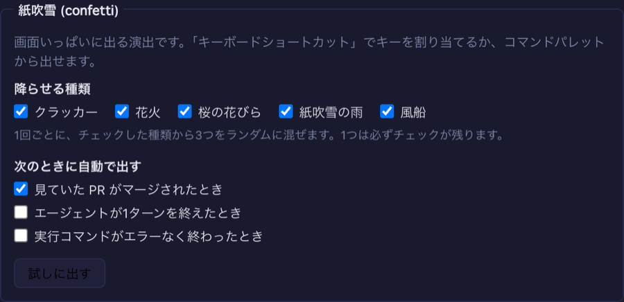

# 9.4.0 — 紙吹雪を、キー・マージ・設定画面から

**9.4.0（2026-10-08 リリース）時点のスナップショットです。** アプリが変わればこのページは古くなります。それは
想定どおりで、最新の説明は各節がリンクしているガイドにあります。

## 新機能

### 紙吹雪

画面いっぱいに出るお祝いです。画面の下の両隅から飛ぶクラッカー、花火、桜の花びら、紙吹雪の雨、風船があります。
1回で何秒も続く波状のショーになり、**許可したスタイルからランダムに3種類を混ぜて**出します
（[#2929](https://github.com/receptron/mulmoterminal/pull/2929)）。紙吹雪は 9.3.0 で使い方の説明なしに入っていて、
このページがその説明です。9.4.0 では設定画面のボックスが加わりました。邪魔にはなりません。クリックは通り抜け、
OS で「視差効果を減らす」を選んでいる場合は何も出ません。

出し方は4つあります。

1. **まず試す。** 設定 → **Theme** → **紙吹雪** → **試しに出す**。
2. **コマンドパレットから。** パレットを開き（`command-palette` に割り当てたキー、またはツールバーの Commands ボタン）、
   `confetti` と打って `Enter`。
3. **キーから。** 設定 → **Keyboard shortcuts** で `confetti` に割り当てるか、設定ファイルに書きます。

   ```json
   { "keymap": { "confetti": "Cmd+Shift+u" } }
   ```

   ブラウザが自分用に取っておく組み合わせは避けてください。効かない組み合わせは、ショートカットのページが警告します。
   このキーはターミナルのグリッドだけでなく、**どの画面でも**効きます。
4. **何かが起きたとき、自動で。** **設定 → Theme → 紙吹雪** で、出したい出来事にチェックを入れます。
   選ばない間はどれも出ません。同じ出来事は数秒のうちは1回として数えます。

   | 出来事 | 出るとき |
   |---|---|
   | 見ていた PR がマージされた | セルがその PR を開いていて、マージされるのを見たとき。セルを開いた時点でもうマージ済みだった PR では出ません |
   | エージェントが1ターンを終えた | 毎ターンなので、かなり多くなります。1日試してから、つけっぱなしにするか決めてください |
   | 実行コマンドがエラーなく終わった | 終了コード 0 のとき |

もう1つ、どのメニューにも出ない出し方があります。ターミナルや入力欄にフォーカスがない状態で
**上 上 下 下 左 右 左 右 b a** と押すと、全スタイルが一度に出ます。

詳しくは: [紙吹雪](config.html#confetti)、[キーボードショートカット](config.html#keymap)。

## 画面の変化

- **設定 → Theme に、紙吹雪のボックスが増えました**（「ちょっとした演出」のチェックの下です）
  （[#2933](https://github.com/receptron/mulmoterminal/pull/2933)）。
  - スタイルごとのチェック。1つは必ずチェックが残ります（最後の1つは灰色になります）。空にすると
    全スタイル扱いに戻ってしまうためです。
  - 自動で出す出来事ごとのチェック。
  - **試しに出す** ボタン。

  チェックは押した時点で保存され、再起動は要りません。保存が断られたら、チェックが元に戻ります。

  

## 見えない変化

- チェックを入れるかキーを割り当てるまで、何も変わりません。どの出来事でも、頼むまでは出ません。
- `config.json` を手で直したときは、サーバーの再起動とタブの読み込み直しが要ります。チェックは要りません。
- feature-list に紙吹雪の操作を載せました（[#2931](https://github.com/receptron/mulmoterminal/pull/2931)）。
  することはありません。

**反映されているかの確かめ方:** 設定 → Theme に「紙吹雪」のボックスがあり、「試しに出す」を押すと
画面に紙吹雪が出ます。
