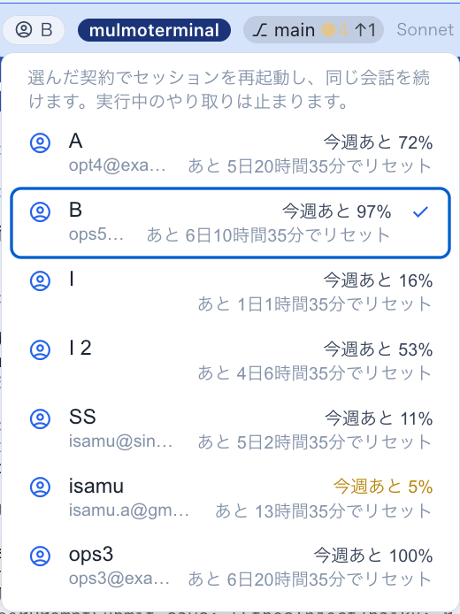

# 9.6.0 — 見出しから別の契約へ移せるようになり、JingleScript が加わった

**9.6.0（2026-10-09 リリース）時点のスナップショットです。** アプリが変わればこのページは古くなります。それは
想定どおりで、最新の説明は各節がリンクしているガイドにあります。

## 新機能

### 見出しから、そのセッションを別の契約へ移す

[トークンのローテーション](token-rotation.html)を使っている場合の話です。セルの見出しには、そのセルが動いている契約の名前がすでに出ています。
その名前がボタンになりました
([#2951](https://github.com/receptron/mulmoterminal/pull/2951))。

1. セルの見出しの**名前をクリック**します。契約の一覧が開きます。`tokenRotation` にある契約と、`includeDefaultLogin` が有効なら
   `/login` のアカウントが並びます。このセルが動いている契約にはチェックが付いています。
2. **各契約の横**に、週の枠があとどれだけ残っているか、その下にリセットまでの時間が出ます。たとえば
   `今週あと 40%` と `あと 2日4時間10分でリセット` です
   ([#2955](https://github.com/receptron/mulmoterminal/pull/2955)、[#2960](https://github.com/receptron/mulmoterminal/pull/2960))。使い切った契約は**上限に達しています**と出ます。まだ測れていない契約は、0 ではなく何も出しません。
   数字はツールバーの使用量ゲージが読んでいるものと同じなので、そのゲージが測れたあとに出ます。
3. **一つ選びます。**選んだ契約でセッションを再起動し、同じ会話を続けます。実行中のやり取りは、**エージェントを再起動**したときと同じく止まります。

一覧が出るのは、トークンのローテーションが置いたセルだけです。複数の契約（accounts）、プロバイダー、カスタムエージェントのセルは、これまでどおりの表示です。

### JingleScript: エージェントがジングルを作れる

エージェントが、短いジングルや効果音を JingleScript の譜面として作り、再生できるようになりました
([#2957](https://github.com/receptron/mulmoterminal/pull/2957))。セルのエージェントに「作業が終わったときの、短い上昇音のチャイム」のように頼んでください。
譜面ができると、**Canvas** にプレイヤーが開きます。波形、拍の目盛り、クリックでその位置へ飛べる名前つきのキュー、トラックごとの音符の列、ダウンロードのリンクが出ます。
裏のツールは `manageJingleScript` で、ほかの操作（ガイド、スキーマ、楽器、チェック）は文字で答えるだけで、プレイヤーは出ません。設定は要りません。

## 画面の変化

- **セルの見出しにある契約名がクリックできます。** 上で説明した一覧が開きます。
- **ページを再読み込みしても、契約名が消えなくなりました。** 再読み込みや、動いているセッションへのつなぎ直しのあと、
  そのセッションを起動し直すまで名前が空白になっていました
  ([#2949](https://github.com/receptron/mulmoterminal/pull/2949))。すぐ出るようになりました。
- **リセットまでの時間が、日・時間・分で出ます。**週のリセットは `あと 52時間10分` と出ていましたが、`あと 2日4時間10分` になります。
  ツールバーのゲージの hover、「トークンの使用量」画面、新しい一覧が対象です
  ([#2964](https://github.com/receptron/mulmoterminal/pull/2964))。1 日未満の表示は変わりません。

## 見えない変化

- **サーバー側のフォルダを整理しました。** `server/agents`、`server/config`、`server/backends`、`server/session`、`server/infra` は、
  それぞれ平らな長いフォルダでしたが、エージェントごと・役割ごとのフォルダに分けました
  ([#2945](https://github.com/receptron/mulmoterminal/pull/2945)、[#2947](https://github.com/receptron/mulmoterminal/pull/2947)、[#2953](https://github.com/receptron/mulmoterminal/pull/2953)、[#2958](https://github.com/receptron/mulmoterminal/pull/2958)、[#2962](https://github.com/receptron/mulmoterminal/pull/2962))。
  ファイルは移しただけで、中身は書き換えていません。使うぶんには何も変わりません。ソースを読む方や、古い場所を指すメモを持っている方だけ、影響があります。

詳しくは: [トークンのローテーション](token-rotation.html)、[機能一覧](feature-list.html)。

**入っているか確かめるには:** トークンのローテーションを使っていれば、セルの見出しの契約名をクリックすると一覧が開き、ページを再読み込みしても名前が残っています。
