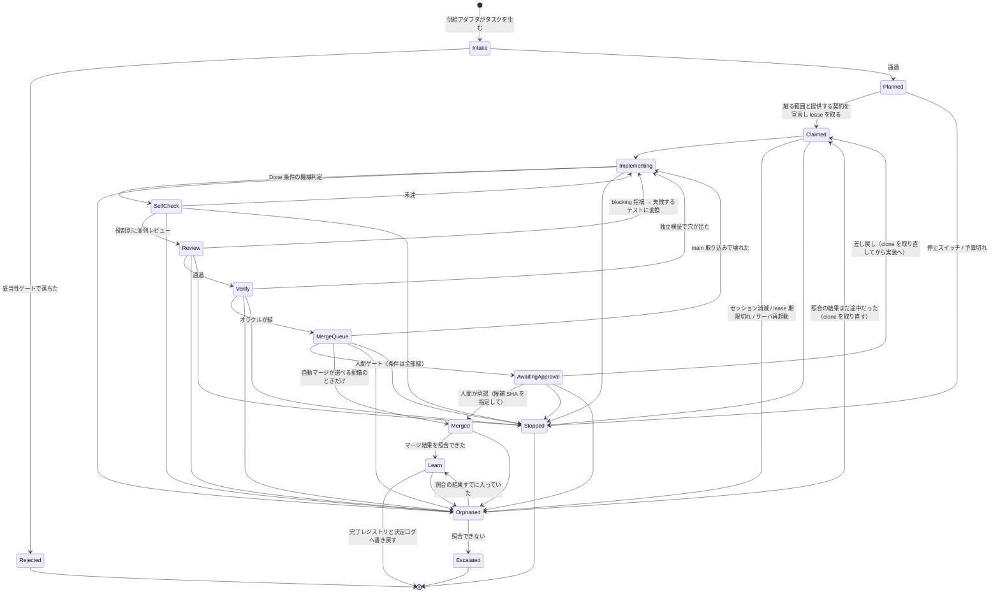
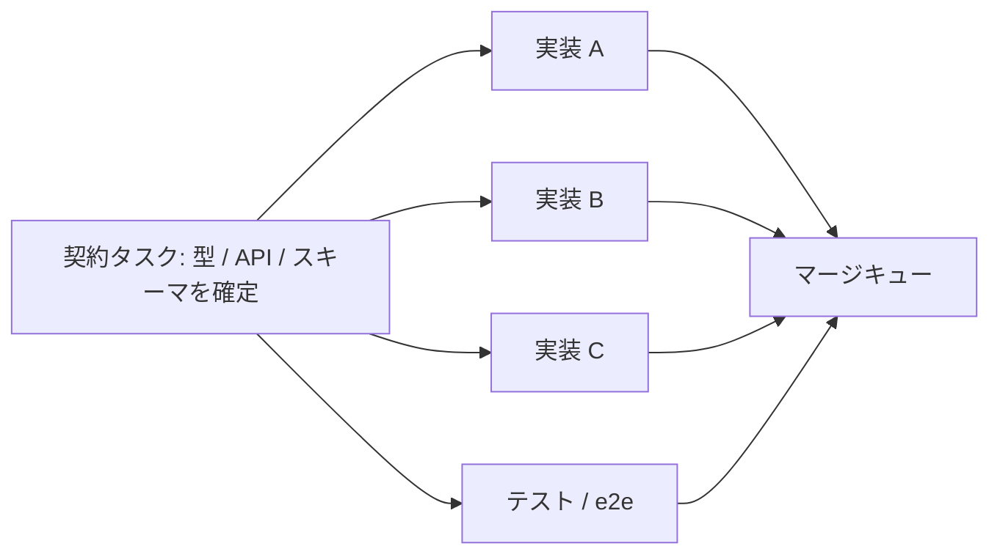

# 自律デリバリ・パイプライン — 構想メモ

`plans/` が「これから入れる変更の設計」であるのに対し、`future/` は **まだ着手していない構想**を置く場所。

このメモは、複数のエージェント・セッションを並列に走らせて **コードを安全に main へ届け続ける**ための
1本のパイプラインを定義し、その具体例として **リファクタリング**と**新規開発（大規模機能追加・新規アプリ）**を置く。

> 出発点になった一次データ（実際に回した約1000 PR 規模のキャンペーン）は **非公開リポジトリ**にある。
> ここには手法と観測だけを書き、リポジトリ名・URL・issue 番号は載せない。

---

## 1. なぜ汎用化するのか

最初はリファクタリング・キャンペーンの自動化として考えていた。しかし整理すると、
**パイプラインの本体はゴールに依存しない**。リファクタリングも、大規模機能追加も、新規アプリ作成も、
機械がやっていることは同じである。

> 作業を分割し、並列に走らせ、正しさを判定し、衝突を避けて main に入れ、学んだことを次に渡す。

違うのは4点だけだった。だから **1本のパイプライン + 差し替え可能な4つのアダプタ** という形にする。
プロファイル（refactor / feature / new app / bugfix / migration …）はアダプタの組み合わせにすぎない。

---

## 2. 不変のコア

### 2.1 状態機械

**辺を足すときに毎回確かめる不変条件を、先に書いておく。** この文書はこれまで、
規則を1箇所に書いて、それが支配する辺へ運び忘れる誤りを繰り返してきた（clone の寿命だけで4回）。
規則ではなく**許される形**を列挙しておく。

- **clone を持って作業する状態**は `Claimed` / `Implementing` / `SelfCheck` / `Review` / `Verify` / `MergeQueue`。
  持たない状態は `Planned` / `AwaitingApproval` / `Merged` / `Orphaned` / `Learn` / `Stopped` / `Escalated`。
- **持たない状態から持つ状態へ入る辺は、必ず `Claimed` を通る。** 直接 `Implementing` へ入れない。
  `Claimed` が「空いている clone を取る」場所だからで、取れなければそこで待つ。
- **パスの claim を持つ状態**は `Claimed` から `Merged` までの全部と `AwaitingApproval`。
  `Stopped` / `Escalated` / `Learn` に入るときに解放する。
- **副作用を起こす状態**（`Implementing` 以降のすべて）からは、`Orphaned` と `Stopped` の辺が要る。
  落ちうるし、止められうるからである。**辺を1本足したら、この2本も足したか確かめる。**

**`AwaitingApproval` は状態であって「待っている気分」ではない。** 人間ゲートを既定にした以上、
「誰の承認を、どの候補に対して、いつ得たか」が状態として残らなければ、
機械が確かめた条件と人間が押した事実が結びつかない。

- **承認は「候補 SHA」と「検証したベース」の組に対して与える。** ベースとは、
  条件2の再検証で取り込んだ `origin/main` の SHA である。
  **どちらかが動いたら承認は無効**になり、`MergeQueue` へ戻って取り込み直し、再検証し、もう一度聞く。
  候補だけを見ていると、**別のタスクが先に main を進めた瞬間に、承認は「もう存在しないベースに対する承認」になる**。
- **だから承認はキューの先頭で求める。** 取り込みと再検証の直後に聞き、承認が返ったら即マージする。
  先回りして承認を集めておくと、使う頃には全部 stale になっている（8並列なら main は常に動く）。
- **人間が押さない間、キューは止めない。** 先頭を次のタスクに明け渡し、
  待たされたタスクはベースが変わったぶん再検証してから、もう一度聞く。
  人間の応答時間がキュー全体の律速になるのを避けるため。
- **最後の照合を、こちら側でやらない。** 「マージ直前に候補とベースを確かめる」も
  確かめた後・呼ぶ前に main が動けば通ってしまう（2.1.1 の停止と同じ形）。
  原子的にできるのは**実際にマージする側だけ**なので、条件を forge に渡す。
  - **期待する head SHA を付けてマージする。** 動いていたら forge が拒否する
    （GitHub の REST なら `PUT /pulls/{n}/merge` の `sha`）。
  - **ベースの新しさは、ブランチ保護の「マージ前に最新であること」で forge に強制させる。**
    こちらの再検証は「オラクルを走らせるため」であって、鮮度の判定はこちらの仕事ではない。
  - 拒否されたら（409、up-to-date でない）`MergeQueue` へ戻し、取り込み直して再検証し、もう一度聞く。
- **キャンペーン内のマージは直列にする。** 同時に投げるのは1本だけ。
  これで自分たちが原因の競合は消え、残るのは**外から main が動く場合**になる — そしてそれは
  上の forge 側の条件でしか止められない。だから両方要る。
- **待っている間に clone は返す。** 候補はもうブランチにあるので clone は要らない。
  ただし**パスの claim は保持する** — 解放すると別のタスクが同じ場所を触り、
  承認済みの差分が古くなる。
- **停止と予算はここにも効く**（`AwaitingApproval --> Stopped`）。停止されたキャンペーンの
  未承認のものは、承認待ちのまま残さず無効にする。
- **差し戻しは `Implementing` へ直行しない。** 承認待ちのタスクは clone を持っていないので、
  まず `Claimed` に戻って**空いている clone を取り直す**（パスの claim は握ったままなので、
  取り直すのは作業場所だけ）。空きが無ければそこで待つ。
  `Orphaned` からの復帰も同じで、落ちる前の clone が使えるとは限らない。
- 待ち時間に上限は置かない。人間が押さないことは異常ではない。ただし
  **待ちの数が並列度を食い潰す**ので、承認待ちが溜まったら新しいタスクの供給を止める。

**`MergeQueue --> Stopped` があることが重要**である。マージはこのパイプライン唯一の不可逆操作なので、
停止スイッチと予算はキューに入った後も効かなければならない。停止されたキャンペーンのタスクが
「もうキューにいるから」でマージまで進むのは、停止スイッチが無いのと同じである。

逆に **`Merged` からは停止できない**。すでに外で起きた事実だからで、そこから先の正しい動きは
「起きたことを記録して `Learn` へ進む」しかない。だから停止と予算の確認は
**マージを呼ぶ直前**に置く（呼んだ後に確認しても手遅れになる）。

**`Merged` を `MergeQueue` と `Learn` の間に置いてあるのは意図的**である。
マージは外部（forge）の副作用で、こちらの状態保存とは原子的にならない。
「マージした」と「マージしたと記録した」の間で落ちると、素朴な状態機械は同じ PR をもう一度マージしにいく。
`Merged` は**外に問い合わせれば真偽が確定する状態**として置き、再開時はそこから照合する。

### 2.1.1 中断からの再開 — 状態遷移より先に外部副作用が起きる

このパイプラインの副作用（clone の lease、セッション spawn、prompt 注入、PR 作成、マージ、close）は
**すべて状態の永続化より先に起きうる**。プロセスはその隙間で落ちる。だから次を契約とする。

- **意図を先に書く。** 副作用の前に `intent` を追記し、後に `outcome` を追記する。
  `intent` があって `outcome` が無いレコードが、再開時に照合すべき対象そのものになる。
- **冪等キーを外に持たせる。** セッション、ブランチ、PR、マージのそれぞれに、こちらが決めた
  安定 ID（`campaign/<id>/<task>/<attempt>`）を**外部側の名前に埋める**。
  再開時は「その名前のものが既にあるか」を forge と clone に聞けば足りる。
- **起動時に必ず照合する。** 生きているセッション、clone の lease、forge 上のブランチ/PR/マージ状態を
  読み、`intent` だけのレコードを `Orphaned` から解決する。照合できないものは `Escalated` にして人間へ出す。
  **推測で先へ進めない**（重複マージはここでしか防げない）。
- **lease は期限つきの compare-and-set** とし、所有者トークン（fencing token）を持たせる。
  期限切れの旧所有者が後から書き戻すことを、トークンの世代で拒否する。

**停止と副作用は「直前に確認する」では足りない。** 確認した後・呼ぶ前に停止が入れば、
不可逆な操作はそのまま通る。外部への副作用とこちらの状態書き込みは原理的に原子にできないので、
できるのは**順序を1つに決めて、境界を宣言すること**だけである。

- **停止も副作用の意図も、同じ writer を通す**（同じログへの追記を直列化する）。
  これで「停止」と「この副作用をやる」の間に全順序がつく。
- **意図には世代（fencing token）を書く。** 停止は世代を進める。
  実行側は呼ぶ直前に世代を照合し、古ければ実行しない。
- **境界はこう宣言する: 停止は「まだ commit されていない意図」を全部取り消す。
  すでに commit された意図は完了し、記録される。** 停止した瞬間に進行中だったマージが1本通ることは
  ありうる。これは実装で消せる隙間ではないので、消せると書かずに**上限として書く**。
- 予算も同じ扱いにする。予算切れは新しい意図の commit を拒否するのであって、
  commit 済みの意図を途中で殺すものではない。
- **だから不可逆な操作ほど、意図の commit から実行までを短くする。**
  マージの直前に長い処理（再検証、CI 待ち）を置かない。再検証はキューの先頭で先に済ませ、
  マージの意図を commit したら即座に呼ぶ。

| フェーズ | やること | 潰している失敗モード |
|---|---|---|
| Intake | 供給されたタスクを受け取り、**やる価値があるか**を判定する | 存在しない問題を直す。重複作業 |
| Planned | 方針と**決着条件（オラクル）を先に宣言**する | 「完了とは何か」が無いまま実装が始まる |
| Claimed | 触るパスと提供/依存する契約を宣言し、排他 lease を取る | 同じところを2人が同時に直す |
| Implementing | 実装する。ステップ予算つき | 無限に手が入り続ける |
| SelfCheck | Done 条件を**機械が**判定する | チェックリストが人間の記憶に置かれる |
| Review | 役割を分けて並列にレビューする | 指摘が混ざり、収束しない |
| Verify | **実装と別の文脈**でオラクルを実行し、敵対的に壊しにいく | LGTM 後に問題が出る |
| MergeQueue | main を取り込んで再検証し、1本ずつ入れる | 並列マージによる相互破壊 |
| Learn | 完了事実と確定した判断を共有の場所へ書き戻す | 同じ発見・同じ議論の再演 |

### 2.2 コアの設計原則

この4つは、実際の並列運用で観測された4つの壁への構造的な答えになっている（詳細は 4.2）。

1. **決着条件を先に宣言する（オラクル先行）。**
   「何をもって正しいとするか」を Plan フェーズで**機械可読に**固定する。これが無いレビューは必ず発散する。
2. **進行は外側の状態機械が持つ。**
   セッションは1ステップだけ実行して報告する。止まるのは正常な終了であって、進行はオーケストレータの仕事。
3. **判定は実装と別の文脈で行う。**
   同じ文脈は同じ前提を共有するので、前提の誤りは見えない。検証者には差分と決着条件だけを渡す。
   このとき**候補はコミット（SHA）であって作業ツリーではない**。レビューは並列に走り、
   その各セッションも書けるので、同じディレクトリを渡すだけでは検証中に中身が動く。
   読み取り専用の checkout で走らせ、直したいことは指摘として返して**新しい候補**を作る。
4. **触る範囲は事前に宣言し、排他を取る。**
   「誰が今どこを触っているか」と「もう直った事実」が共有されていないことが、重複作業の唯一の原因。
5. **強制はエージェントの外側で行う。ただし「外側」はプロセス境界であってファイル権限でもある。**
   エージェントに与える道具を絞ることは方針の表明であって、強制ではない。
   実行中のエージェントは clone の中にシェルを持っており、loopback の API も CLI も叩ける。
   だから開始・停止・予算・許可パスは**サーバ側の能力境界**で拒否する。
   エージェントの自己申告（触ったパス、オラクルの結果）は**すべて未検証入力**として扱い、
   claim や merge の判断には使わない。触ったパスは `git diff` から導出する。
   そして**権威データをエージェントが書けるファイルの上に置かない**。同じ UID で走るなら
   API に capability を付けても、状態ファイルは直接書き換えられる。
   ハッシュ連鎖は検知にならない（相手も同じハッシュを計算できる）。
   守れるのは隔離するか、鍵かログを別権限のプロセスが持つときだけ。
   **どちらも無いなら、その信頼領域に不可逆な力を持たせない** — 自動マージを外し、
   マージの資格情報を届かない場所に置く。

---

## 3. 差し替える4つのアダプタ

| アダプタ | 何を決めるか | 無いとどうなるか |
|---|---|---|
| **Supply**（供給） | 何がタスクを生むか | 人間が毎回タスクを書く。つまり自動化しない |
| **Oracle**（決着条件） | 何をもって正しいとするか | レビューが発散し、LGTM が信用できない |
| **Partition**（分割） | 何を単位に並列化するか | 衝突で詰まるか、手待ちで遊ぶ |
| **Gate**（関門） | どこで人間が止めるか / 失敗の許容度 | 事故る。逆に厳しすぎると人間が律速になる |

### 3.1 オラクルのカタログ

| オラクル | 正解の出どころ | 決着の形 | 主な用途 |
|---|---|---|---|
| **差分** | 旧実装そのもの | 生成入力で全件一致、件数を記録 | リファクタリング、最適化、抽出 |
| **仕様** | 先に書いた受け入れテスト | 赤 → 緑 | 新機能、新規アプリ |
| **参照** | 既存の別実装・外部の権威 | 出力が一致する | 移植、互換維持、ホスト間パリティ |
| **性質** | 不変条件・メトリクス閾値 | 反例が出ない / 悪化しない | 性能、セキュリティ、ratchet |
| **人間** | 人 | 承認 | 設計判断、UX、対外文言 |

**規則: 1タスクに必ず1つ以上の非人間オラクルを付ける。**
人間オラクルだけのタスクは並列化できず、収束もしない。人間しか判定できない部分があるなら、
それは**別タスクに切り出す**（例: 「配色を決める」と「決まった配色を実装する」は別のタスク）。

**ただし「非人間オラクルが1つある」ことは自動マージの十分条件ではない。**
オラクルは正しさを保証する装置ではなく、**根拠を宣言する装置**である。だから1つ1つに次を必須とする。

| 必須項目 | 無いとどうなるか |
|---|---|
| 正解の根拠（何を権威とするか） | **差分**オラクルは旧実装のバグを正解として保存する |
| 適用範囲（何を判定していないか） | 一部を測っただけの緑が、全体の緑として読まれる |
| 再現可能な環境 | **参照**オラクルがバージョン差・環境差を検出できない |
| 入力生成の条件と変異検証 | 「全件一致」が、生成器が届いていない境界の証明として読まれる |
| タイムアウトと証跡 | 走らなかったことと通ったことが区別できない |
| 失敗時の fail-closed | 判定不能が「問題なし」に倒れる |

非決定性・副作用を持つ対象に**差分**オラクルを当てるときは、それを固定する手当（seed、時計の注入、
I/O の遮断）まで宣言に含める。固定できないなら差分オラクルは使えない。

### 3.2 分割の2軸 — ここがゴールによって最も違う

| | 依存 | 衝突 | 律速 | 並列度を作る手 |
|---|---|---|---|---|
| リファクタリング | **薄い** | **濃い**（多数のタスクが同じファイルに触る） | lease と merge queue | 重ならない範囲へ切り分ける |
| 新規開発 | **濃い**（上流が決まらないと下流が書けない） | **薄い**（新規ファイルが多い） | 依存グラフの臨界パス | **契約先行**（型・API・スキーマを先に固定する） |

だから同じ Plan フェーズでも、**宣言するものが違う**。

- リファクタリング: 「このタスクは `server/git/*.ts` の23ファイルを触る」
- 新規開発: 「このタスクは `SharedAppKey` 型と `POST /api/shared-app/declare` を**提供する**。
  下流の3タスクはそれに**依存する**」

両方とも同じ Claim レジストリに載る。**パスの排他と契約の依存が同じ台帳に載っている**ことが、
オーケストレータが順序を決められる条件になる。

**台帳に載せるだけでは排他にならない。** issue に1つコメントを置く（既存の `issueWorkComments`）のは
監査と可視化には効くが、2つのタスクが同時に読んで同時に書けば両方が勝つ。取得は次の形にする。

- **正規化した識別子**（実パスに解決し、大文字小文字とシンボリックリンクを畳んだもの）で引く
- **compare-and-set**（または1トランザクション）で取り、取れなかった側は待つ
- **期限つき**にして、期限内は所有者が延長する
- **所有者トークン**を持たせ、期限切れの旧所有者による書き戻しを世代で拒否する

新規開発の並列度は、**契約タスクをどれだけ早く確定させられるか**でほぼ決まる。
契約が立つまでは並列化できない（骨格フェーズ）。ここを認めずに並列に流すと、
「動くが噛み合わない実装が8本」になる。

---

## 4. 例1: リファクタリング・キャンペーン（プロファイル `refactor`）

### 4.1 アダプタの設定

| アダプタ | この プロファイルでの実体 |
|---|---|
| Supply | ESLint の残警告、`any` の出現箇所、関数長・ファイル長の超過、カバレッジ欠落。**ルール × ディレクトリ**でバッチ化 |
| Oracle | **差分**（旧実装を harness に持ってきて生成入力で全件比較）＋ **性質**（メトリクスが悪化しない） |
| Partition | パスの衝突。同じファイル群に触るタスクは直列化 |
| Gate | マージ前は人間。自動マージは**権威データが保護された配備でだけ**選べる（条件は 4.4） |

### 4.2 出発点と、実際にぶつかった壁

人間が書いた大規模 TypeScript / JavaScript には、型が無い・曖昧、lint が最初から通らない（警告が数千件あるので誰も読んでいない）、
関数とファイルが大きすぎて一度に読めない、という共通の性質がある。
ESLint を入れ、**段階的にルールを厳しくしながら AI が読めるコードへ寄せる**のが基本方針だった。

1. 簡単な lint の warn から始める
2. warn を徐々に減らす（機械的に直せるものから）
3. 最後に **`any` と巨大な関数・巨大なファイル**が残る。ここが一番厄介

規模は **約1週間・かなりの手動込み・PR 約1000本・その過程で見つかった issue 100本以上**、セッションは5〜8並列。
そこで繰り返し起きたことと診断:

| # | 現象 | 診断 | コアのどれが答えか |
|---|---|---|---|
| A | どう調整しても**同じところを修正してしまう** | 「誰が今どこを触っているか」がどこにも無い。「もう直った」も伝わらない | 原則4（宣言と lease）＋ Learn（完了レジストリ） |
| B | 数十行の変更でも**レビューが20回ループする** | 指摘が文章のまま往復し、決着条件が無い。style と correctness が混在 | 原則1（オラクル先行）＋ R2/R3/R5 |
| C | **LGTM でも、詳しく調べ直すと問題が出る** | レビューが実装と同じ文脈の中にある。共有された前提の誤りは見えない | 原則3（別文脈での検証） |
| D | 「ループを止めるな」と指示しても**止まる** | 進行の意志をセッション内部に置いている | 原則2（外側の状態機械） |

### 4.3 このプロファイル固有の必須ステップ

キャンペーンの中で固まった人間側の規律。自動化とは、**これを機械に守らせること**にほかならない。

- **タスクが本物か先に検証する。** ダミー（実際には到達しない経路、誤読、すでに直っている）が混ざる。
  再現するか、実際の呼び出し元から1本の呼び出し鎖を辿れなければ、直さずに閉じる。
- **本物なら、まず視野を広げる。** 報告された1件はルールの1インスタンスにすぎない。
  同じ判断をしている他の呼び出し元、同じ分岐に入る兄弟入力、そのルールが本来属する層を先に見る。
- **問題の周りを pure 関数として切り出す。** fs / network / clock / process は注入に変え、呼び出し元を付け替える。
- **正常系と異常系の両方を網羅する。** 空、null / undefined、型違い、境界、壊れた入力、例外。
- 直す → 型を直す → バグが出る → また pure 関数化してテストを足す、を繰り返す。テストは単調増加する。

### 4.4 自動マージの条件 — 「CI が緑」は条件ではない

まず前提として、**権威データがエージェントから書ける配備では、自動マージを選ばない**。
条件はキャンペーンの状態から読むので、書ける相手を相手に条件を課しても意味がない
（原則5の続き）。自動マージは、隔離か別権限プロセスを配備したときの選択肢である。

そのうえで条件の中身。CI が緑であることは、**CI が何を走らせたか**を言わない限り情報量がない。
次を全部満たしたときだけ人間を外す。満たせないものが1つでもあれば人間ゲートへ倒す。
なお**人間ゲートはこれらを免除しない** — 人が押す前に、機械が確かめられることは機械が確かめる。

1. Plan で**宣言したオラクルが全部走り、緑で、証跡が残っている**（走らなかったオラクルは赤と同じ扱い）
2. **現在の main を取り込んだ状態で**再検証した（マージキューの先頭で再実行する）
3. 未解決の blocking 指摘が**ゼロ**（follow-up に落としたものは解決扱いだが、行き先が記録されている）
4. 触ったパスが claim の範囲内である（`git diff` から導出したもので照合する。自己申告では照合しない）
5. 触ったパスが **P1 の許可パスの内側**であり、**禁止パスに触れていない**
6. 差分が **P1 の最大差分**を超えていない
7. **対象ブランチが P1 の指定と一致**し、そのブランチの必須保護が**実際に有効**で、
   マージに使う資格情報がそれを**迂回できない**
8. **PR の head が、レビューと検証を通った候補 SHA と一致する。**
   ただし 2 の再検証で main を取り込むと head は変わるので、正確には
   「候補 SHA そのもの」か「**runner が作った** main 取り込みコミット」のどちらかであること。
   **エージェントが書いた変更がレビュー後に入っていないこと**が本体で、
   main 取り込みは新しい候補を作る行為なので、2 のオラクル再実行がそれを引き受ける
9. **判定不能は赤**。オラクルがタイムアウトした、証跡が読めない、照合できない — 全部止める

**4 と 5 は別の条件である。** claim はタスクが自分で申告した範囲であって、ゴール定義が許した範囲ではない。
禁止パス（lockfile、デプロイ設定、CI 設定、秘密情報）を claim したタスクは、4 だけなら通ってしまう。
権限はタスクの申告ではなく **P1 から**照合する。

**この 5〜8 の検査が実装されるまでは、既定は人間ゲートのままにする。** 自動マージを先に入れて
権限検査を後から足す順序にしない — その間に通ってしまったものは、後から検査を足しても戻らない。

### 4.5 なぜ worktree ではなく clone を8個か

worktree は `.git` を共有するので軽いが、**作業ツリーだけが分かれていて実行環境は分かれない**。
8並列で効いてくるのは実行環境側の分離のほうである。

- `node_modules` / ビルドキャッシュ / dist が独立する（依存を足す PR が他の並列作業を巻き添えにしない）
- dev サーバのポート、Playwright のプロファイル、テスト用一時ディレクトリが衝突しない
- 1つが壊れたら捨てて作り直せる。`git gc` や index のロック競合も起きない

代償はディスクと初回 install 時間。MulmoTerminal は既に **1リポジトリに複数 clone が並ぶ前提**
（`server/git/repo-dirs.ts` / #1172）で書かれているので、概念としては新規ではない。

---

## 5. 例2: 新規開発（プロファイル `feature` / `new-app`）

### 5.1 アダプタの設定

| アダプタ | この プロファイルでの実体 |
|---|---|
| Supply | 仕様・要求 → **垂直スライス**（ユーザから見て意味のある単位）→ 依存グラフ |
| Oracle | **仕様**（受け入れテスト先行）＋ **参照**（既存ホストとのパリティ）＋ e2e スモーク |
| Partition | **契約先行**。型・API・スキーマを確定させるタスクを先に1本通し、その下で扇形に並列化 |
| Gate | 仕様承認 → 契約承認 → マージ前。**前の2つが新規開発だけに要る**関門 |

### 5.2 リファクタリングとの構造的な違い

| | リファクタリング | 新規開発 |
|---|---|---|
| ゴールの与えられ方 | 機械的（警告 = タスク） | **人間が決める。間違っていたら全部無駄** |
| 追加で要る前段 | なし | **Spec ゲート**（何を作るか）と**契約ゲート**（どう噛み合うか） |
| 正解の出どころ | 旧実装（すでに存在する） | **これから書く受け入れテスト** |
| 主な失敗モード | 静かな退行 | スコープ膨張、契約の不整合、「動くが仕様と違う」 |
| 並列度の源 | 重ならないパス | 確定した契約 |
| 「もう直った」問題 | 起きる（現象 A） | 起きにくい。代わりに**「同じものを2通りに実装する」**が起きる |

**Spec ゲートは省略できない。** リファクタリングにこれが要らないのは、ゴールが機械的に定義されているからで、
新規開発でこれを飛ばすと、パイプラインは「間違ったものを高速かつ安全に作る機械」になる。

### 5.3 進み方

1. **Spec タスク**（人間オラクル、並列化しない）— 何を作るか、完了とは何か、受け入れ条件は何か。
2. **契約タスク**（1本、または少数）— 型・API パス・スキーマ・イベント名を確定させる。
   ここで確定したものが Claim レジストリに「提供する契約」として載る。
   受け入れテストの**骨格もここで書く**（この時点では全部赤）。
3. **実装タスクを扇形に並列化** — 各タスクは自分が依存する契約を宣言する。
   契約に変更が要ると分かったら、勝手に変えずに**契約タスクへ差し戻す**（これを許すと 5.2 の「不整合」になる）。
   このとき、**契約 ID は版つきかつ不変**とし、差し戻しは新しい版を作る。
   旧版に依存していた下流タスクは、実行中なら停止、コミット済みなら再検証対象として `Implementing` へ戻す。
   これが無いと、噛み合わない API・型・スキーマを実装した PR がそのままマージされる。
4. **統合と e2e** — 実際にアプリを起動して主要導線を通す。build 成功は動作の証明ではない。
5. **Learn** — 確定した契約と設計判断を決定ログへ。次のスライスがそれを読む。

新規アプリはこれの拡大版で、最初の数タスク（骨格・ビルド・配線）は並列化できない。
**契約が立った時点で一気に扇形に開く**、という形になる。

### 5.4 新規開発でも変わらないもの

- 決着条件を先に宣言する（差分オラクルが仕様オラクルに変わるだけ）
- 進行は外側が持つ
- 検証は別文脈で行う
- pure 関数として切り出し、正常系・異常系を網羅する
- 指摘は失敗するテストに変換して赤 → 緑で決着させる

---

## 6. 他のゴールも同じ枠に入る

汎用性の確認として、他のプロファイルを1行ずつ。

| プロファイル | Supply | Oracle | Partition | 固有の関門 |
|---|---|---|---|---|
| `bugfix` | issue / bot 指摘 / 障害 | 差分（修正前後）＋ 性質（再現テストが赤→緑） | ルールが属する層 | **再現ゲート**（再現できなければ着手しない） |
| `dep-upgrade` | 依存の新バージョン、脆弱性 | 参照（テスト全部）＋ 性質（クリーン install で緑） | パッケージ単位 | メジャー変更の人間承認 |
| `migration` / 移植 | 旧システムの機能一覧 | 参照（旧システムの出力） | 機能単位 | 切り替え計画 |
| `perf` | プロファイル結果 | 性質（閾値）＋ 差分（結果は変わらない） | ホットパス単位 | 計測の再現性 |
| `docs` | 実装との差分検出 | 参照（実装が正）＋ リンク検証 | ページ単位 | 対外文言は人間 |

---

## 7. すでに MulmoTerminal にあるもの

ゼロから作る話ではない。土台として使える既存資産:

| 既存 | 何ができるか | どのフェーズに効くか |
|---|---|---|
| `server/git/repo-dirs.ts`（#1172） | `owner/repo` → このマシン上の clone 候補リスト | clone プール |
| `server/git/issue-work.ts`（#1173 / #1219） | タスクを読んで作業場所を作り、種プロンプト付きでセッションを起こす | Intake → Claimed |
| `server/session/worktree-session-limit.ts`（#1207 / #1208） | 1作業ツリー = 1セッション。launch の claim で競合も潰す | Claimed（lease の原型） |
| `server/git/prPhase.ts` | ブランチの PR フェーズと CI 状態 | Review / MergeQueue |
| `server/git/work-comment.ts`（#979 / #1369） | issue に1つのコメントを置き、マイルストーンを編集で追記。二重投稿しない | 外形的な進捗ログ |
| `server/session/activity-*.ts` / `completion-hooks.ts` | working / waiting の検出、hidden ワーカーの完了フック | 進行エンジン（stall 検出） |
| `server/backends/scheduler.ts` / `scheduled-run.ts` | cron でチャットを spawn | 定期巡回（CI 待ち、bot 取り込み） |
| `server/session/draft-injection.ts` / `issue-spawn-options.ts`（#1253） | 種プロンプトを draft で置く / 自動実行する の使い分け | Gate（自動進行と人間確認の切替） |
| `server/agents/rate-limit-*.ts` | エージェントのレート制限の観測と永続化 | 並列度の制御 |
| `server/session/decisions.ts` / `decision-digest.ts` | セッション中の決定の抽出とダイジェスト | Learn |
| cockpit roster（`docs/grid-view-modes.md`） | 全セルの状態を一覧する既存ビュー | ダッシュボード |
| `plans/chore-1682-lint-zero-warnings.md` | 減らせるものは減らし、減らせないものは明示リストで閉じて増やさない | ratchet の実証 |

---

## 8. 必要な機能一覧

**区分**: 共通 = どのプロファイルでも要る / `refactor` `feature` `new-app` = そのプロファイル固有。
ID は後で issue にするときの見出し用。

### T. Intake（妥当性）— 共通

| ID | 機能 | 解く問題 |
|---|---|---|
| T1 | **妥当性ゲート**。refactor は「その違反は本物か（到達するか）」、feature は「その要求は仕様と整合するか」 | 存在しない問題を直す |
| T2 | **重複検出**。既存タスク・完了レジストリと照合してから着手 | 現象 A |
| T3 | **粒度分割**。1タスク = 1 PR に割る | キューが詰まる |

### P. パイプライン — 共通

| ID | 機能 | 解く問題 |
|---|---|---|
| P1 | **ゴール定義ファイル**（対象リポ、プロファイル、完了条件、並列数、予算、**および実行権限**: 対象ブランチ、許可パス、許可コマンド、ネットワーク、資格情報、最大差分、マージ権限。既定は deny） | 全体の入力。オラクルが緑でも許可範囲外を触れるなら安全ではない |
| P2 | **タスク状態機械の永続化**。サーバ再起動でも続く | 現象 D |
| P3 | **進行エンジン**。stall 検出 → 次ステップを注入 → 報告を受けて遷移 | 現象 D |
| P4 | **ステップ予算と打ち切り**。超えたら人間へ上げる | 無限進行 |
| P5 | **ダッシュボード**。残数、clone 別状態、マージキュー、ループ回数、退行 | 人間の監督 |
| P6 | **人間ゲート設定**。どのフェーズで止めるかをゴール単位で宣言 | 安全と速度の調停 |
| P7 | **監査ログ**。どのセッションがどの clone で何をしたか。**append-only、生プロンプト/生差分/資格情報は入れず参照とハッシュで持つ、閲覧権限と保持期限つき** | 事故調査。監査ログ自体が漏洩面にならないように |
| P8 | **停止スイッチ**。全体の即時停止・一時停止 | 最後の制御 |

### A. アダプタ機構 — 共通（汎用化の本体）

| ID | 機能 | 解く問題 |
|---|---|---|
| A1 | **Supply プラグイン**。タスク供給源を差し替え可能にする | プロファイル化 |
| A2 | **オラクル宣言と実行**。Plan で機械可読に宣言し、Verify で実行する | 現象 B / C |
| A3 | **Partition 戦略**。パス衝突型と契約依存型の両方を扱う | 5章 vs 4章の違い |
| A4 | **Gate ポリシー**。関門の位置と失敗許容度 | 事故と律速の調停 |

### K. 衝突と契約 — 共通

| ID | 機能 | 解く問題 |
|---|---|---|
| K1 | **宣言と lease**。触るパスと提供/依存する契約を同じ台帳に載せる | 現象 A、契約不整合 |
| K2 | **重複着手の検出**（ルール ID + パス + シンボルの fingerprint） | 現象 A |
| K3 | **マージキュー**。green のものから1本ずつ、main 取り込み後に再検証 | 並列マージの相互破壊 |
| K4 | **完了レジストリ**。何をどこで解決したかを全 clone / 全セッションが読める場所へ | 現象 A |
| K5 | **退行検出**。マージ後に main のメトリクスが悪化したら止める | 静かな退行 |

### R. レビューの収束 — 共通

| ID | 機能 | 解く問題 |
|---|---|---|
| R1 | **役割分離**。correctness / security / test / perf を別セッションで並列に | 現象 B |
| R2 | **blocking / follow-up の分類**。follow-up は自動 issue 化してマージを止めない | 現象 B |
| R3 | **同一指摘の再掲検出**（正規化 + fingerprint、却下理由も持ち回る） | 現象 B |
| R4 | **ループ上限とエスカレーション**。N 往復で人間へ | 現象 B / D |
| R5 | **指摘 → 失敗するテスト**の変換。**テストで表現できる指摘に限る**（権限・設定・UI・文書・migration・性能閾値は、直接のオラクル / 設定検査 / 人間ゲートで決着させる）。無理に変換すると、根本原因を直さずに通る弱いテストが増える | 現象 B / C |
| R6 | **独立敵対検証**。差分と決着条件だけを渡した別セッション | 現象 C |
| R7 | **bot レビューの取り込み**を R2 / R3 の同じ経路へ | 現象 B |

### V. 検証 — 共通

| ID | 機能 | 解く問題 |
|---|---|---|
| V1 | **Done 条件の機械判定 — 述語はプロファイルごとに定義する**（`refactor` なら「`any` が版つき baseline から増えていない」「公開 API 差分なし」、`feature` なら「宣言した受け入れテストが緑」）。生成物を測定対象から外すことと、baseline の版を明示することが条件 | 判定を人間の記憶に置かない。普遍的な Done 条件は存在しない |
| V2 | **e2e スモーク**。アプリを起動し、描画・console error・主要導線を確認して証跡を残す | build 成功 ≠ 動作 |
| V3 | **property-based / mutation テスト** | 現象 C |
| V4 | **正常系 / 異常系の網羅チェック**（空・null・型違い・境界・壊れた入力・例外） | テストの穴 |

### W. 作業場所と並列 — 共通

| ID | 機能 | 解く問題 |
|---|---|---|
| W1 | **clone プール管理**（作成 / 更新 / 健全性 / 破棄・再作成） | 並列 |
| W2 | **環境分離**（ポート、キャッシュ、一時ディレクトリ、ブラウザプロファイル） | 並列 |
| W3 | **main 同期ポリシー**。着手前と各コミット前に `git fetch` し、**作業ブランチへ `git merge origin/main`**（rebase も reset もしない。reset は未コミットの作業を捨てる）。未コミット変更があるときは先にコミットしてから取り込む。K3 のマージキューでも同じ手順で再検証する | 現象 A / K3 |
| W4 | **affinity 配分**。同じ領域は同じ clone に寄せる | ビルドキャッシュと文脈の再利用 |
| W5 | **クリーン install 検証**。依存を触った PR は `rm -rf node_modules` から検証 | warm な `node_modules` は嘘をつく |
| W6 | **レート制限とコスト配分**。残枠から並列数を決める | 並列 |

### RF. `refactor` プロファイル固有

| ID | 機能 | 解く問題 |
|---|---|---|
| RF1 | **ratchet baseline**。現在の警告数を固定し、増えたら CI を落とす | 減らす前に増やさないを閉じる |
| RF2 | **ルール昇格スケジューラ**（off → warn → error を残件数の閾値で自動化、昇格は PR で出す） | 段階的厳格化 |
| RF3 | **メトリクス追跡**（`any` 数、関数長、ファイル長、複雑度、テスト数、カバレッジの時系列） | ダッシュボードの主データ |
| RF4 | **残債の自動バックログ化**（ルール × ディレクトリでまとめて Supply へ） | 燃料の供給 |
| RF5 | **差分テスト harness の自動生成**（旧実装を持ってきて並走、生成入力で全件比較、件数を記録して破棄） | ふるまい保存の証明 |
| RF6 | **pure 関数抽出レシピ**（切り出し → 呼び出し元の付け替え → テスト雛形生成） | 4.3 の規律の機械化 |

### FN. `feature` / `new-app` プロファイル固有

| ID | 機能 | 解く問題 |
|---|---|---|
| FN1 | **Spec ゲート**。何を作るか・受け入れ条件を人間が承認するまで実装を始めない | 間違ったものを高速に作る |
| FN2 | **仕様 → 垂直スライス分解**と依存グラフ生成 | 並列度の設計 |
| FN3 | **契約先行タスク**。型・API・スキーマを確定させ、Claim レジストリに「提供」として載せる | 契約不整合 |
| FN4 | **受け入れテスト先行生成**。契約タスクの時点で骨格を書く（全部赤） | 仕様オラクルの実体 |
| FN5 | **契約整合テスト**。提供と依存が食い違ったら CI で落ちる | 「動くが噛み合わない」 |
| FN6 | **スコープ膨張の検出**。宣言した範囲を超えた差分を指摘する | 新規開発の主な失敗モード |
| FN7 | **人間オラクル部分の切り出し**。UI・文言・設計判断を別タスクへ | 収束しないタスクの混入 |
| FN8 | **骨格ブートストラップ**（新規アプリ）。並列化できない初期タスク列を明示的に扱う | 早すぎる並列化 |

---

## 9. 実装順の目安

1. **Walking skeleton** — 1プロファイル・1タスクを、状態機械の全フェーズに手動で通す。ここで設計の嘘が出る。
2. **P2 + P3 + P4** — 進行エンジン。これが無いと以降が全部手動運転になる（現象 D）。
3. **R2 + R3 + R4 + R5** — レビュー収束（現象 B）。ここが1タスクあたりの所要時間を決める。
4. **A2 + R6 + V1** — オラクル宣言・別文脈検証・Done の機械判定（現象 C）。
5. **K1 + K2 + K4 + W3** — 衝突制御（現象 A）。ここまでで4つの壁が塞がる。
6. **RF1 + RF4 + RF3** — `refactor` の燃料が自動供給される。ここで初めて「放っておくと進む」になる。
7. **W1 + W2 + W6 + K3** — clone プールとマージキュー。規模を8並列へ。
8. **FN1〜FN5** — `feature` プロファイル。パイプラインの汎用性がここで試される。
9. **P5** — ダッシュボード。遅くともこの段階までに（人間が監督を諦めないために）。

---

## 10. 未決事項

- **オーケストレータをどこに置くか。** MulmoTerminal 本体（`server/`）か、別パッケージか。
  状態機械とゴール状態は本体の関心とは別なので、分けたほうが良い可能性が高い。
- **プロファイルをどう記述するか。** 設定ファイルか、コードか。4アダプタの差し替え粒度がこれで決まる。
- **オラクルの宣言をどこに書くか。** タスクファイルか、PR 本文か。人間が読める場所と機械が読む場所を一致させたい。
- **契約先行を誰がやるか。** 人間が書くのか、エージェントが提案して人間が承認するのか。
- **clone は8個で良いか。** レート制限・CI 同時実行枠・ディスクのどれが先に律速するか未測定。
- **フェーズごとにどのエージェントを使うか。** 実装と敵対的検証で別モデルを使う配分は、現象 C に直接効く可能性がある。
- **状態の保存先。** リポジトリ内か `~/.mulmoterminal/` 配下か。他人のリポジトリでも回すなら後者。
- **失敗の許容度。** 「間違ったマージが月に何本までなら許すか」を先に決めないと、R4 のループ上限も
  K5 の厳しさも決められない。
- **人間が見るのは1日何回か。** ここが決まらないと P5 と P6 の設計が決まらない。
