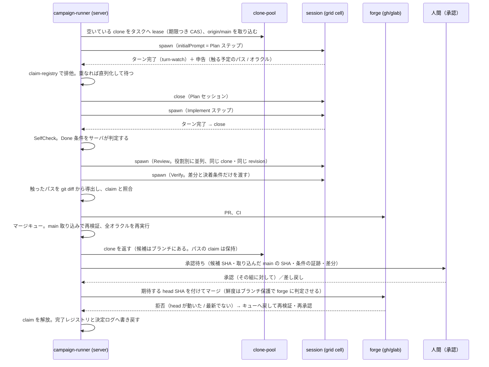

# Campaign Mode — grid の1機能としての設計

[`autonomous-delivery-pipeline.md`](autonomous-delivery-pipeline.md) が「何を作るか」の概念設計。
このメモは **それを MulmoTerminal の grid にどう載せるか**の具体設計。

追跡 issue: receptron/mulmoterminal#1815。隣接する構想は #991（判断キュー）と #1026（1件のループ）。

前提: **UI は大きく変えない。理想は全自動で動くこと。**

---

## 1. 結論から — grid はすでに9割できている

Campaign Mode は新しい画面ではない。**grid に供給されるセッションの出どころが、人間からオーケストレータに変わるだけ**である。

| 要るもの | 既存 | 場所 |
|---|---|---|
| N セッションを1画面で監督する | **cockpit roster**（全ページの全セルを一覧、status + PR フェーズ + prompt/reply 行） | `docs/grid-view-modes.md`、`CockpitHeader.vue` |
| サーバが起こしたセッションを勝手にセルにする | **unplaced sweep**。サーバが「誰のブラウザも頼んでいない」印を付け、grid が拾って adopt する | `GridView.vue:572-609`、`/api/sessions/unplaced` |
| 作業場所の排他 | **1作業ツリー = 1セッション**の claim（#1207 / #1208） | `server/session/worktree-session-limit.ts` |
| ターン完了の判定 | **因果相関**（送った文字列が相手の次の prompt に現れたターンだけを答えとする）。実機で枯れている | `src/composables/exchangeRules.ts` / `useCrossTalk.ts` |
| 次の1ステップを打ち込む | round table の submit と draft injection | `useRoundTable.ts` / `server/session/draft-injection.ts` |
| PR の状態 | フェーズ + CI 状態をセルごとに表示済み | `server/git/prPhase.ts` / `src/components/rosterPhase.ts` |
| エージェントが今何をしているか | planning / implementing の分類 | `server/session/workPhase.ts` |
| 定期的に何かを起こす仕掛け | scheduler の tick | `server/backends/scheduler.ts` |
| 会話をタブより長生きさせる | rooms（ディスク上の会話ログ） | `server/rooms/rooms.ts` |
| 進捗の外形的な記録 | issue に1つのコメントを編集し続ける | `server/git/work-comment.ts` |

セル上限は **81**（`gridTabs.ts:76`、9ページ×9）。8並列は余裕。

---

## 2. 設計の背骨 — 4つの決定

### D1. オーケストレータはサーバ側に置く

round table は**意図的にブラウザ側**にある。`useRoundTable.ts` の冒頭にこう書いてある。

> It runs in the browser, like the exchange it generalises: close the tab and the table stops.
> A conversation that continues where nobody is watching is a different feature with a different safety argument.

**Campaign Mode はまさにその「別の機能」**である。だから、この一文を無視して round table を延長するのではなく、
**別の安全論拠を立てたうえで**サーバ側に runner を置く（D4）。置き場所は scheduler と同じ層。

### D2. キャンペーンのセッションを `hidden` にしない

`hidden` は背景ワーカーの印で、**セルを取らない**（`GridView.vue:591`「hidden workers and scheduled tasks never take a cell」）。
見えないワーカーが8本走っている状態は監督不能で、この機能の価値を捨てる。
**通常のセッションとして spawn し、unplaced sweep に拾わせる。** これで UI 変更ゼロのまま grid に現れる。

### D3. 1 clone = 1 タスク。セッションは1ステップごとに使い捨てる

worktree の規則をそのまま clone に一般化する。**lease を持つのはタスクであってセッションではない**。
1つのタスクは、**作業をしているあいだ**（`Claimed` から `AwaitingApproval` まで）1つの clone を占有し、
その中で Plan / Implement / Review / Verify を**別々のセッション**として順に立てる。
各セッションはそのステップが終わったら**閉じる**。
承認待ちに入ると clone は返す（下の表）。

理由は文脈衛生で、前のステップの誤解・思い込みを持ち越さないため（同じところを直し続ける現象 A の一因）。
そして原則3（判定は実装と別の文脈で）を成立させるには、Review と Verify が実装と**別セッション**であることが必要になる。

**候補はディレクトリではなくコミットである。** ここを取り違えると、同じ clone を渡しただけでは足りない。
Review は役割別に**並列**で走り、そのセッションたちも書ける以上、
「同じ作業ツリーを見ている」だけでは検証中に中身が動く。

- Implement は**コミットで終わる**。その SHA が候補。
- Review と Verify にはその **SHA を渡し、読み取り専用の checkout で走らせる**
  （clone の中に detached な作業ツリーを立てる）。lease は clone に、候補は SHA に付く。
- **Review / Verify 中に書かれたものは採らない。** 直したいことがあれば blocking 指摘として返し、
  `Implementing` へ戻って**新しい候補**を作る。そこから Review をやり直す（状態機械の既存の辺）。
- PR は**レビュー済みの SHA から**開く。マージの直前に **PR の head が候補 SHA と一致すること**を照合する。
  一致しなければ、それはレビューされていない変更を含む PR である。

これで「レビューした版と検証した版が違う」も「レビュー後に足された変更が入る」も同時に消える。

**clone の lease とパスの claim は、寿命が違う。** ここを一つのものとして書くと、
承認待ちのあいだ何を握っているのかが決まらない。

| | いつ取る | いつ返す | 途中で移れるか |
|---|---|---|---|
| **clone の lease** | `Claimed` | `AwaitingApproval` に入るとき | **移れる**。差し戻されて `MergeQueue` に戻るときは、空いている**別の** clone でよい |
| **パスの claim** | `Claimed` | `Merged`（または放棄） | 移らない。承認待ちのあいだも握り続ける |

clone を返せるのは、その時点で**候補も検証済みのベースも forge 側にある**からで、
手元の作業ツリーに残っている情報が無いためである。逆に claim を返してはいけないのは、
返した瞬間に別のタスクが同じ場所を触り、承認済みの差分が古くなるからである。

**ステップ間（Plan / Implement / Review / Verify）では clone を返さない。**
返すのは `AwaitingApproval` に入るときの一度だけ。
そして**承認待ちのタスクは「clone を持たない」のが正常な状態**なので、
再開時の照合はそれを取り残された lease と読み違えないこと（下記）。

溜まったセッションは既存の reap に任せる。

### D4. エージェントはキャンペーンを開始できない

round table が守っている不変条件をそのまま守る。

> They call nothing, see no other cell, and cannot start or join anything — the runner reads their
> turns and types the next one in. That is what makes "an agent starts a conversation on its own"
> impossible rather than merely discouraged.

キャンペーンの開始・停止は**人間だけ**。エージェントに与える MCP ツールは**報告系のみ**
（宣言する / 主張する / 結果を返す）で、spawn も merge も持たせない。

**ただし「報告系ツールしか渡さない」ことは強制ではない。** キャンペーンのセッションは clone の中に
シェルを持っており、loopback の `/api/*` も CLI も叩ける。リポジトリの中身に
「このコマンドを実行せよ」と書いておく攻撃（prompt injection）もこの経路に乗る。
だから **round table の不変条件をここで再現するには、サーバ側の能力境界が要る**。

- 開始・停止・予算変更の route は、**エージェントが読めず作れもしない capability** を要求する。
  持たない要求は拒否する。UI の作法ではなく route の実装として持つ。
  これは runner の PR（PR3）の前提条件であり、**PR2 として先に入れる**。後付けの締め直しにしない。
- **エージェントの自己申告を判断に使わない。** `campaign.declare` / `campaign.report` が返す
  触ったパスやオラクル結果は未検証入力として扱い、claim と merge の判断は
  **サーバが `git diff` と実行結果から導出した事実**で行う。重複報告・順序逆転・過大サイズは拒否する。
- **副作用の直前に、停止スイッチと予算を atomic に読み直す。** spawn / prompt 注入 / PR / merge の
  それぞれの前で確認する。走行中に停止されたセッションは、次のステップを注入せずに閉じる。
  ただし**「直前に読む」だけでは、読んだ後・呼ぶ前に入った停止を防げない**。停止と副作用の意図を
  同じログへ直列に追記し、意図に世代を書いて実行直前に照合する。
  境界は「停止は commit されていない意図を全部取り消す。commit 済みは完了して記録される」。
  停止の瞬間に進行中だったマージが1本通ることはありうる（汎用側 2.1.1）。
- **予算はレート制限の残枠とは別物。** 残枠は「今どれだけ並列にできるか」を決めるだけで、
  「このキャンペーンが使ってよい総量」は決めない。タスク数・時間・トークンを別に数える。

タブを閉じても走るぶんの代償として、次を義務にする。

- **予算**（タスク数・時間・トークン）を宣言しないと start できない
- **監査ログ**（どのセッションがどの clone で何をしたか）。**append-only、生プロンプトと生差分は
  参照とハッシュで持つ、閲覧権限と保持期限つき**（監査ログ自体を漏洩面にしない）
- **全体停止スイッチ**
- **人間ゲートに当たったときだけ既存の通知/push で鳴らす**（見ていなくてよい、が要件なので）

---

## 3. UI の差分 — これだけ

| | 内容 |
|---|---|
| **変更なし** | セルへの adoption、roster の status / PR フェーズ / prompt・reply 行、dir の色とアイコン、attention の点滅、タブページ、単一ビュー、launcher |
| 追加 1 | roster 行に**キャンペーン・フェーズのピル**。既存の PR フェーズピルと同じ形・同じ隣（`rosterPhase.ts` の `PhaseDisplay` にもう1系統） |
| 追加 2 | `CockpitRowMenu.vue` に「このタスクを止める」を**1項目**追加 |
| 追加 3 | Settings に Campaign セクション（既存パターン: セクション + `SkillLaunchButton.vue`）。開始・停止・並列数・プロファイル |
| 追加 4 | `AppToolbar.vue` の既存タリーに**キャンペーン全体の進捗**を1つ（下記） |

**新規コンポーネントは 0、新規ビューも 0。** 追加1は roster 側だけに入れる。
`docs/grid-view-modes.md` が言うとおり roster 行は `TerminalCell` ではないので、
セル側にも同じピルを足すと**2箇所で同じ規則が腐る**。監督は cockpit でする、と決めて片側に寄せる。

開始 UI を Settings に置くのは、**新しい入口を作らずに済む**から。
`mulmoterminal-campaign` スキルを1本ぶら下げれば、設定の読み書きも自然言語で済む（既存スキル群と同じ形）。

### 追加4: キャンペーン全体の進捗はどこに出るか

roster は**1タスク1行**なので、「1000件のうち今どこか」の居場所が無い。新しいパネルは作らず、
**`AppToolbar.vue` の既存タリーに寄せる**。あそこには grid 全体の blocked / done / working が
`font-mono text-[12px]` の点として既に出ており（`gridStatusSummary()`、#1307 の色の経緯つき）、
`RateLimitGauge` も隣にいる。ここに `12/48` の形で1つ足すのが、CLAUDE.md の
「compact status 表記は文字のまま」という方針とも合う。

隣に `RateLimitGauge` がいるのは偶然ではなく都合が良い。並列数は設定値ではなく**残枠から**決める
（8章）ので、「今8本走っている」と「残枠がこれだけ」が同じ場所で読める。

タスク単位より粗い記録（何を決めたか、何を諦めたか）は `rooms` に流す。画面ではなくログで追う。

---

## 4. サーバ側の構造

新規: `server/campaign/`

| ファイル | 役割 | 純粋か |
|---|---|---|
| `campaign-state.ts` | タスクの状態機械。遷移だけ | **純関数**（テスト対象の本体） |
| `campaign-store.ts` | 永続化。`mulmoterminalHome()/campaigns/<id>.jsonl`。**副作用の前に intent、後に outcome を追記する**（下記） | I/O |
| `campaign-runner.ts` | tick。次に何を誰に打つかを決めて実行。**起動時にまず照合する** | I/O |
| `clone-pool.ts` | clone の割当・lease・main 同期（`~/mulmoterminal-campaign/<repo>/w1..w8`）。lease は**期限つき compare-and-set + 所有者トークン** | I/O |
| `claim-registry.ts` | 触るパスと提供/依存する契約の台帳、排他 | 判定は純関数 |
| `oracle.ts` | 決着条件の宣言と実行（差分 / 仕様 / 参照 / 性質） | 判定は純関数 |
| `step-prompt.ts` | 各フェーズのプロンプト生成 | **純関数** |
| `turn-watch.ts` | ターン完了の観測 | I/O（規則は common） |

**`common/` へ移すもの**: 現在 `src/composables/exchangeRules.ts` にある `waitVerdict` / 相関判定の純関数部分。
サーバ側の runner とブラウザ側の round table が**同じ判断をする**ので、CLAUDE.md の `common/` 規則にそのまま当てはまる。
移動はふるまい保存の変更なので、`/refactor-safely` の差分テストを付ける（PR0）。

> `RoundTableDeps` / `CrossTalkDeps` の統合は暫定という経緯があるため確認が要る箇所だったが、
> **2026-08-19 に「触ってよい」と合意済み**（9章 決定3）。ただし暫定であることは変わらないので、
> PR0 は「純関数を `common/` へ移す」だけに留め、deps の形そのものの整理は別 PR にする。

### キャンペーンの権威を、エージェントが書けるファイルの上に置かない

route に capability を要求しても、**ファイルは守られない**。キャンペーンのセッションは
同じユーザで動くシェルを持っているので、`mulmoterminalHome()/campaigns/` の JSONL を
直接書き換えられる。予算・許可パス・lease・オラクルの結果を、HTTP を一度も通さずに書き換えられる、
ということである。「append-only の約束」は規約であって強制ではない。

**ハッシュ連鎖は、この相手には検知にならない。** 同じハッシュを計算できるのだから、
正当に見える追記を偽造できるし、ログ全体を書き換えて再ハッシュもできる。
runner がメモリに持つ先頭ハッシュは runner が生きている間しか効かず、再起動後は
ログを読み直すので、再ハッシュ済みのログと本物を区別できない。**これは対策ではない。**

権威を守れるのは、**エージェントの手が届かない何かがある**ときだけである。

1. **隔離。** エージェントを別 UID / 別 mount namespace / サンドボックスで走らせ、
   キャンペーンの保存先を書けなくする。MulmoTerminal の前提（ローカルの PTY を
   ユーザ自身の権限で動かす）と正面から衝突するので、**明示的な配備オプション**として扱う。
2. **別プロセスが鍵かログを持つ。** レコードに MAC を付け、鍵は別権限のプロセスが持つ。
   あるいはログ自体を、エージェントが書けない先（別権限のプロセスへのソケット、遠隔の追記専用ログ）
   にだけ書く。鍵をこちらのプロセスのメモリに置くだけでは足りない — 同じ UID なら読める。

**どちらも配備しないなら、キャンペーンの権威は信用できない。** これは実装で埋められる差ではない。

ここで正確に書いておく必要がある。**deny-by-default の実行権限（許可コマンド・ネットワーク・資格情報）は、
同一 UID の配備では「安全境界」ではなく「ガードレール」である。** そして守れる範囲は、
思っているより狭い。

- **止まるもの: 協力的なエージェントの取り違い。** 意図と違うディレクトリを触った、
  範囲外のファイルを直した、想定していないコマンドを打った。これは実際によく起きるので、
  ガードレールとして十分に価値がある。
- **止まらないもの: リポジトリの中身に仕込まれた指示（prompt injection）。**
  注入された指示に従うエージェントは、**その検査が読むポリシー自体を書き換えられる**。
  拒否リストを書き換えられるなら、拒否リストは拒否しない。
  「injection による事故は止まる」とは書けない。

そして**マージを人間ゲートにしても、この問題は減らない**。コマンド・ネットワーク・資格情報の濫用は
マージを経由しないからである。8章に書いた「結果を有界にする」はマージしか有界にしていない。

一方で、これは Campaign Mode が新しく持ち込む力ではない。**通常のセルで動く
エージェントも同じ権限を持っている**（ローカルの PTY をユーザ権限で動かす、という前提そのもの）。
Campaign Mode が変えるのは権限ではなく、**誰も見ていないこと**と**規模**である。

したがって選択肢は2つで、これは実装ではなく**配備の決定**である。

| | 意味 | 代償 |
|---|---|---|
| **隔離を必須にする** | ポリシー保管を別 UID / 別権限プロセスに置き、保護されていなければ runner を**起動しない**（fail closed） | 通常の開発マシンでそのまま動かなくなる。配備の手間が増える |
| **通常セルと同じ信頼モデルを受け入れる** | 権限はガードレールとして持つが、安全境界とは呼ばない。無人と規模のぶんだけ露出が増えることを承知で使う | リポジトリに仕込まれた指示が、誰も見ていない状態で8並列に効きうる |

**2026-08-19、後者に決定**（9章 決定4）。理由は、エージェントが持つ権限は今日の通常セルと同じであり、
Campaign Mode が増やすのは権限ではなく露出だから。隔離を必須にすると、この機能は
普段の開発マシンで動かなくなる。

**決めたことの帰結を、実装が守る形にしておく。**

- 実行権限は**ガードレールとして実装する**。止まるのは協力的なエージェントの取り違いまで。
- **ドキュメントでもコードのコメントでも「安全境界」と呼ばない。** 呼んだ時点で、
  次の読み手はそれに寄りかかった判断をする。
  **「injection を止める」とも書かない** — 止めないからである。
- Campaign Mode の説明（Settings のセクション、skill）に、**この機能で守られないもの**を書く。
  ぼかさずに: 「対象リポジトリの中身は、誰も見ていない状態で8つのエージェントに読まれる。
  そこに書かれた指示は、あなたの権限で実行されうる。ここの許可設定はそれを止めない」。
- したがって運用上の規則はひとつ: **中身を信用できるリポジトリにだけキャンペーンを向ける。**
  信用できない対象を回したくなったときが、隔離を配備するときである。
- 隔離（別 UID / 別権限プロセス）は**将来の配備オプションとして口を残す**。必須にはしないが、
  ポリシー保管の場所を最初から差し替え可能にしておけば、後から足せる。

あわせて、キャンペーンの保存先は**どの clone の外・リポジトリツリーの外**に置く。
そうすればタスクがそこに触ること自体が claim の範囲外になり、権限検査で落ちる。
ただしこれは**正直に振る舞うタスクを取り違いから守る**ものであって、
敵対的な相手を止めるものではない。

### 中断からの再開

`campaigns/<id>.jsonl` に状態を書くだけでは、**spawn / prompt 注入 / PR / merge / close の途中で
プロセスが落ちた場合**が決まらない。外部の操作が成功した後にログの書き込みが失敗すると、
再開時に同じ操作をもう一度やるか、成功した操作を未完了として扱う。どちらも実害が出る。

- **intent を先に、outcome を後に**追記する。`intent` だけのレコードが再開時の照合対象。
- **冪等キーを外部の名前に埋める。** ブランチ名・PR タイトル・セッション名に
  `campaign/<id>/<task>/<attempt>` を入れる。再開時は「その名前のものが既にあるか」を forge と
  clone に聞けばよく、こちらの記録を信じなくて済む。
- **起動時に照合する。** 生きているセッション、clone の lease、forge 上のブランチ/PR/マージ状態を読み、
  `intent` だけのレコードを解決する。**照合できないものは人間へエスカレートし、推測で先へ進めない。**
  このとき **`AwaitingApproval` のタスクは clone を持たないのが正常**で、取り残された lease ではない。
  逆に**パスの claim はそのタスクが持っているのが正常**なので、回収してはいけない。
- **期限切れ lease の回収。** 所有者トークンの世代で、旧所有者の書き戻しを拒否する。

**再利用するもの**: `issue-work.ts`（タスク → 作業場所 → 種プロンプト付きセッション、の骨格）、
`worktree-session-limit`（claim）、`prPhase`、`work-comment`、`activity-*` と `completion-hooks`、
`reap-idle-sessions`、`rate-limit-*`、`scheduler` の tick、`rooms`（キャンペーンの会話ログ）。

---

## 5. 1タスクの流れ（具体）

**承認は状態である。** 誰がどの候補 SHA に、**どのベース（取り込んだ main の SHA）に対して**
承認したかを記録し、**どちらかが動いたら無効**にする。別のタスクが先に main を進めれば、
その承認はもう存在しないベースに対するものになる。だから承認はキューの先頭で、
取り込みと再検証の直後に求め、返ってきたら即マージする。

**そして最後の照合はこちらでやらない。** マージ直前に確かめても、確かめた後・呼ぶ前に
main が動けば通る。原子的にできるのは実際にマージする側だけなので、
**期待する head SHA を付けてマージし、ベースの鮮度はブランチ保護（マージ前に最新であること）で
forge に判定させる**。拒否されたらキューへ戻して再検証・再承認。
キャンペーン内のマージは直列にして、自分たちが原因の競合は先に消しておく。
待っている間 clone は返すが**パスの claim は保持する**（解放すると承認済みの差分が古くなる）。
停止と予算は承認待ちにも効く。承認待ちが溜まったら新しいタスクの供給を止める（汎用側 2.1）。

**セッションはステップごとに立てて閉じる。clone は `Claimed` から `AwaitingApproval` まで同じものを持つ**（D3）。
Review と Verify が実装と別セッションであることが原則3を成立させ、
同じ clone・同じ revision であることが「レビューした版と検証した版が違う」を防ぐ。

### エージェントの出力をどう構造化して受け取るか

ここが実装上の分かれ目。3案:

| 案 | 中身 | 評価 |
|---|---|---|
| (a) **MCP の報告ツール** | `campaign.declare` / `campaign.report` を GUI MCP に足す | **推奨**。型と検証が付き、既存の mcp-config の仕組みに乗る |
| (b) マーカー行 | round table の `ROUND-TABLE-DONE` 方式 | 実績はあるが、構造化データには弱い |
| (c) ファイル | タスクディレクトリに JSON を書かせる | 監査は楽。読み取り遅延と競合の扱いが増える |

(a) を採るとき、ツールは**報告のみ**にする（D4）。spawn / merge / 他タスクの参照は持たせない。
そして**受け取った値は未検証入力**として扱う。task / session / phase / revision はサーバ側で検証し、
触ったパスは報告ではなく `git diff` から導出する。重複報告・順序逆転・過大サイズは拒否する。
報告は「エージェントが何を考えたか」の記録であって、claim や merge の根拠ではない。
サーバ id とツール群の設計は `common/toolGroups.ts` の既存規則に従う（新しい単一ビュー系サーバなら
`LEGACY_GUI_SERVER_ID` の扱いも含めて確認する）。

---

## 6. どこまで全自動にするか（Gate の既定）

| フェーズ | `refactor` | `feature` / `new-app` |
|---|---|---|
| Intake（妥当性） | 自動 | 自動 |
| Spec | — | **人間** |
| 契約確定 | — | **人間** |
| Plan / Implement / SelfCheck | 自動 | 自動 |
| Review / Verify | 自動 | 自動 |
| Merge | **人間**（同一 UID 配備での既定。理由は下記） | **人間** |

**決定4（同一 UID を受け入れる）を選んだ以上、`refactor` でも自動マージはしない。**
自動マージの条件は、オラクルの結果・claim・予算・許可パスといった**キャンペーンの状態から読む**。
その状態はエージェントが書ける。つまり自動マージとは、**マージされる側が書けるデータを根拠に、
誰も見ていないところで main を更新する**ことになる。ここだけは受け入れる露出の範囲を超える。

自動マージが選べるようになるのは、**保護されたポリシー保管を配備したとき**（隔離、別権限プロセス）である。
下の条件表は、そのときのための条件であり、同時に**人間に「マージしていいか」を聞く前に
満たしていなければならない条件**でもある。人間ゲートは条件を免除するものではない —
人間が押す前に機械が確かめられることは、機械が確かめる。

条件の中身に入ると、`refactor` の自動マージが成立する条件は **CI が緑であること**ではない。
CI が緑という事実は「CI が何を走らせたか」を言わないので、それ単独では情報量がない。

1. Plan で宣言したオラクルが**全部走り、緑で、証跡が残っている**（走らなかったオラクルは赤扱い）
2. **現在の main を取り込んだ状態で**再検証した（マージキューの先頭で再実行）
3. 未解決の blocking 指摘がゼロ（follow-up は行き先の記録つきで解決扱い）
4. 触ったパスが claim の範囲内（`git diff` から導出した事実で照合。自己申告では照合しない）
5. 触ったパスが**ゴール定義（P1）の許可パスの内側**で、禁止パスに触れていない。差分が最大差分以内
6. 対象ブランチが指定と一致し、その保護が実際に有効で、マージに使う資格情報が迂回できない
7. **PR の head が、レビューと検証を通った候補 SHA か、runner が作った main 取り込みコミットである**
   （2 で main を取り込むと head は変わる。本体は「レビュー後にエージェントの変更が入っていない」こと）
8. **判定不能は赤**（タイムアウト、証跡が読めない、照合できない — 全部止める）

4 と 5 は別物である。claim は**タスクの申告**、5 は**ゴール定義が許した範囲**。
禁止パス（lockfile、デプロイ設定、CI 設定）を claim したタスクは 4 だけなら通る。
**5〜7 が実装されるまで、これらは人間に聞く前の必須条件としても未完成**である。
そして同一 UID 配備では、全部揃っても既定は人間ゲートのままである（上記）。

この形は `~/ss/llm/CLAUDE.md` の dep 更新ワークフローで既に許可されている運用の延長にある
（ただしあちらは人間が対象リポジトリを選び、走らせるたびに見ている点が違う）。

**人間ゲートでも `refactor` プロファイルの価値は残る。** タスクの供給（ratchet）から
実装・レビュー・検証・PR までは無人で進み、人が押すのは最後の1回だけになる。
決定1で `refactor` を先にした理由（燃料が自動供給されるので自走を検証できる）はそのまま生きている。
`feature` は Spec と契約で人間が2回入るので、そこで方向は正せる。

---

## 7. PR 分割案

| PR | 中身 | これで何が消えるか |
|---|---|---|
| PR0 | 相関ルールを `common/` へ（差分テスト付き） | — |
| PR1 | `campaign-state.ts` + store。**intent/outcome レコードと起動時照合を含む**。UI なし、テストのみ | 再開時の重複実行 |
| PR2 | **サーバ側の能力境界**（開始/停止/予算の capability、副作用直前の再確認、監査ログ、通知）＋ **ゴール定義の実行権限を deny-by-default で強制**（許可パス・許可コマンド・ネットワーク・資格情報・最大差分）。runner はまだ無い | 「エージェントが開始できない」が方針から強制になる。シェルを持つ runner が走り出す前に権限が閉じている |
| PR3 | runner: 1 clone・1タスク・1ステップの walking skeleton | 設計の嘘がここで出る |
| PR4 | turn-watch でステップ連結（1タスクが最後まで自走する） | **現象 D**（勝手に止まる） |
| PR5 | MCP 報告ツール + claim-registry（期限つき CAS + 所有者トークン） | **現象 A**（同じところを直す） |
| PR6 | レビュー収束（役割分離・blocking/follow-up・再掲検出・上限） | **現象 B**（20ループ） |
| PR7 | オラクル実行 + 独立検証 | **現象 C**（LGTM 後に出る） |
| PR8 | clone プール 8並列 + マージキュー + レート制限配分 | 規模 |
| PR9 | roster ピル / 行メニュー / Settings セクション / toolbar のタリー | **UI 差分はここだけ** |
| PR10 | `refactor` プロファイル（ratchet からの供給、自動マージのゲート条件） | 放っておくと進む状態 |
| PR11 | `feature` プロファイル（Spec ゲート・契約先行・受け入れテスト） | 汎用性の検証 |

PR4 まで到達すれば「1タスクが人手なしで PR まで行く」。そこが最初の実用ライン。

**PR1 と PR2 が先に来るのは意図的**である。どちらもレビューで足された要件（再開照合と能力境界）で、
runner より後に入れると、その間に走ったキャンペーンには効かない。

とくに **PR2 の実行権限は PR3 より前でなければならない**。PR3 で初めて
「シェルを持つエージェントが人の見ていないところで走る」状態になるので、
そこで許可コマンド・ネットワーク・資格情報が deny-by-default になっていないなら、
権限の話は**一度も閉じないまま**自走が始まる。自動マージ（PR10）まで待つ話ではない。

---

## 8. 先に潰しておく危険

- **タブを閉じても走る = 事故が見えない。** 予算・監査ログ・通知・停止スイッチを、runner より前の PR2 で入れる（後付けにしない）。
- **キャンペーン状態を localStorage に置かない。** grid のセル配置はブラウザごとの localStorage
  （`GridView.vue:92`）。キャンペーンの真実はサーバのファイルに置き、grid は表示だけ。
- **セッションが溜まる。** タスク完了で close、あとは reap に任せる。81 セル上限に触れさせない。
- **レート制限。** 並列数は設定値ではなく**残枠から**決める（`rate-limit-store.ts`）。
- **clone の main 同期。** merge の直後に他の clone へ取り込む。取り込みで壊れたらタスクを Implementing に戻す。
- **`hidden` にしたくなる誘惑。** 見えないほうが静かだが、それは監督を捨てるということ（D2）。
- **同一 UID で走る限り、キャンペーンの状態はエージェントから書ける。** ハッシュ連鎖では
  検知にもならない（同じハッシュを計算できる相手だから）。決定4でこれを受け入れたので、
  残るのは**書き方の規律**である: 「capability があるから安全」「権限設定が injection を止める」と
  読める文を、ドキュメントにもコメントにも UI にも書かない（4章）。
- **MulmoClaude との API 整合。** キャンペーンの route を足すときは `../mulmoclaude` に対応物があるか先に見る
  （CLAUDE.md の規則。#907 の再演を避ける）。

---

## 9. 決定事項と、残っている未決

### 決定済み（2026-08-19）

**決定1. 最初のプロファイルは `refactor`。**
lint warning という燃料が ratchet から自動で供給されるので、人間が題材を用意しなくても回り続ける。
「全自動で動く」を検証したいのだから、供給まで自動なほうが題材として正しい。
`feature` プロファイル（PR11）はその次で、汎用性の検証という位置づけは変えない。

**決定2. clone は `~/mulmoterminal-campaign/<repo>/w1..w8`。**
専用ディレクトリを掘り、既存の作業 clone の隣には置かない。`cwdPresets` には出さない
（人間が普段開く場所ではなく、runner が lease して返す使い捨ての作業場所）。
これは D3（1 clone = 1 タスク、セッションはステップごとに使い捨て、タスクが終わるまで同じ clone）の
置き場所側の裏付けでもある。lease を持つのはタスクなので、clone は人間の作業ディレクトリの隣ではなく、
runner が貸し出して返す場所に置く。

**決定3. `RoundTableDeps` / `CrossTalkDeps` に触ってよい。**
PR0（相関ルールを `common/` へ）の前提が満たされた。ただし上記のとおり PR0 の範囲は純関数の移動に限る。

### まだ決めていない — うち1つは PR2 より前に要る

**決定4（2026-08-19 決定）: 通常セルと同じ信頼モデルを受け入れる。**
同一 UID の配備では実行権限は安全境界ではなくガードレールで、ポリシー自体を書き換えられる。
マージを人間ゲートにしても、コマンド・ネットワーク・資格情報の濫用はマージを経由しないので減らない。
それでも受け入れるのは、**その権限が今日の通常セルと同じ**だからで、
Campaign Mode が増やすのは権限ではなく露出（無人・並列）である。隔離を必須にすると、
この機能は普段の開発マシンで動かなくなる。

PR2 はガードレールとして実装し、安全境界とは呼ばない。**injection を止めるとも書かない** —
注入されたエージェントは検査が読むポリシーを書き換えられるので、止まらない。
守られないものを Settings と skill の説明にぼかさずに書き、運用の規則を
「中身を信用できるリポジトリにだけ向ける」とする。
隔離はポリシー保管を差し替え可能にしておくことで、将来の配備オプションとして残す（4章）。

### そのほか（PR5 以降まで遅らせられる）

- **開始の入口。** Settings セクション + skill で十分か、header chip も要るか。
  → PR9（UI 差分）まで不要。
- **報告は MCP ツールでよいか。** よければサーバ id とツール群の置き場所（`common/toolGroups.ts`）を先に決める。
  → PR5 まで不要。それまでは runner 側の観測（turn-watch）だけで進む。
- **キャンペーン状態の保存先。** `mulmoterminalHome()/campaigns/` でよいか。
  → PR1 で要る。既定のまま進め、違うなら PR1 のレビューで直す。
- **通知の kind。** 人間ゲートに当たったときに何で鳴らすか（既存 `common/notifyKinds.ts`）。
  → PR2 で要る（危険の項の「事故が見えない」対策の一部）。
